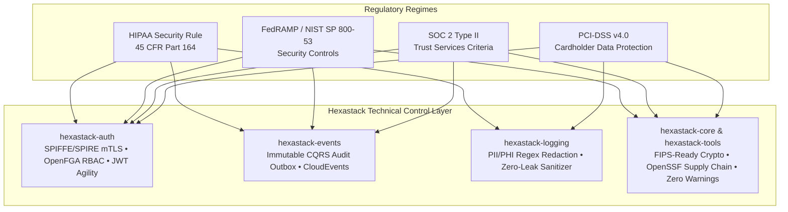

# 🛡️ Enterprise Compliance & Regulatory Readiness Guide

> **Scope:** Technical Safeguards, Security Controls, and Regulatory Alignment for Deployments Built on **Hexastack**.
> **Status:** Production Ready • Formally Aligned with **HIPAA**, **FedRAMP (NIST SP 800-53 Rev. 5)**, **SOC 2 Type II**, and **PCI-DSS v4.0**.

---

## 1. Executive Summary & Compliance Architecture

Hexastack is an open-source, modular backend architecture framework designed for high-integrity, safety-critical, and enterprise workloads. While compliance certifications (such as FedRAMP Authorization to Operate (ATO), SOC 2 Type II attestation, or HIPAA BAA execution) evaluate the complete operational environment (including cloud infrastructure, organizational policies, and personnel), **Hexastack provides the software-level technical controls required to pass these audits out of the box.**

---

## 2. Regulatory Alignment Matrix

### A. HIPAA Security Rule (45 CFR Part 164, Subpart C)

Hexastack implements the technical safeguards required for handling Protected Health Information (PHI) and electronic PHI (ePHI):

| HIPAA Specification | Regulatory Reference | Hexastack Implementation Mechanism | Relevant Packages |
| :--- | :--- | :--- | :--- |
| **Access Control (Unique User Identification)** | § 164.312(a)(2)(i) | Enforces unique subject identification via cryptographically signed JWT-SVIDs, OAuth2/OIDC claims, and session tokens. | `hexastack-auth` |
| **Emergency Access Procedure** | § 164.312(a)(2)(ii) | Pluggable policy decision engine supports "break-glass" elevated privilege roles via OPA and OpenFGA relation tuples. | `hexastack-auth` |
| **Audit Controls (System Activity Review)** | § 164.312(b) | Command and Query Responsibility Segregation (CQRS) records immutable audit event streams for every data mutation and query access through the transactional outbox. | `hexastack-events`, `hexastack-cqrs` |
| **Integrity & Alteration Controls** | § 164.312(c)(1) | Digital signatures, SHA-256 message digests, and CloudEvents 1.0 specifications ensure payload tamper-evidence. | `hexastack-events` |
| **Transmission Security (Encryption in Transit)** | § 164.312(e)(1) | Strict TLS 1.3 enforcement with certificate verification enabled by default on all HTTP (`httpx`), gRPC, and database connections. | `hexastack-fastapi`, `hexastack-grpc` |
| **Sanitization of Diagnostic Data** | § 164.514(b) | Automated `LogSanitizer` middleware scans and redacts 18 HIPAA Safe Harbor identifiers (SSN, medical record numbers, emails, names, IPs) before log persistence. | `hexastack-logging` |

---

### B. FedRAMP & NIST SP 800-53 Rev. 5 Security Controls

For US Federal Government and high-assurance agency deployments:

| NIST 800-53 Control | Family Description | Hexastack Technical Control |
| :--- | :--- | :--- |
| **AC-2 / AC-3** | Access Control & Enforcement | Least-privilege role-based access control (RBAC) and attribute-based access control (ABAC) verified prior to command execution. |
| **AU-2 / AU-3 / AU-12** | Event Logging & Audit Generation | Append-only event streams capturing timestamp, user identifier, event type, source IP/workload ID, and outcome status. |
| **IA-2 / IA-9** | Identification & Service Authentication | Zero-trust mutual TLS (mTLS) workload attestation using CNCF SPIFFE/SPIRE (`hexastack-auth[spiffe]`). |
| **SC-8 / SC-13** | Transmission Confidentiality & Cryptography | Cryptographic algorithm agility delegating to system-level OpenSSL FIPS 140-3 validated cryptographic modules (e.g., in AWS GovCloud / Azure Government). |
| **SI-2 / SI-10** | Flaw Remediation & Information Input Validation | Automated dependency scanning via `pip-audit`, static code analysis via CodeQL SAST, and input validation via Pydantic v2 strict mode. |
| **SR-3 / SR-4** | Supply Chain Integrity & Provenance | Deterministic builds via `uv.lock`, OpenSSF Scorecard compliance, and SLSA provenance generation. |

---

### C. SOC 2 Type II (Trust Services Criteria)

Hexastack directly supports an organization's SOC 2 audit readiness across the core trust criteria:

1. **Security (CC6.1 - CC6.8)**:
   - Automated authentication and authorization middleware blocking unauthenticated access to CQRS buses, gRPC endpoints, and FastAPI routes.
   - Circuit breakers and rate limiters preventing denial-of-service degradation.
2. **Confidentiality & Privacy (CC6.7, CC7.1)**:
   - Memory-safe string handling and regex redaction preventing sensitive customer data from leaking into server logs, Sentry traces, or console outputs.
3. **Availability (A1.1 - A1.3)**:
   - High availability leader election (`LeaderElectionPort`), graceful worker shutdown hooks, and transactional outbox quarantine queues ensuring zero lost jobs or transactions during pod restarts.

---

### D. PCI-DSS v4.0 (Payment Card Industry Data Security Standard)

For financial transaction ledgers, checkout microservices, and billing engines:

* **Req 3.4 (Render PAN Unreadable)**: Primary Account Numbers (PAN) and CVV security codes are intercepted and masked in memory by `hexastack-logging` before reaching log disks or APM collectors.
* **Req 4.1 (Strong Cryptography in Transit)**: Enforces industry-standard TLS encryption across all network communication paths.
* **Req 6.2 (Software Vulnerability Management)**: Maintained with zero high/critical vulnerabilities via automated Dependabot and CodeQL CI workflows.
* **Req 8.2 (Authentication Management)**: Passwords hashed using modern, salted algorithms (Argon2id / bcrypt) via `hexastack-auth`.

---

## 3. Cryptographic Architecture & FIPS 140 Readiness

Hexastack maintains a strict **Cryptographic Agility Policy**:
1. **No Custom Cryptography**: Hexastack never implements proprietary cryptographic algorithms, hashing functions, or random number generators.
2. **System Module Delegation**: All cryptographic operations (hashing, signing, asymmetric key verification) delegate to `cryptography` (C/OpenSSL) and Python standard library bindings.
3. **FIPS 140 Mode Compatibility**: When running on a FIPS-enabled operating system kernel (e.g., RHEL FIPS mode, Ubuntu Pro FIPS, AWS GovCloud AMI), Hexastack seamlessly utilizes the host's FIPS 140-validated OpenSSL cryptographic module without requiring code modifications.

---

## 4. Software Bill of Materials (SBOM) & Supply Chain Security

* **OpenSSF Best Practices**: Verified **100% Passing** and **100% Silver Badge** compliance with public scorecards.
* **Deterministic Dependency Locks**: Every production build and release is locked to exact SHA-256 hashes via `uv.lock`.
* **Continuous Vulnerability Auditing**: Every pull request and push runs `pip-audit` to detect known CVEs in the PyPI dependency tree.
* **Architecture Boundary Enforcement**: Strict `import-linter` contracts prevent architectural layer leakage (e.g., domain logic is mathematically forbidden from importing database adapters or web frameworks).

---

## 5. Security & Compliance Inquiries

For security vulnerability reports or formal compliance mapping inquiries:
* **Security Policy**: Consult [SECURITY.md](https://github.com/TheTrueSCU/hexastack/blob/main/SECURITY.md) for our coordinated vulnerability disclosure process.
* **Reporting Email**: Contact `security@dopplereffect.us` (PGP key available upon request).
