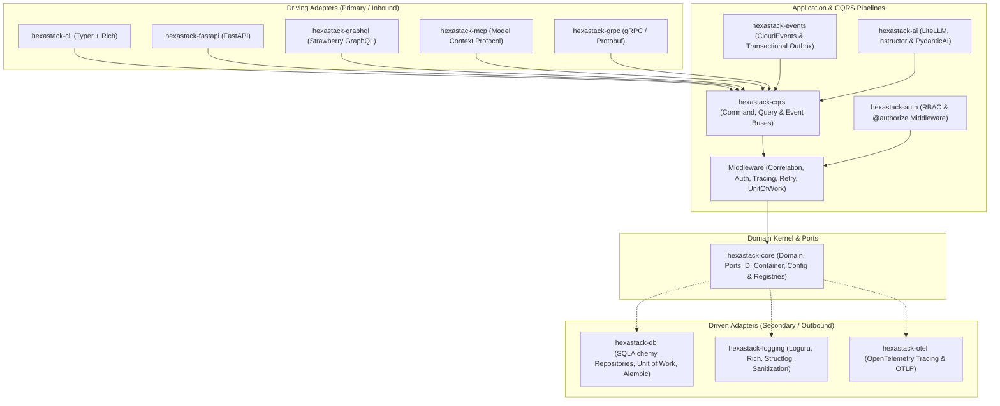
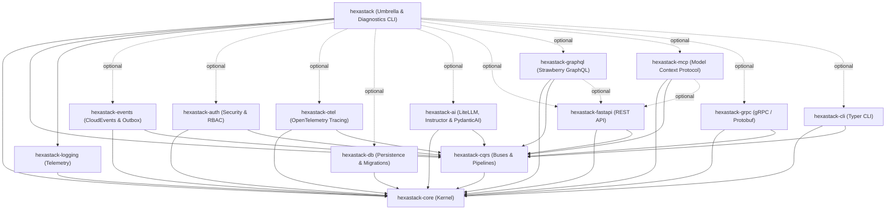

# Hexastack

> High-performance, modular Hexagonal Architecture & CQRS Framework for Python 3.13+.

[](https://www.python.org/downloads/)
[](https://github.com/astral-sh/ruff)
[](https://github.com/astral-sh/ty)

---

## 1. Architectural Philosophy

Hexastack is engineered around the principles of **Hexagonal Architecture (Ports and Adapters)** and **Command Query Responsibility Segregation (CQRS)** to build decoupled, maintainable, and highly testable Python systems.



### Core Tenets

1. **Dependency Inversion & Zero Framework Lock-In**:
   The domain and abstract ports in `hexastack-core` have zero third-party web or database framework dependencies. Core depends exclusively on `pydantic` (validation) and `rodi` (dependency injection). Frameworks (FastAPI, Typer, SQLAlchemy, Strawberry, Anthropic MCP, gRPC, Loguru, Huey) exist purely in the outer adapter layers.
2. **First-Class CQRS Segregation**:
   Mutating operations (Commands) and read-only operations (Queries) run on distinct pipelines. Commands traverse configurable middleware pipelines (telemetry, correlation ID propagation, retry policies, automatic transaction management) while Queries return optimized DTO projections.
3. **Multi-Tier Feature Flagging**:
   Standardized `FeatureFlagPort` and `EvaluationContext` with targeting for multi-tenancy, ambient `UserContext`, and dynamic runtime middleware/route toggling (`@feature_flag`, `require_feature`, `@feature_flag_route`, `@feature_flag_command`, `@feature_flag_field`).
4. **DI-Mediated Decoupling**:
   Packages interact through contracts in the DI container rather than tight, cross-package imports. For example, `hexastack-fastapi` provides session middleware by consuming a `sessionmaker` from DI without depending directly on `hexastack-db`.
5. **Three-Phase Deterministic Bootstrap**:
   Applications and extensions configure deterministically in 3 distinct phases:
   - **Phase 1: Config Registration** (`register_config`): Extensions register Pydantic configuration schemas under `[hexastack.<section>]`.
   - **Phase 2: Subsystem Assembly** (`configure`): Extensions configure runtime resources and register instances/factories into the DI container ordered by explicit priority (`order`).
   - **Phase 3: Reflective Module Scanning** (`scan_modules`): Single-pass reflective scanning discovers and binds handlers, routes, CLI commands, and MCP tools via declarative decorators.

---

## 2. Monorepo Package Catalog



| Package | Description | Standalone Install | Scoped Umbrella Extra |
|---|---|---|---|
| [`hexastack`](file:///home/rjdw/Projects/hexastack/packages/hexastack) | Umbrella distribution package and diagnostic demo CLI application | `pip install hexastack` | `hexastack[all]` |
| [`hexastack-ai`](file:///home/rjdw/Projects/hexastack/packages/hexastack_ai) | Agnostic AI engine (LiteLLM, Instructor, PydanticAI) and CQRS agent tool reflection | `pip install hexastack-ai` | `hexastack[ai]` |
| [`hexastack-auth`](file:///home/rjdw/Projects/hexastack/packages/hexastack_auth) | Security, RBAC, JWT tokens, PBKDF2 password hashing, and `@authorize` CQRS pipeline middleware | `pip install hexastack-auth` | `hexastack[auth]` |
| [`hexastack-cli`](file:///home/rjdw/Projects/hexastack/packages/hexastack_cli) | CLI presentation layer with nested commands, command aliases, and Rich formatted output | `pip install hexastack-cli` | `hexastack[cli]` |
| [`hexastack-core`](file:///home/rjdw/Projects/hexastack/packages/hexastack_core) | Core domain abstractions, ports, DI container (`rodi`), feature flags, testing & property fuzzing toolkit (`pytest-archon`, `hypothesis`), bootstrap engine | `pip install hexastack-core` | *(Included by default)* |
| [`hexastack-cqrs`](file:///home/rjdw/Projects/hexastack/packages/hexastack_cqrs) | Synchronous & asynchronous command, query, and event buses with extensible middleware pipelines | `pip install hexastack-cqrs` | *(Included by default)* |
| [`hexastack-db`](file:///home/rjdw/Projects/hexastack/packages/hexastack_db) | SQLAlchemy generic repositories, Unit of Work, declarative mixins, pgvector, and Alembic migrations | `pip install hexastack-db` | `hexastack[db]` |
| [`hexastack-events`](file:///home/rjdw/Projects/hexastack/packages/hexastack_events) | CloudEvents 1.0 serialization, Transactional Outbox engine (Asyncio/Huey), distributed event buses | `pip install hexastack-events` | `hexastack[events]` |
| [`hexastack-fastapi`](file:///home/rjdw/Projects/hexastack/packages/hexastack_fastapi) | FastAPI integration, automatic CQRS routing, exception handlers, and DB session middleware | `pip install hexastack-fastapi` | `hexastack[fastapi]` |
| [`hexastack-graphql`](file:///home/rjdw/Projects/hexastack/packages/hexastack_graphql) | Strawberry GraphQL adapter, CQRS context injection, schema registry, and FastAPI router | `pip install hexastack-graphql[fastapi]` | `hexastack[graphql]` |
| [`hexastack-grpc`](file:///home/rjdw/Projects/hexastack/packages/hexastack_grpc) | High-performance gRPC presentation adapter, interceptors (correlation, logging, timing) | `pip install hexastack-grpc[reflection]` | `hexastack[grpc]` |
| [`hexastack-logging`](file:///home/rjdw/Projects/hexastack/packages/hexastack_logging) | Structured JSON/console logging, PII sanitization, and Loguru / Rich / Structlog adapters | `pip install hexastack-logging` | *(Included by default)* |
| [`hexastack-mcp`](file:///home/rjdw/Projects/hexastack/packages/hexastack_mcp) | Model Context Protocol adapter, AI agent CQRS tools, resources, prompts, and SSE transport | `pip install hexastack-mcp[fastapi]` | `hexastack[mcp]` |
| [`hexastack-otel`](file:///home/rjdw/Projects/hexastack/packages/hexastack_otel) | OpenTelemetry distributed tracing, OTLP gRPC/HTTP export, and CQRS telemetry middleware | `pip install hexastack-otel` | `hexastack[otel]` |

---

## 3. Standard Package Anatomy

Every package in the monorepo adheres to a standardized architectural layout:

```
packages/hexastack_<name>/
├── pyproject.toml      # Packaging metadata, entry points, and scoped extras
├── README.md           # Package-specific documentation and relationship mapping
├── src/hexastack_<name>/
│   ├── __init__.py     # Explicit public API export surface
│   ├── adapters/       # Concrete driver implementations (SQLAlchemy, FastAPI, Typer)
│   ├── application/    # (Optional) Built-in handlers, services, and diagnostic queries
│   ├── domain/         # Pure domain models, value objects, exceptions (no I/O)
│   ├── infra/          # Bootstrappers, config schemas, middleware, registries, decorators
│   │   └── registries/ # Specialized type, schema, and metadata registries
│   └── ports/          # Abstract protocols / ABCs defining interface boundaries
└── tests/
    ├── architecture/   # pytest-archon test(s) to enforce architectual boundaries
    ├── properties/     # Property-based invariant fuzzing (e.g. CRUD repository contracts)
    └── unit/           # Fast, isolated unit test suite
```

---

## 4. Installation & Scoped Extras

Hexastack can be installed as individual micro-packages or via the scoped `hexastack` umbrella package:

```bash
# Minimal installation (core + cqrs + logging)
pip install hexastack

# Testing toolkit (Archon boundary checks, Hypothesis fuzzing, Schemathesis)
pip install "hexastack[testing]"

# CLI application development
pip install "hexastack[cli]"

# Web API development with FastAPI & Uvicorn
pip install "hexastack[web]"

# Database integration with SQLite/Postgres & Alembic migrations
pip install "hexastack[db]"

# Complete ecosystem installation
pip install "hexastack[all]"
```

---

## 5. Quickstart Example

Create a complete application in just a few lines using CQRS and the unified bootstrap engine:

```python
from dataclasses import dataclass
from hexastack_core.infra.bootstrap import bootstrap
from hexastack_cqrs.domain.command import Command
from hexastack_cqrs.domain.query import Query
from hexastack_cqrs.infra.decorators import command_handler, query_handler
from hexastack_cqrs.ports.buses import CommandBusPort, QueryBusPort


# 1. Define Messages
@dataclass(frozen=True)
class RegisterUserCommand(Command):
    user_id: str
    email: str


@dataclass(frozen=True)
class GetUserQuery(Query):
    user_id: str


# 2. Define Handlers
@command_handler(RegisterUserCommand)
class RegisterUserHandler:
    def __call__(self, cmd: RegisterUserCommand) -> str:
        return f"User {cmd.user_id} registered ({cmd.email})"


@query_handler(GetUserQuery)
class GetUserHandler:
    def __call__(self, qry: GetUserQuery) -> dict:
        return {"id": qry.user_id, "status": "active"}


# 3. Bootstrap Application
runtime = bootstrap(packages_to_scan=[__name__])

cmd_bus = runtime.container.get(CommandBusPort)
query_bus = runtime.container.get(QueryBusPort)

print(
    cmd_bus.dispatch(RegisterUserCommand(user_id="u-123", email="user@hexastack.dev"))
)
print(query_bus.dispatch(GetUserQuery(user_id="u-123")))
```

---

## 6. Monorepo Development & Quality Gates

Hexastack maintains a tiered quality hierarchy enforcing static typing, architectural boundary rules, property-based invariants, and mutation testing:

### Fast Quality Checks & Linters

```bash
# Install all dependencies with uv
uv sync --all-extras

# Run full pre-commit pipeline (Ruff, Ty, Import-Linter 15/15 contracts)
uv run pre-commit run --all-files

# Run full test suite with statement coverage (>90% gate)
uv run pytest

# Run static type checking with Ty
uv run ty check

# Validate hexagonal architecture import boundaries
uv run import-linter
```

### Mutation Testing (`mutmut`)

Hexastack uses `mutmut` to ensure high test efficacy and verify that tests fail when code is mutated.

#### 1. Mutation Test Runner (`scripts/run_mutation_tests.py`)

Run mutations across a specific subsystem or the whole monorepo:

```bash
# Run mutation tests against a specific package (e.g. db, auth, cqrs, core)
uv run python scripts/run_mutation_tests.py --package db
uv run python scripts/run_mutation_tests.py --package auth

# Run mutation tests against all packages sequentially
uv run python scripts/run_mutation_tests.py --all

# Inspect the diff of a specific surviving mutant by ID
uv run python scripts/run_mutation_tests.py --show 42
```

#### 2. Mutation Cache Inspector (`scripts/inspect_mutants.py`)

Analyze `.mutmut-cache` to identify remaining surviving mutants, hotspot files, and line-level details:

```bash
# Display high-level survivor counts grouped by package and top files
uv run python scripts/inspect_mutants.py --summary

# Inspect surviving mutants in a specific package
uv run python scripts/inspect_mutants.py --package db --limit 25

# Inspect surviving mutants matching a specific filename
uv run python scripts/inspect_mutants.py --file engine.py
```
