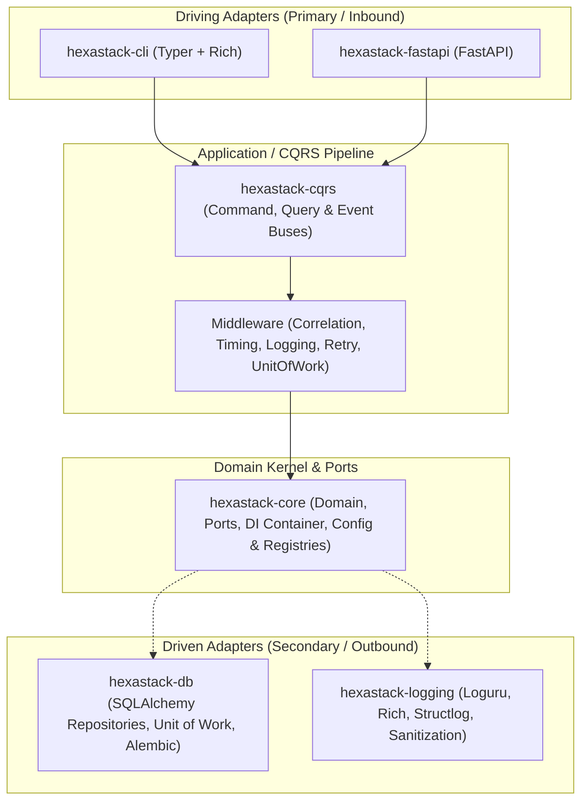
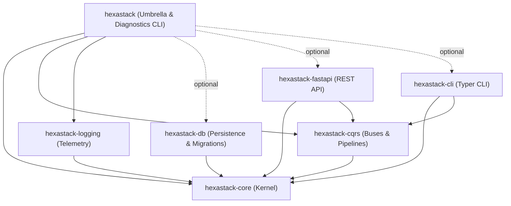

# Hexastack

> High-performance, modular Hexagonal Architecture & CQRS Framework for Python 3.13+.

[](https://www.python.org/downloads/)
[](https://github.com/astral-sh/ruff)
[](https://github.com/astral-sh/ty)

---

## 1. Architectural Philosophy

Hexastack is engineered around the principles of **Hexagonal Architecture (Ports and Adapters)** and **Command Query Responsibility Segregation (CQRS)** to build decoupled, maintainable, and highly testable Python systems.



### Core Tenets

1. **Dependency Inversion & Zero Framework Lock-In**:
   The domain and abstract ports in `hexastack-core` have zero third-party web or database framework dependencies. Core depends exclusively on `pydantic` (validation) and `rodi` (dependency injection). Frameworks (FastAPI, Typer, SQLAlchemy, Loguru, Huey) exist purely in the outer adapter layers.
2. **First-Class CQRS Segregation**:
   Mutating operations (Commands) and read-only operations (Queries) run on distinct pipelines. Commands traverse configurable middleware pipelines (telemetry, correlation ID propagation, retry policies, automatic transaction management) while Queries return optimized DTO projections.
3. **DI-Mediated Decoupling**:
   Packages interact through contracts in the DI container rather than tight, cross-package imports. For example, `hexastack-fastapi` provides session middleware by consuming a `sessionmaker` from DI without depending directly on `hexastack-db`.
4. **Three-Phase Deterministic Bootstrap**:
   Applications and extensions configure deterministically in 3 distinct phases:
   - **Phase 1: Config Registration** (`register_config`): Extensions register Pydantic configuration schemas under `[hexastack.<section>]`.
   - **Phase 2: Subsystem Assembly** (`configure`): Extensions configure runtime resources and register instances/factories into the DI container ordered by explicit priority (`order`).
   - **Phase 3: Reflective Module Scanning** (`scan_modules`): Single-pass reflective scanning discovers and binds handlers, routes, and CLI commands via declarative decorators.

---

## 2. Monorepo Package Catalog



| Package | Description | Standalone Install | Scoped Umbrella Extra |
|---|---|---|---|
| [`hexastack-core`](file:///home/rjdw/Projects/hexastack/packages/hexastack_core) | Core domain abstractions, ports, DI container (`rodi`), config and type registries, bootstrap engine | `pip install hexastack-core` | *(Included by default)* |
| [`hexastack-cqrs`](file:///home/rjdw/Projects/hexastack/packages/hexastack_cqrs) | Synchronous & asynchronous command, query, and event buses with extensible middleware pipelines | `pip install hexastack-cqrs` | *(Included by default)* |
| [`hexastack-logging`](file:///home/rjdw/Projects/hexastack/packages/hexastack_logging) | Structured JSON/console logging, PII sanitization, and Loguru / Rich / Structlog adapters | `pip install hexastack-logging` | *(Included by default)* |
| [`hexastack-db`](file:///home/rjdw/Projects/hexastack/packages/hexastack_db) | SQLAlchemy generic repositories, Unit of Work, declarative mixins, and Alembic migrations | `pip install hexastack-db` | `hexastack[db]` |
| [`hexastack-fastapi`](file:///home/rjdw/Projects/hexastack/packages/hexastack_fastapi) | FastAPI integration, automatic CQRS routing, exception handlers, and DB session middleware | `pip install hexastack-fastapi` | `hexastack[fastapi]` |
| [`hexastack-cli`](file:///home/rjdw/Projects/hexastack/packages/hexastack_cli) | CLI presentation layer with nested commands, command aliases, and Rich formatted output | `pip install hexastack-cli` | `hexastack[cli]` |
| [`hexastack`](file:///home/rjdw/Projects/hexastack/packages/hexastack) | Umbrella distribution package and diagnostic demo CLI application | `pip install hexastack` | `hexastack[all]` |

---

## 3. Standard Package Anatomy

Every package in the monorepo adheres to a standardized architectural layout:

```
packages/hexastack_<name>/
├── src/hexastack_<name>/
│   ├── domain/        # Pure domain models, value objects, exceptions (no I/O)
│   ├── ports/         # Abstract protocols / ABCs defining interface boundaries
│   ├── adapters/      # Concrete driver implementations (SQLAlchemy, FastAPI, Typer)
│   ├── infra/         # Bootstrappers, config schemas, middleware, registries, decorators
│   │   └── registries/# Specialized type, schema, and metadata registries
│   ├── application/   # (Optional) Built-in handlers, services, and diagnostic queries
│   └── __init__.py    # Explicit public API export surface
├── tests/
│   ├── unit/          # Fast, isolated unit test suite
│   └── hypothesis/    # Property-based invariant fuzzing (e.g. CRUD repository contracts)
├── pyproject.toml     # Packaging metadata, entry points, and scoped extras
└── README.md          # Package-specific documentation and relationship mapping
```

---

## 4. Installation & Scoped Extras

Hexastack can be installed as individual micro-packages or via the scoped `hexastack` umbrella package:

```bash
# Minimal installation (core + cqrs + logging)
pip install hexastack

# CLI application development
pip install "hexastack[cli]"

# Web API development with FastAPI & Uvicorn
pip install "hexastack[web]"

# Database integration with SQLite/Postgres & Alembic migrations
pip install "hexastack[db]"

# Complete ecosystem installation
pip install "hexastack[all]"
```

---

## 5. Quickstart Example

Create a complete application in just a few lines using CQRS and the unified bootstrap engine:

```python
from dataclasses import dataclass
from hexastack_core.infra.bootstrap import bootstrap
from hexastack_cqrs.domain.command import Command
from hexastack_cqrs.domain.query import Query
from hexastack_cqrs.infra.decorators import command_handler, query_handler
from hexastack_cqrs.ports.buses import CommandBusPort, QueryBusPort


# 1. Define Messages
@dataclass(frozen=True)
class RegisterUserCommand(Command):
    user_id: str
    email: str


@dataclass(frozen=True)
class GetUserQuery(Query):
    user_id: str


# 2. Define Handlers
@command_handler(RegisterUserCommand)
class RegisterUserHandler:
    def __call__(self, cmd: RegisterUserCommand) -> str:
        return f"User {cmd.user_id} registered ({cmd.email})"


@query_handler(GetUserQuery)
class GetUserHandler:
    def __call__(self, qry: GetUserQuery) -> dict:
        return {"id": qry.user_id, "status": "active"}


# 3. Bootstrap Application
runtime = bootstrap(packages_to_scan=[__name__])

cmd_bus = runtime.container.get(CommandBusPort)
query_bus = runtime.container.get(QueryBusPort)

print(
    cmd_bus.dispatch(RegisterUserCommand(user_id="u-123", email="user@hexastack.dev"))
)
print(query_bus.dispatch(GetUserQuery(user_id="u-123")))
```

---

## 6. Monorepo Development

```bash
# Install all dependencies with uv
uv sync --all-extras

# Run full test suite with Hypothesis property testing
uv run pytest

# Run linting and formatting checks
uv run ruff check .

# Run static type checking
uv run ty check
```
