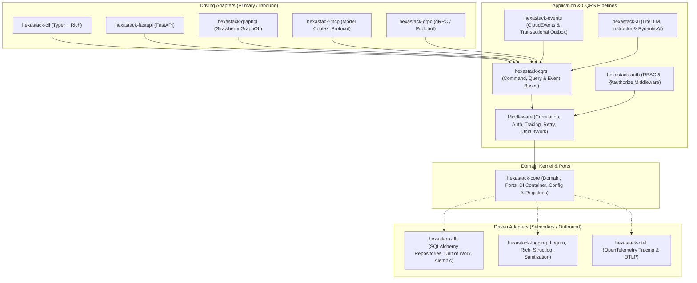
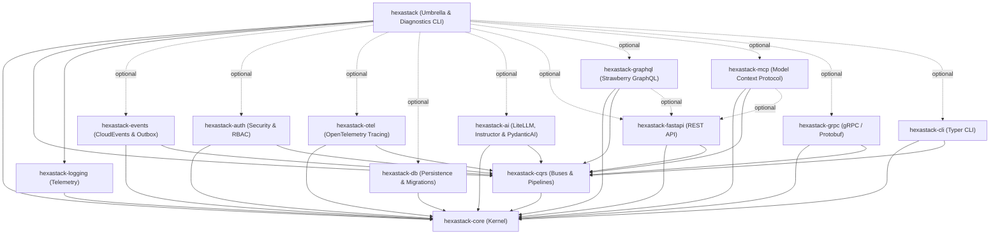
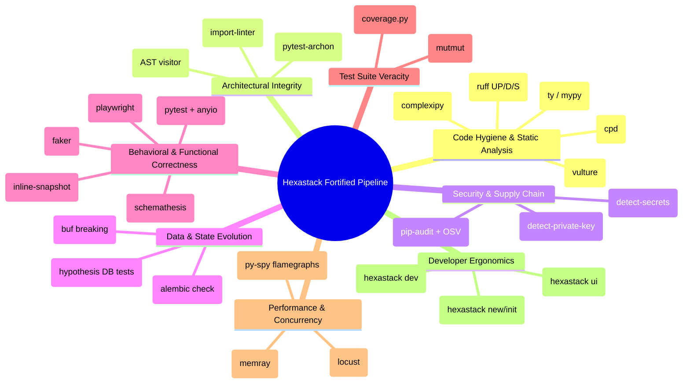
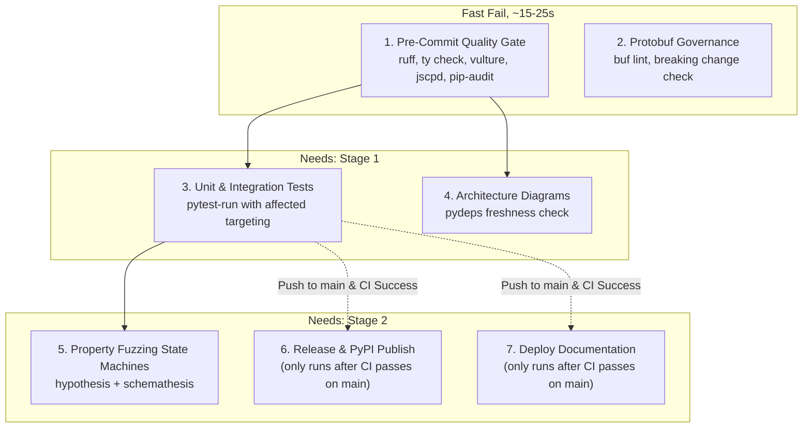
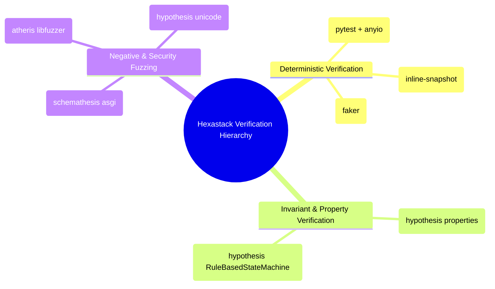

# Hexastack

> High-performance, modular Hexagonal Architecture & CQRS Framework for Python 3.13+.

[](https://github.com/TheTrueSCU/hexastack/actions/workflows/ci.yml)
[](https://codecov.io/github/TheTrueSCU/hexastack)
[](https://www.python.org/downloads/)
[](https://pypi.org/project/hexastack/)
[](https://www.w3.org/WAI/WCAG21/quickref/?levels=aa)
[](https://github.com/dequelabs/axe-core)
[](LICENSE)
[](https://github.com/astral-sh/ruff)
[](https://github.com/astral-sh/ty)
[](https://securityscorecards.dev/viewer/?uri=github.com/TheTrueSCU/hexastack)
[](https://www.bestpractices.dev/projects/14264)
[](https://www.bestpractices.dev/projects/14264)

---

## 1. Why Hexastack? (Engineering Rigor vs. "AI Slop")

In the era of AI-accelerated programming and vibe-coding, it is trivial to scaffold thousands of lines of code in minutes. Without structural discipline, unconstrained AI generation quickly devolves into **architectural rot**: monolithic files, tangled singletons, database models leaking into HTTP routes, and shallow tests that pass without actually asserting behavior.

Hexastack was designed from the ground up to **turn vibe-coding into an unfair superpower** by embedding automated, hardware-enforced guardrails that dictate the architecture for both humans and autonomous agents:

| Dimension | Typical "AI Slop" / Vibe-Coded Repos | What Hexastack Actually Has |
|---|---|---|
| **Architectural Boundaries** | Massive files, circular imports, domain models importing FastAPI `Request` or SQLAlchemy `Session`. | **Hardware-enforced by `import-linter` in pre-commit.** Domain code has **0** framework dependencies. If a domain entity imports Typer, FastAPI, or gRPC, the commit is physically blocked. |
| **Dependency Injection** | Global variables, singleton decorators with module-level state, tangled lifecycles. | **True dynamic DI with `rodi` & single-pass visitor scanning.** Bootstrapping is explicit, composable, and swappable in unit tests without monkey-patching. |
| **Test Parity & Veracity** | Mocks asserting that mocks were called; 90% "line coverage" with zero branch assertions; orphaned test suites. | **Tiered testing with 100% test symmetry (`check_test_parity.py`), `ty` static typing, Hypothesis property fuzzing, Schemathesis ASGI contract tests, and `mutmut` mutation kill audits.** |
| **Multi-Transport Parity** | Manual boilerplate, copy-pasting DTOs, running `protoc` with 14 flags manually. | **Write once, dispatch everywhere.** A single `@command_handler` or `@query_handler` serves FastAPI REST, Typer CLI, Claude/Gemini MCP tools, and binary gRPC over HTTP/2 simultaneously. |
| **Observability & Caching** | Scattered `print()` calls or manual span passing across async coroutines. | **Ambient Context Engine & Declarative Caching.** Correlation IDs and OpenTelemetry traces propagate ambiently; `@cached_query` provides zero-latency in-memory / Redis cache hits with tag-group invalidation. |
| **Supply Chain & Production Scaffolding** | Outdated Dockerfiles running as `root`, hardcoded API keys. | **Golden-Path Scaffolding (`hexastack new/init`).** Emits multi-stage `uv` Dockerfiles, rootless execution (`appuser:10001`), `detect-secrets`, and `pip-audit` OSV vulnerability scanning out of the box. |

---

## 2. Architectural Philosophy

Hexastack is engineered around the principles of **Hexagonal Architecture (Ports and Adapters)** and **Command Query Responsibility Segregation (CQRS)** to build decoupled, maintainable, and highly testable Python systems.



### Core Tenets

1. **Dependency Inversion & Zero Framework Lock-In**:
   The domain and abstract ports in `hexastack-core` have zero third-party web or database framework dependencies. Core depends exclusively on `pydantic` (validation) and `rodi` (dependency injection). Frameworks (FastAPI, Typer, SQLAlchemy, Strawberry, Anthropic MCP, gRPC, Loguru, Huey) exist purely in the outer adapter layers.
2. **First-Class CQRS Segregation**:
   Mutating operations (Commands) and read-only operations (Queries) run on distinct pipelines. Commands traverse configurable middleware pipelines (telemetry, correlation ID propagation, retry policies, automatic transaction management) while Queries return optimized DTO projections.
3. **Multi-Tier Feature Flagging**:
   Standardized `FeatureFlagPort` and `EvaluationContext` with targeting for multi-tenancy, ambient `UserContext`, and dynamic runtime middleware/route toggling (`@feature_flag`, `require_feature`, `@feature_flag_route`, `@feature_flag_command`, `@feature_flag_field`).
4. **DI-Mediated Decoupling**:
   Packages interact through contracts in the DI container rather than tight, cross-package imports. For example, `hexastack-fastapi` provides session middleware by consuming a `sessionmaker` from DI without depending directly on `hexastack-db`.
5. **Three-Phase Deterministic Bootstrap**:
   Applications and extensions configure deterministically in 3 distinct phases:
   - **Phase 1: Config Registration** (`register_config`): Extensions register Pydantic configuration schemas under `[hexastack.<section>]`.
   - **Phase 2: Subsystem Assembly** (`configure`): Extensions configure runtime resources and register instances/factories into the DI container ordered by explicit priority (`order`).
   - **Phase 3: Reflective Module Scanning** (`scan_modules`): Single-pass reflective scanning discovers and binds handlers, routes, CLI commands, and MCP tools via declarative decorators.

---

## 2. Monorepo Package Catalog



| Package | Description | Standalone Install | Scoped Umbrella Extra |
|---|---|---|---|
| [`hexastack`](file:///home/rjdw/Projects/hexastack/packages/hexastack) | Umbrella distribution package and diagnostic demo CLI application | `pip install hexastack` | `hexastack[all]` |
| [`hexastack-ai`](file:///home/rjdw/Projects/hexastack/packages/hexastack_ai) | Agnostic AI engine (LiteLLM, Instructor, PydanticAI) and CQRS agent tool reflection | `pip install hexastack-ai` | `hexastack[ai]` |
| [`hexastack-auth`](file:///home/rjdw/Projects/hexastack/packages/hexastack_auth) | Security, RBAC, JWT tokens, PBKDF2 password hashing, and `@authorize` CQRS pipeline middleware | `pip install hexastack-auth` | `hexastack[auth]` |
| [`hexastack-cli`](file:///home/rjdw/Projects/hexastack/packages/hexastack_cli) | CLI presentation layer with nested commands, command aliases, and Rich formatted output | `pip install hexastack-cli` | `hexastack[cli]` |
| [`hexastack-core`](file:///home/rjdw/Projects/hexastack/packages/hexastack_core) | Core domain abstractions, ports, DI container (`rodi`), feature flags, testing & property fuzzing toolkit (`pytest-archon`, `hypothesis`), bootstrap engine | `pip install hexastack-core` | *(Included by default)* |
| [`hexastack-cqrs`](file:///home/rjdw/Projects/hexastack/packages/hexastack_cqrs) | Synchronous & asynchronous command, query, and event buses with extensible middleware pipelines | `pip install hexastack-cqrs` | *(Included by default)* |
| [`hexastack-db`](file:///home/rjdw/Projects/hexastack/packages/hexastack_db) | SQLAlchemy generic repositories, Unit of Work, declarative mixins, pgvector, and Alembic migrations | `pip install hexastack-db` | `hexastack[db]` |
| [`hexastack-events`](file:///home/rjdw/Projects/hexastack/packages/hexastack_events) | CloudEvents 1.0 serialization, Transactional Outbox engine (Asyncio/Huey), distributed event buses | `pip install hexastack-events` | `hexastack[events]` |
| [`hexastack-fastapi`](file:///home/rjdw/Projects/hexastack/packages/hexastack_fastapi) | FastAPI integration, automatic CQRS routing, exception handlers, and DB session middleware | `pip install hexastack-fastapi` | `hexastack[fastapi]` |
| [`hexastack-flags`](file:///home/rjdw/Projects/hexastack/packages/hexastack_flags) | CNCF OpenFeature provider adapters (Flagd, In-Memory, Env) and enterprise feature toggling | `pip install hexastack-flags` | `hexastack[flags]` |
| [`hexastack-graphql`](file:///home/rjdw/Projects/hexastack/packages/hexastack_graphql) | Strawberry GraphQL adapter, CQRS context injection, schema registry, and FastAPI router | `pip install hexastack-graphql[fastapi]` | `hexastack[graphql]` |
| [`hexastack-grpc`](file:///home/rjdw/Projects/hexastack/packages/hexastack_grpc) | High-performance gRPC presentation adapter, interceptors (correlation, logging, timing) | `pip install hexastack-grpc[reflection]` | `hexastack[grpc]` |
| [`hexastack-logging`](file:///home/rjdw/Projects/hexastack/packages/hexastack_logging) | Structured JSON/console logging, PII sanitization, and Loguru / Rich / Structlog adapters | `pip install hexastack-logging` | *(Included by default)* |
| [`hexastack-mcp`](file:///home/rjdw/Projects/hexastack/packages/hexastack_mcp) | Model Context Protocol adapter, AI agent CQRS tools, resources, prompts, and SSE transport | `pip install hexastack-mcp[fastapi]` | `hexastack[mcp]` |
| [`hexastack-otel`](file:///home/rjdw/Projects/hexastack/packages/hexastack_otel) | OpenTelemetry distributed tracing, OTLP gRPC/HTTP export, and CQRS telemetry middleware | `pip install hexastack-otel` | `hexastack[otel]` |


---

## 3. Standard Package Anatomy

Every package in the monorepo adheres to a standardized architectural layout:

```
packages/hexastack_<name>/
├── pyproject.toml      # Packaging metadata, entry points, and scoped extras
├── README.md           # Package-specific documentation and relationship mapping
├── src/hexastack_<name>/
│   ├── __init__.py     # Explicit public API export surface
│   ├── adapters/       # Concrete driver implementations (SQLAlchemy, FastAPI, Typer)
│   ├── application/    # (Optional) Built-in handlers, services, and diagnostic queries
│   ├── domain/         # Pure domain models, value objects, exceptions (no I/O)
│   ├── infra/          # Bootstrappers, config schemas, middleware, registries, decorators
│   │   └── registries/ # Specialized type, schema, and metadata registries
│   └── ports/          # Abstract protocols / ABCs defining interface boundaries
└── tests/
    ├── architecture/   # pytest-archon test(s) to enforce architectual boundaries
    ├── properties/     # Property-based invariant fuzzing (e.g. CRUD repository contracts)
    └── unit/           # Fast, isolated unit test suite
```

---

## 4. Installation & Scoped Extras

Hexastack can be installed as individual micro-packages or via the scoped `hexastack` umbrella package:

```bash
# Minimal installation (core + cqrs + logging)
pip install hexastack

# Testing toolkit (Archon boundary checks, Hypothesis fuzzing, Schemathesis)
pip install "hexastack[testing]"

# CNCF OpenFeature flags (Flagd, Unleash, Flipt)
pip install "hexastack[flags]"

# CLI application development
pip install "hexastack[cli]"

# Web API development with FastAPI & Uvicorn
pip install "hexastack[web]"

# Database integration with SQLite/Postgres & Alembic migrations
pip install "hexastack[db]"

# Complete ecosystem installation
pip install "hexastack[all]"
```

---

## 5. Quickstart Example

Create a complete application in just a few lines using CQRS and the unified bootstrap engine:

```python
from dataclasses import dataclass
from hexastack_core.infra.bootstrap import bootstrap
from hexastack_cqrs.domain.command import Command
from hexastack_cqrs.domain.query import Query
from hexastack_cqrs.infra.decorators import command_handler, query_handler
from hexastack_cqrs.ports.buses import CommandBusPort, QueryBusPort


# 1. Define Messages
@dataclass(frozen=True)
class RegisterUserCommand(Command):
    user_id: str
    email: str


@dataclass(frozen=True)
class GetUserQuery(Query):
    user_id: str


# 2. Define Handlers
@command_handler(RegisterUserCommand)
class RegisterUserHandler:
    def __call__(self, cmd: RegisterUserCommand) -> str:
        return f"User {cmd.user_id} registered ({cmd.email})"


@query_handler(GetUserQuery)
class GetUserHandler:
    def __call__(self, qry: GetUserQuery) -> dict:
        return {"id": qry.user_id, "status": "active"}


# 3. Bootstrap Application
runtime = bootstrap(packages_to_scan=[__name__])

cmd_bus = runtime.container.get(CommandBusPort)
query_bus = runtime.container.get(QueryBusPort)

print(
    cmd_bus.dispatch(RegisterUserCommand(user_id="u-123", email="user@hexastack.dev"))
)
print(query_bus.dispatch(GetUserQuery(user_id="u-123")))
```

---

## 6. 360° Quality & Rigor Matrix

Hexastack maintains a comprehensive quality hierarchy to ensure any project—whether handwritten or "vibe-coded" with AI—starts from a foundation of uncompromising rigor:

| Capability / Inspection | Engine / Tool | Pre-Commit | CI Gate | Provided / Scaffolded for Users |
| :--- | :--- | :---: | :---: | :--- |
| **Architecture-as-Code Invariants** | `pytest-archon` | — | ✅ | Abstract port checks & domain purity rules |
| **Cognitive Complexity Guard** | `complexipy` | ✅ | ✅ | Scaffolded in `[tool.complexipy]` (max 25 score cap) |
| **CPU Flamegraph Profiling** | `py-spy` | — | — | CLI command: `hexastack profile cpu --pid <PID>` |
| **Database Schema Drift Check** | `alembic check` | ✅ | ✅ | CLI command: `hexastack db check` |
| **Dead Code Elimination** | `vulture` | ✅ | ✅ | Scaffolded in `pyproject.toml` + `.pre-commit-config.yaml` |
| **Dependency Vulnerability Audit** | `pip-audit` | ✅ | ✅ | Scaffolded `pip-audit --local` pre-commit gate |
| **Duplicate Code Detection** | `cpd` / `jscpd` | ✅ | ✅ | Monorepo CI check + golden standards |
| **End-to-End Browser & UI Testing** | `playwright` | — | ✅ | Pre-configured headless browser & axe-core fixtures |
| **Golden Master Output Assertion** | `inline-snapshot` | — | ✅ | Diagnostic & JSON payload snapshot testing |
| **Hexagonal Boundary Enforcement** | `import-linter` | ✅ | ✅ | Auto-generated `.importlinter` contract rules |
| **Lint & Idiomatic Code Style** | `ruff` (UP/D/S/B/SIM) | ✅ | ✅ | Scaffolded in `pyproject.toml` + `.pre-commit-config.yaml` |
| **Load & Concurrency Benchmarking** | `locust` | — | — | CLI command: `hexastack load` + default `locustfile.py` |
| **Memory Allocation Flamegraph** | `memray` | — | — | CLI command: `hexastack profile memory --bin <FILE>` |
| **Mutation Testing** | `mutmut` | — | — | `scripts/run_mutation_tests.py` suite |
| **Negative API Contract Fuzzing** | `schemathesis` | — | ✅ | OpenAPI negative payload fuzzing integration |
| **Property-Based Invariant Fuzzing** | `hypothesis` | — | ✅ | Scaffolded sample in `tests/hypothesis/` |
| **Protobuf Linting & Breaking Changes** | `buf` | — | ✅ | Scaffolded `buf.yaml` + CLI: `hexastack grpc lint/breaking` |
| **Public API Surface Integrity** | AST Visitor | ✅ | ✅ | `scripts/pre_commit/all_statements.py` (`check-all-statements`) |
| **Realistic Synthetic Test Data** | `faker` | — | ✅ | Pre-configured `faker` pytest fixture support |
| **Secret & Key Leak Prevention** | `detect-secrets` | ✅ | ✅ | Automated `.secrets.baseline` in pre-commit |
| **Statement & Branch Coverage** | `coverage.py` | — | ✅ | Pre-configured `fail_under = 90` threshold |
| **Strict Static Type Checking** | `ty` / `mypy` | ✅ | ✅ | Pre-configured in scaffolded `[dependency-groups]` |
| **Unit & Transport Integration** | `pytest` + `anyio` | — | ✅ | Golden-path test fixtures in `tests/conftest.py` |



---

## 7. Monorepo Development & Quality Gates

### Fast Quality Checks & Linters

```bash
# Install all dependencies with uv
uv sync --all-extras

# Run full pre-commit pipeline (23 hooks across Ruff, Ty, Vulture, Detect-Secrets, Import-Linter)
uv run pre-commit run --all-files

# Run full test suite with statement coverage (>90% gate)
uv run pytest

# Run static type checking with Ty
uv run ty check packages

# Validate hexagonal architecture import boundaries
uv run import-linter-run
```

### Mutation Testing (`mutmut`)

Hexastack uses `mutmut` to ensure high test efficacy and verify that tests fail when code is mutated.

#### 1. Mutation Test Runner (`scripts/run_mutation_tests.py`)

Run mutations across a specific subsystem or the whole monorepo:

```bash
# Run mutation tests against a specific package (e.g. db, auth, cqrs, core)
uv run python scripts/run_mutation_tests.py --package db
uv run python scripts/run_mutation_tests.py --package auth

# Run mutation tests against all packages sequentially
uv run python scripts/run_mutation_tests.py --all

# Inspect the diff of a specific surviving mutant by ID
uv run python scripts/run_mutation_tests.py --show 42
```

#### 2. Mutation Cache Inspector (`scripts/inspect_mutants.py`)

Analyze `.mutmut-cache` to identify remaining surviving mutants, hotspot files, and line-level details:

```bash
# Display high-level survivor counts grouped by package and top files
uv run python scripts/inspect_mutants.py --summary

# Inspect surviving mutants in a specific package
uv run python scripts/inspect_mutants.py --package db --limit 25

# Inspect surviving mutants matching a specific filename
uv run python scripts/inspect_mutants.py --file engine.py
```

### Selective Testing & Impact-Driven Test Runner (`pytest-run`)

Hexastack features a direct, in-process workspace test runner (`scripts.pytest.run:main`) backed by an automated dependency DAG resolver:

```bash
# Run 100% full workspace unit & integration test suite
uv run pytest-run

# Run tests ONLY for packages affected by current git changeset (and their downstream dependents)
uv run pytest-run -A

# Target specific packages directly
uv run pytest-run -p fastapi -p core

# Run only deep property-based state machine fuzzing suites
uv run pytest-run -P

# List impacted packages and target test directories without running pytest
uv run pytest-run -A --list
```

### Staged Fail-Fast CI Pipeline

The GitHub Actions workflow is orchestrated across 3 dependent fail-fast stages to optimize developer feedback speed and prevent broken releases:



### Deep Testing & Invariant Verification

Hexastack enforces testing rigor across 5 complementary verification layers:



| Engine | Primary Scope | Core Value |
| :--- | :--- | :--- |
| **`hypothesis`** | Algebraic properties & state machines | Proves outbox zero-loss & domain invariants under arbitrary concurrency. |
| **`schemathesis`** | ASGI API contract fuzzing | Guarantees zero unhandled 500 server crashes on malformed HTTP inputs. |
| **`inline-snapshot`** | JSON & SDL contract locks | Instant, immutable golden-master contract assertions. |
| **`faker`** | Synthetic test data generation | Eliminates hardcoded magic strings and fragile test coupling. |
| **`atheris`** | Coverage-guided binary fuzzing | Verifies 100% ReDoS immunity in PII sanitizers and regex engines. |
