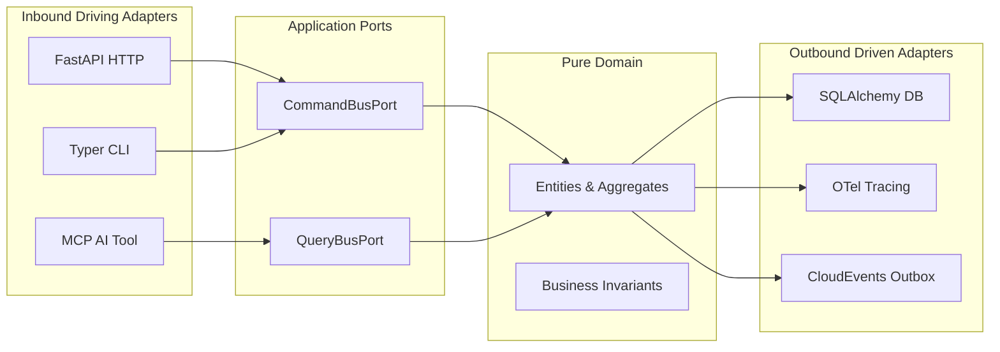

# Monorepo Architecture & Principles

> Hexastack enforces clean, decoupled hexagonal architectures (Ports & Adapters) through automated linting contracts and strict verification layers.

---

## 1. The Hexagonal Golden Rules

1. **Pure Domain Center**:
   - The domain layer contains zero dependencies on databases, ORMs, HTTP frameworks, or external infrastructure.
   - All domain errors subclass `HexastackError`.
2. **Ports as Inversion Boundaries**:
   - `Driving Ports` (inbound) expose application interfaces (e.g. `CommandBusPort`, `QueryBusPort`).
   - `Driven Ports` (outbound) define infrastructure contracts (e.g. `RepositoryPort`, `LoggerPort`, `OutboxPort`).
3. **Adapters Implement Ports**:
   - Adapters translate between external protocols (FastAPI, Typer CLI, gRPC, LiteLLM) and internal domain/port models.

---

## 2. Monorepo Quality Gates & Enforcement

- **`import-linter`**: Enforces strict unidirectional dependencies across packages and layers.
- **`complexipy`**: Cognitive complexity limit per function ($\le 15$).
- **`ty check`**: Strict type checking with no untyped definitions.
- **`hypothesis`**: Property-based fuzzing on core pipelines and routing algorithms.
- **`mutmut`**: Mutation testing ensuring resilient assertions.
