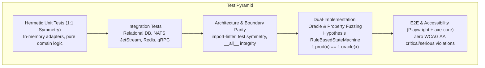
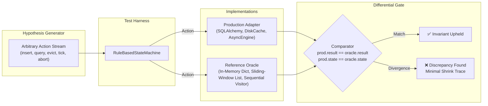

# Testing & Dual-Implementation Oracle Rigor

> **Mathematical Correctness via Hexagonal Symmetry**: In enterprise systems, high test line coverage ($\ge 90\%$) is a necessary baseline, but it does not prove that an optimized, concurrent, or database-backed implementation behaves identically to its specification across arbitrary sequences of operations. Hexastack combines the Hexagonal Testing Pyramid with **Stateful Dual-Implementation Oracle Testing** powered by [Hypothesis](https://hypothesis.readthedocs.io/).

---

## 1. The Hexastack Testing Pyramid

Hexastack enforces a multi-tiered verification pipeline designed to catch regressions at the earliest possible lifecycle stage:



1. **Hermetic Unit Tests**:
   - 1:1 symmetry between every `src/<pkg>/<path>.py` file and `tests/unit/<path>/test_<name>.py`.
   - Pure domain invariants and ports tested against in-memory doubles without network or filesystem side effects.
2. **Integration Tests**:
   - Concrete infrastructure adapters (SQLite, PostgreSQL, Redis, NATS, FastAPI HTTP endpoints).
3. **Architectural & Boundary Verification**:
   - Strict hexagonal isolation enforced via `import-linter` (`domain/` cannot import `adapters/` or `infra/`; `adapters/` cannot import `infra/`).
   - Symmetrical test parity and sorted `__all__` integrity verified by `hexaqual parity`.
4. **Dual-Implementation Oracle Testing (Stateful Fuzzing)**:
   - Optimized, distributed, or persistent adapters are cross-evaluated against naive in-memory or mathematical reference implementations under interleaved random action sequences.
5. **E2E & Accessibility Audits**:
   - Full browser execution via Playwright, validating UI rendering, interactive state machines, and zero WCAG 2.1 AA accessibility violations with `axe-core`.

---

## 2. What is Dual-Implementation (Oracle) Testing?

In property-based testing, tests fall into three primary taxonomies:

| Taxonomy | Mathematical Invariant | Purpose | Example |
|---|---|---|---|
| **Round-Trip** | $f^{-1}(f(x)) == x$ | Serialization & persistence integrity | JSON / CloudEvent encoder-decoder |
| **Invariant** | $P(f(x)) == \text{True}$ | Fundamental domain invariants | Conservation of money across ledger entries |
| **Oracle (Differential)** | $f_{\text{prod}}(x) == f_{\text{oracle}}(x)$ | Algorithmic and state equivalence | Production SQL repository vs In-memory dictionary |

Because Hexastack adheres strictly to **Hexagonal Architecture**—where every primary port defines a pure, in-memory reference implementation alongside concrete production adapters—the codebase is positioned to implement dual-implementation testing with zero architectural friction.



---

## 3. Production Oracle Implementations in the Ecosystem

The workspace maintains five dedicated oracle suites covering key infrastructure components:

### Phase 1: Repository Differential Oracle (`hexastack-db`)
- **Suite**: `packages/hexastack_db/tests/properties/test_repository_oracle.py`
- **Target**: `SqlAlchemyRepository[T, K]` vs `InMemoryRepository[T, K]`
- **Invariants Tested**:
  - CRUD operation equivalence across arbitrary key/value schemas.
  - Slicing and pagination parity (`limit`, `offset`).
  - Filter criteria matching and batch count consistency.

### Phase 2: Rate Limiter Oracle (`hexastack-core`)
- **Suite**: `packages/hexastack_core/tests/properties/test_ratelimit_oracle.py`
- **Target**: `InMemoryRateLimiter` vs `NaiveSlidingWindowOracle`
- **Invariants Tested**:
  - Sliding-window eviction cutoff accuracy (`t > now - window`).
  - Admission and denial decisions across erratic, bursty timestamp sequences.
  - Recovery window reset boundaries using injected `ClockPort`.

### Phase 3: Cache Storage & Eviction Oracle (`hexastack-core`)
- **Suite**: `packages/hexastack_core/tests/properties/test_cache_oracle.py`
- **Target**: `DiskCacheAdapter` vs `InMemoryCache` vs `NaiveDictCacheOracle`
- **Invariants Tested**:
  - Cache hit and miss parity across arbitrary key sets.
  - Key eviction on capacity overflow.
  - TTL expiration semantics (`now > expires_at`).
  - `get_or_set` atomicity and delete idempotency.

### Phase 4: Outbox State Machine Oracle (`hexastack-events`)
- **Suite**: `packages/hexastack_events/tests/properties/test_outbox_oracle.py`
- **Target**: `SqlAlchemyOutboxStorage` vs `InMemoryOutboxStorage`
- **Invariants Tested**:
  - Strict FIFO retrieval ordering under batch concurrency limits.
  - State machine transitions (`PENDING` $\rightarrow$ `PROCESSING` $\rightarrow$ `PUBLISHED` / `FAILED`).
  - Retry counter increment isolation and max retry threshold enforcement.

### Phase 5: DAG Execution & Compensation Unwinding Oracle (`hexaflow`)
- **Suite**: `packages/hexaflow/tests/properties/test_dag_oracle.py`
- **Target**: `AsyncioWorkflowEngine` vs `NaiveSequentialDAGOracle`
- **Invariants Tested**:
  - Concurrent multi-stage async DAG evaluation producing identical outputs to sequential topological execution.
  - Failure suspension and exact reverse topological compensation unwinding (Saga pattern).
  - Checkpointed resumption idempotency: steps completed prior to failure are strictly skipped on resume.

---

## 4. Authoring Guidelines for Oracle Tests

When introducing new production adapters or extending existing ones, follow these invariants:

### Rule 1: Injectable Clocks for Deterministic Time Fuzzing
Never use `time.time()` or `asyncio.sleep()` inside adapters under test. Always inject a `ClockPort` (defaulting to system clock) so that state machines can advance simulated time deterministically:

```python
class ClockPort(ABC):
    @abstractmethod
    def now(self) -> datetime:
        """Return the current timestamp."""
```

### Rule 2: Side-Effect Free Assertions
Assign method call outcomes to local variables prior to evaluating `assert` statements to prevent CodeQL *"assert statement with side-effect"* alerts:

```python
# ❌ Anti-pattern (triggers CodeQL alert):
assert cache.delete(key) is True

# ✅ Hexastack standard:
deleted = cache.delete(key)
assert deleted is True
```

### Rule 3: Keep Reference Oracles Naive and Obvious
The reference oracle should be trivially simple (e.g. pure Python `list` or `dict`, brute-force linear search). Do not optimize the oracle; its value lies in being obviously correct by inspection.

---

## 5. Developer Commands (Hexaqual Suite)

Execute testing workflows using the `hexaqual test` toolsuite:

```bash
# Run unit tests across all workspace packages
uv run hexaqual test run -U

# Run all property-based and state machine oracle tests
uv run hexaqual test run -P --no-cov

# Run property tests for a specific package
uv run pytest packages/hexastack_core/tests/properties/ -v

# Run fast scoped quality check (lint, types, complexity, test symmetry, pytest)
uv run hexaqual sanity -p hexastack-core

# Full workspace pre-commit quality gate
uv run hexaqual sanity -a --skip-tests
```
