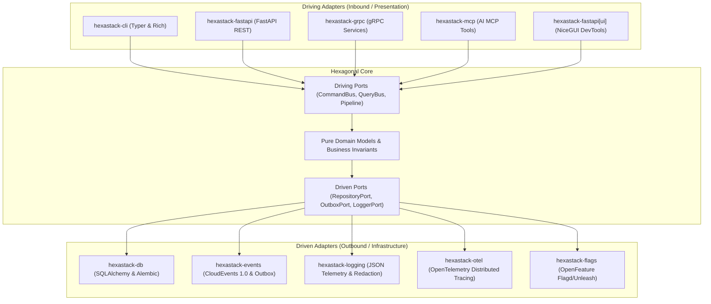

# Hexastack

> **Production-grade Hexagonal Architecture (Ports & Adapters) monorepo framework for Python 3.13+.**

[](https://www.python.org/downloads/)
[](architecture.md)

---

## 🌟 Why Hexastack?

Modern backend microservices often suffer from leaky abstractions, tightly coupled ORMs, fragmented logging, and brittle presentation layers. **Hexastack** solves this by establishing strict architectural boundaries backed by automated conformance tests and tiered CI gates:



---

## 🚀 Instant Scaffolding

Generate a standardized, production-ready hexagonal microservice with zero local dependencies using `uvx`:

```bash
# REST Web API service with FastAPI and SQLite
uvx hexastack new web-api billing-service --db sqlite

# Event-driven streaming microservice with CloudEvents & Transactional Outbox
uvx hexastack new event-driven order-service

# Model Context Protocol (MCP) server & AI tools
uvx hexastack new mcp-agent agent-service

# Minimal CLI or background worker
uvx hexastack new minimal worker-service
```

---

## 📚 Explore Documentation

- [**Feature Demos & Interactive Walkthroughs**](demos.md): Watch recorded demonstrations of the Scaffolding CLI and DevTools Console.
- [**Tutorial: Building a Complete Todo Service**](tutorials/01-building-a-todo-service.md): Step-by-step guide from zero to production.
- [**Architecture & Invariants**](architecture.md): Deep dive into strict package boundaries, tiered CI, and hexagonal rules.
- [**Monorepo Packages Catalog**](packages.md): Complete index of all 13 specialized packages in the monorepo.
