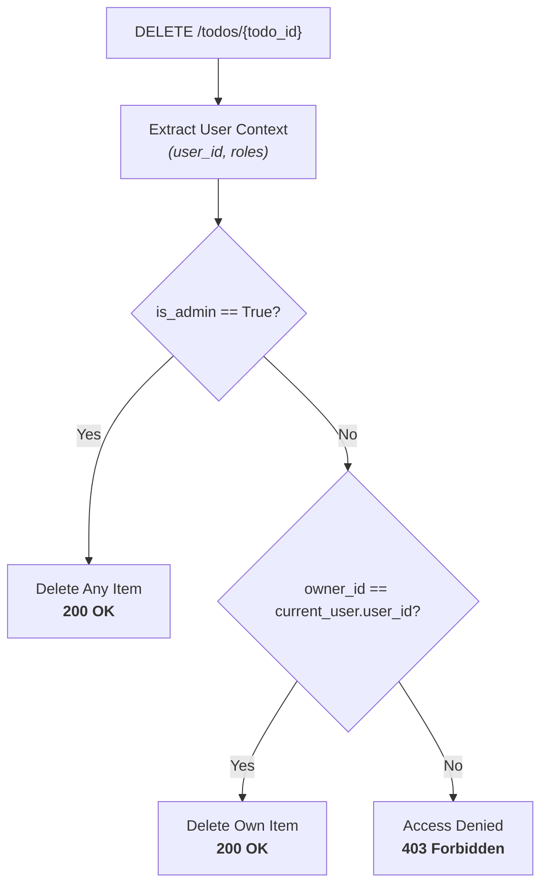

# Tutorial 3: JWT Authentication & Role-Based Access Control (RBAC)

In this chapter, you will secure the To-Do microservice by enforcing **Task Ownership** and **Role-Based Access Control (RBAC)**, answering the critical security question:

> *"What stops Bob from deleting Alice's tasks, or modifying data he doesn't own?"*

---

## 1. The Ownership & RBAC Security Model

We enforce two distinct security tiers:
1. **Regular Users (`role="user"`)**:
   - Can create and view their own To-Do items.
   - Can **only delete items they own** (`item.owner_id == current_user.user_id`).
   - Attempting to delete another user's item raises `HTTP 403 Forbidden`.
2. **Administrators (`role="admin"`)**:
   - Possess elevated privileges to inspect and delete **any** user's To-Do item.



---

## 2. Enforcing Ownership in HTTP Driving Adapter

Update `src/todo_app/adapters/driving/http.py`:

```python
"""FastAPI HTTP driving adapters exposing CQRS commands with RBAC protection."""

from typing import Annotated
from fastapi import Depends, Header, HTTPException, status
from hexastack_fastapi.adapters.dependencies import get_pipeline
from hexastack_fastapi.adapters.routing import CqrsRouter
from hexastack_core.utils.context import UserContext, set_user_context
from hexastack_cqrs.infra.pipeline import ExecutionPipeline

from todo_app.domain.commands import (
    CompleteTodoCommand,
    CreateTodoCommand,
    DeleteTodoCommand,
    GetTodoQuery,
    ListTodosQuery,
    TodoItemDTO,
)

router = CqrsRouter(tags=["todos"])


def get_current_user(
    authorization: Annotated[str | None, Header()] = None,
) -> UserContext:
    """Extract authenticated user context from Bearer token."""
    if authorization and authorization.startswith("Bearer "):
        token = authorization.removeprefix("Bearer ").strip()
        if ":" in token:
            role, user_id = token.split(":", 1)
            ctx = UserContext(user_id=user_id, roles=[role])
            set_user_context(ctx)
            return ctx
        ctx = UserContext(user_id=token, roles=["user"])
        set_user_context(ctx)
        return ctx

    # Default fallback context for development
    ctx = UserContext(user_id="alice", roles=["user"])
    set_user_context(ctx)
    return ctx


@router.post("/todos", status_code=201, summary="Create a new To-Do task")
def create_todo(
    cmd: CreateTodoCommand,
    pipeline: Annotated[ExecutionPipeline, Depends(get_pipeline)],
    user: Annotated[UserContext, Depends(get_current_user)],
) -> TodoItemDTO:
    if not cmd.owner_id or cmd.owner_id == "alice":
        cmd = CreateTodoCommand(
            title=cmd.title,
            owner_id=user.user_id,
            description=cmd.description,
            priority=cmd.priority,
        )
    return pipeline.execute(cmd)


@router.delete("/todos/{todo_id}", summary="Delete a To-Do task")
def delete_todo(
    todo_id: str,
    pipeline: Annotated[ExecutionPipeline, Depends(get_pipeline)],
    user: Annotated[UserContext, Depends(get_current_user)],
) -> dict[str, bool]:
    # 1. Fetch item to verify ownership
    query = GetTodoQuery(todo_id=todo_id)
    dto: TodoItemDTO = pipeline.execute(query)

    # 2. Reject if caller is not an admin and does not own the task
    if "admin" not in user.roles and dto.owner_id != user.user_id:
        raise HTTPException(
            status_code=status.HTTP_403_FORBIDDEN,
            detail=f"Forbidden: '{user.user_id}' cannot delete task owned by '{dto.owner_id}'.",
        )

    # 3. Execute deletion
    cmd = DeleteTodoCommand(todo_id=todo_id)
    pipeline.execute(cmd)
    return {"deleted": True}
```

---

## 3. Dedicated Scoped Entrypoint (`ch03_secure.py`)

Create `src/todo_app/entrypoints/ch03_secure.py`:

```python
"""Chapter 3 Entrypoint: Secure To-Do Service with JWT Auth & RBAC."""

import uvicorn
from fastapi import FastAPI
from hexastack_core.infra.bootstrap import bootstrap
import todo_app.infra.handlers
from todo_app.adapters.driven.sqlite import (
    SqliteTodoRepository,
    create_sqlite_session_factory,
)
from todo_app.adapters.driving.http import router
from todo_app.ports.repositories import TodoRepositoryPort


def build_app(db_url: str = "sqlite:///todos_ch03.db") -> FastAPI:
    session_factory = create_sqlite_session_factory(db_url=db_url)
    repo = SqliteTodoRepository(session_factory=session_factory)
    res = bootstrap(packages_to_scan=[todo_app.infra.handlers])
    res.container.add_instance(repo, declared_class=TodoRepositoryPort)
    app = res.container.resolve(FastAPI)
    app.include_router(router)
    return app


app = build_app()

if __name__ == "__main__":
    uvicorn.run(app, host="127.0.0.1", port=8000)
```

---

## 4. Scaffolding & Terminal Experience

Watch the CLI setup for a secured microservice:

<video controls autoplay loop muted playsinline width="100%" style="border-radius: 8px; margin: 16px 0; box-shadow: 0 10px 30px rgba(0,0,0,0.4);">
  <source src="../assets/demos/todo-ch03-cli-demo.webm" type="video/webm">
  <track label="English" kind="subtitles" srclang="en" src="../assets/demos/todo-ch03-cli-demo.vtt" default>
</video>

---

## 5. Verification: RBAC & Swagger UI

Launch the application to verify role-based security in the Swagger UI:

```bash
uv run hexastack serve --port 8000
```

1. Click **Authorize** in Swagger UI (`http://127.0.0.1:8000/docs`).
2. Pass `Bearer user` to create and view your own items.
3. Pass `Bearer admin` to execute administrative deletions across all user items.

---

## 6. Next Steps: The Event Dilemma

Now our system is secure: Bob cannot touch Alice's items, and administrators can maintain the database.

> *"When an administrator deletes another user's task, how can we automatically notify the user or log an audit alert without coupling our handlers directly to third-party messaging services?"*

In Chapter 4, we introduce the **Transactional Outbox Pattern**, **CloudEvents**, and our new **`NotificationPort` (Apprise)**:

- **[Tutorial 4: Event-Driven Architecture with Outbox & CloudEvents](./04-events-outbox-and-notifications.md)**
