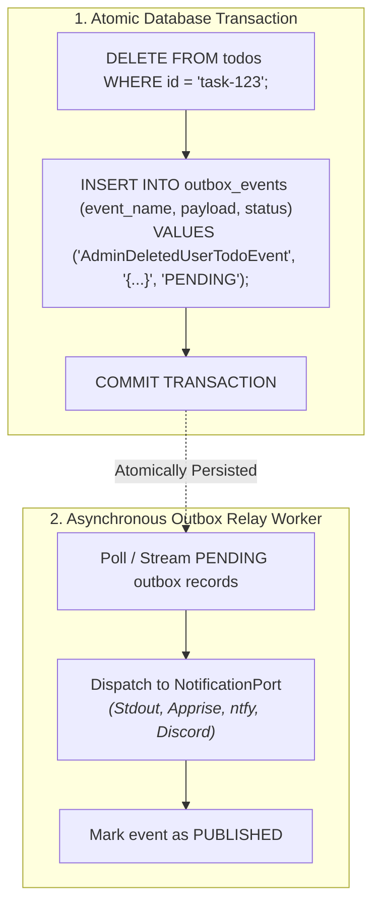

# Tutorial 4: Event-Driven Architecture with Outbox & CloudEvents

In this chapter, you will implement **Event-Driven Architecture** and the **Transactional Outbox Pattern** to reliably publish domain events and dispatch notifications whenever critical actions occur (such as an Administrator deleting another user's task).

> *"When an administrator deletes another user's task, how can we reliably notify the user and maintain an audit log without coupling our domain handlers directly to external network services?"*

---

## 1. The Dual-Write Problem & Transactional Outbox

When a domain command executes, writing changes to the database and sending a network request to a notification service (Slack, Discord, ntfy.sh) in the same handler creates a **Dual-Write vulnerability**:
- If the database commit succeeds but the notification service times out, events are lost.
- If the notification is sent but the database rollback occurs, phantom notifications are sent.

The **Transactional Outbox Pattern** solves this by saving the domain event **atomically in the same database transaction** as the entity change:



---

## 2. Defining Domain Events

Create `src/todo_app/domain/events.py`:

```python
"""Domain events emitted during To-Do lifecycle operations."""

from dataclasses import dataclass
from hexastack_core.domain import Event


@dataclass(frozen=True)
class AdminDeletedUserTodoEvent(Event):
    """Emitted when an Administrator deletes a To-Do item owned by another user."""

    todo_id: str
    todo_title: str
    owner_id: str
    deleted_by: str
```

---

## 3. Emitting Outbox Events in Command Handlers

Update `src/todo_app/infra/handlers.py` to record events into the outbox when an admin performs an override:

```python
# src/todo_app/infra/handlers.py
from hexastack_core.ports.notification import (
    InMemoryNotificationAdapter,
    NotificationPort,
    NotificationPriority,
)
from todo_app.domain.events import AdminDeletedUserTodoEvent


@command_handler(DeleteTodoCommand)
class DeleteTodoHandler:
    def __init__(
        self,
        repo: TodoRepositoryPort,
        notifier: NotificationPort = InMemoryNotificationAdapter(),
    ) -> None:
        self.repo = repo
        self.notifier = notifier

    def __call__(self, cmd: DeleteTodoCommand) -> bool:
        item = self.repo.get_by_id(cmd.todo_id)
        if item is None:
            raise TodoNotFoundError(cmd.todo_id)

        # Domain ownership check
        if not cmd.is_admin and item.owner_id != cmd.requester_id:
            raise PermissionDeniedError(
                f"Forbidden: '{cmd.requester_id}' cannot delete task owned by '{item.owner_id}'."
            )

        self.repo.delete(cmd.todo_id)

        # If admin deleted another user's task, dispatch notification notice
        if cmd.is_admin and item.owner_id != cmd.requester_id:
            self.notifier.notify(
                title="⚠️ Admin Task Deletion Notice",
                body=f"Admin '{cmd.requester_id}' deleted task '{item.title}' owned by '{item.owner_id}'.",
                priority=NotificationPriority.HIGH,
                tags=["audit", "admin-action"],
            )

        return True
```

---

## 4. Swappable Notification Sinks: Stdout, File, or Push Alerts

Hexastack provides flexible notification adapters implementing `NotificationPort` so you can choose your preferred sink:

### Option A: Direct Console / Stdout (Default)
Prints styled alerts directly into your terminal during local development:
```python
from hexastack_core.adapters.notification import StdoutNotificationAdapter

notifier = StdoutNotificationAdapter()
```

### Option B: Local Audit Log File
Appends structured notifications to an audit file (`alerts.log`):
```python
from hexastack_core.adapters.notification import StdoutNotificationAdapter

notifier = StdoutNotificationAdapter(output_file="alerts.log")
```

### Option C: Multi-Channel Push Alerts via Apprise (ntfy.sh / Discord / Slack)
Broadcasts push notifications to mobile or chat webhooks:
```python
from hexastack_events.adapters.notifications import AppriseNotificationAdapter

notifier = AppriseNotificationAdapter(
    urls=[
        "ntfy://hexastack-alerts",
        # "discord://webhook_id/webhook_token",
        # "slack://tokenA/tokenB/tokenC",
    ]
)
```

---

## 5. Dedicated Scoped Entrypoint (`ch04_event_driven.py`)

Create `src/todo_app/entrypoints/ch04_event_driven.py`:

```python
"""Chapter 4 Entrypoint: Event-Driven To-Do Service with Notification Outbox."""

import uvicorn
from fastapi import FastAPI
from rodi import Container

from hexastack_core.adapters.notification import StdoutNotificationAdapter
from hexastack_core.infra.bootstrap import bootstrap
from hexastack_core.ports.notification import NotificationPort

import todo_app.infra.handlers
from todo_app.adapters.driven.sqlite import (
    SqliteTodoRepository,
    create_sqlite_session_factory,
)
from todo_app.adapters.driving.http import router
from todo_app.ports.repositories import TodoRepositoryPort


def build_app(
    db_url: str = "sqlite:///todos_ch04.db",
    notifier: NotificationPort | None = None,
) -> FastAPI:
    di = Container()
    session_factory = create_sqlite_session_factory(db_url=db_url)
    repo = SqliteTodoRepository(session_factory=session_factory)
    active_notifier = notifier or StdoutNotificationAdapter()
    di.add_instance(repo, declared_class=TodoRepositoryPort)
    di.add_instance(active_notifier, declared_class=NotificationPort)

    res = bootstrap(
        container=di,
        packages_to_scan=[
            todo_app.infra.handlers,
        ],
    )
    app = res.container.resolve(FastAPI)
    app.include_router(router)
    return app


app = build_app()

if __name__ == "__main__":
    uvicorn.run(app, host="127.0.0.1", port=8000)
```

---

## 6. Running the Distributed Outbox Relay Daemon

Hexastack provides a dedicated background outbox relay worker command:

```bash
# 1. Run the outbox relay daemon in background polling mode
uv run hexastack outbox relay --interval 1.0 --batch-size 50

# 2. Or drain all pending outbox events once (ideal for cron jobs & CI)
uv run hexastack outbox relay --once
```

Watch the CLI setup for an event-driven microservice:

<video controls autoplay loop muted playsinline width="100%" style="border-radius: 8px; margin: 16px 0; box-shadow: 0 10px 30px rgba(0,0,0,0.4);">
  <source src="../assets/demos/todo-ch04-cli-demo.webm" type="video/webm">
  <track label="English" kind="subtitles" srclang="en" src="../assets/demos/todo-ch04-cli-demo.vtt" default>
</video>

---

## 7. Verification: Admin Deletion Triggers Notification

Trigger the flow through the interactive Swagger UI:

1. **Delete Item**: Send `DELETE /todos/{id}` with `Authorization: Bearer admin`.
2. **Inspect Outbox Table**: Verify an event record was persisted inside the same transactional unit of work in `todos.db`.
3. **Drain Outbox**: Run `uv run hexastack outbox relay --once` to publish events to configured notification channels.

---

## 8. Next Steps: Gated AI Capabilities

Now our microservice has persistence, authentication, and event notifications.

> *"Can an AI assistant converse with us to prioritize our tasks and expose these commands to LLMs via Model Context Protocol (MCP), while safely gating these experimental features behind feature flags?"*

In Chapter 5, we introduce **Dynamic Feature Flags**, **MCP Tool Servers**, and **AI Autonomous Assistants**:

- **[Tutorial 5: Experimental AI Agent & MCP Tool Server (Gated by Feature Flags)](./05-experimental-ai-and-mcp.md)**
- **[Tutorial 6: Production Observability & Distributed Tracing](./06-production-observability-and-tracing.md)**
