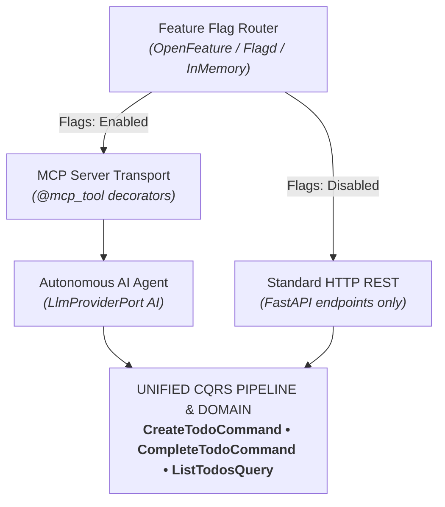

# Tutorial 5: Experimental AI Agent & MCP Tool Server (Gated by Feature Flags)

In this chapter, you will turn the To-Do microservice into an **agent-native AI application**. You will expose your CQRS commands and queries as **Model Context Protocol (MCP)** tools, connect an autonomous AI agent to manage tasks, and safely gate all experimental AI features behind **Dynamic Feature Flags**.

> *"How can we allow AI assistants (like Claude Desktop or autonomous agents) to interact with our To-Do service without exposing unvalidated endpoints, while keeping experimental features safely hidden from standard users?"*

---

## 1. Architecture: Flags, MCP, and Hexagonal CQRS

Because Hexastack cleanly separates domain CQRS handlers from driving transports, exposing our application to an LLM requires **zero rewrites** of business logic:



---

## 2. Exposing CQRS as Model Context Protocol (MCP) Tools

Hexastack's MCP driving adapter transforms domain Commands and Queries directly into typed tools consumable by Claude Desktop, Cursor, or autonomous agents:

Create `src/todo_app/adapters/driving/mcp.py`:

```python
"""Model Context Protocol (MCP) tool exposure for To-Do CQRS commands and queries."""

from hexastack_mcp.infra.decorators import mcp_tool
from todo_app.domain.commands import (
    CompleteTodoCommand,
    CreateTodoCommand,
    DeleteTodoCommand,
    ListTodosQuery,
)

mcp_create_todo = mcp_tool(
    name="create_todo",
    description="Create a new To-Do task with title, description, and priority level",
    kind="command",
)(CreateTodoCommand)

mcp_complete_todo = mcp_tool(
    name="complete_todo",
    description="Mark a To-Do task as completed by ID",
    kind="command",
)(CompleteTodoCommand)

mcp_delete_todo = mcp_tool(
    name="delete_todo",
    description="Delete a To-Do task by ID (as owner or admin)",
    kind="command",
)(DeleteTodoCommand)

mcp_list_todos = mcp_tool(
    name="list_todos",
    description="List all To-Do items with optional completion filter",
    kind="query",
)(ListTodosQuery)
```

---

## 3. Building the Autonomous AI Assistant (`LlmProviderPort`)

Create `src/todo_app/domain/assistant.py`:

```python
"""Autonomous AI Productivity Assistant service built on LlmProviderPort."""

from hexastack_core.ports.ai import LlmProviderPort
from hexastack_cqrs.infra.pipeline import ExecutionPipeline
from todo_app.domain.commands import ListTodosQuery


class TodoAiAssistant:
    def __init__(self, llm: LlmProviderPort, pipeline: ExecutionPipeline) -> None:
        self.llm = llm
        self.pipeline = pipeline

    def generate_morning_briefing(self, user_id: str = "alice") -> str:
        todos = self.pipeline.execute(
            ListTodosQuery(owner_id=user_id, completed_only=False)
        )
        if not todos:
            return "Good morning! You have no pending tasks today. Enjoy your day!"

        task_lines = [
            f"- [{t.priority.value.upper()}] {t.title}: {t.description}" for t in todos
        ]
        prompt = (
            f"You are an executive productivity assistant. Review these {len(todos)} pending tasks "
            f"for user '{user_id}' and provide an action plan with top priorities:\n"
            + "\n".join(task_lines)
        )
        return self.llm.generate_text(
            prompt, system_prompt="You are a crisp, high-signal AI executive assistant."
        )
```

---

## 4. Dedicated Scoped Entrypoint (`ch05_ai_mcp.py`)

Create `src/todo_app/entrypoints/ch05_ai_mcp.py`:

```python
"""Chapter 5 Entrypoint: To-Do Service with MCP Server & AI Assistant."""

import uvicorn
from fastapi import FastAPI
from rodi import Container

from hexastack_core.adapters.ai import InMemoryLlmProvider
from hexastack_core.adapters.feature_flags.in_memory import InMemoryFeatureFlagAdapter
from hexastack_core.adapters.notification import InMemoryNotificationAdapter
from hexastack_core.infra.bootstrap import bootstrap
from hexastack_core.ports.ai import LlmProviderPort
from hexastack_core.ports.feature_flags import FeatureFlagPort
from hexastack_core.ports.notification import NotificationPort
from hexastack_cqrs.infra.pipeline import ExecutionPipeline

import todo_app.infra.handlers
from todo_app.adapters.driven.sqlite import (
    SqliteTodoRepository,
    create_sqlite_session_factory,
)
from todo_app.adapters.driving.http import router
from todo_app.domain.assistant import TodoAiAssistant
from todo_app.ports.repositories import TodoRepositoryPort


def build_app(
    db_url: str = "sqlite:///todos_ch05.db",
    enable_ai: bool = True,
) -> tuple[FastAPI, TodoAiAssistant]:
    di = Container()
    session_factory = create_sqlite_session_factory(db_url=db_url)
    repo = SqliteTodoRepository(session_factory=session_factory)
    notifier = InMemoryNotificationAdapter()
    flags = InMemoryFeatureFlagAdapter(flags={"experimental_ai_assistant": enable_ai})
    llm = InMemoryLlmProvider()

    di.add_instance(repo, declared_class=TodoRepositoryPort)
    di.add_instance(notifier, declared_class=NotificationPort)
    di.add_instance(flags, declared_class=FeatureFlagPort)
    di.add_instance(llm, declared_class=LlmProviderPort)

    res = bootstrap(
        container=di,
        packages_to_scan=[
            todo_app.infra.handlers,
        ],
    )
    pipeline = res.container.resolve(ExecutionPipeline)
    assistant = TodoAiAssistant(llm=llm, pipeline=pipeline)
    app = res.container.resolve(FastAPI)
    app.include_router(router)
    return app, assistant


app, _ = build_app()

if __name__ == "__main__":
    uvicorn.run(app, host="127.0.0.1", port=8000)
```

---

## 5. MCP Server Launch & Introspection Tooling

Hexastack includes first-class Model Context Protocol tooling:

```bash
# 1. Inspect registered MCP AI tools, prompts, and resources
uv run hexastack mcp list

# 2. Generate client JSON config for Gemini / Antigravity, Claude, or Cursor
uv run hexastack mcp config --client antigravity
uv run hexastack mcp config --client claude

# 3. Launch the MCP server in stdio mode for AI agents
uv run hexastack mcp run
```

Watch the CLI setup for an agent-native MCP microservice:

<video controls autoplay loop muted playsinline width="100%" style="border-radius: 8px; margin: 16px 0; box-shadow: 0 10px 30px rgba(0,0,0,0.4);">
  <source src="../assets/demos/todo-ch05-cli-demo.webm" type="video/webm">
  <track label="English" kind="subtitles" srclang="en" src="../assets/demos/todo-ch05-cli-demo.vtt" default>
</video>

---

## 6. Verification: Gated AI Execution & MCP Tools

Watch the browser interaction and AI tool walkthrough live in Chromium:

<video controls autoplay loop muted playsinline width="100%" style="border-radius: 8px; margin: 16px 0; box-shadow: 0 10px 30px rgba(0,0,0,0.4);">
  <source src="../assets/demos/todo-ch05-browser-demo.webm" type="video/webm">
  <track label="English" kind="subtitles" srclang="en" src="../assets/demos/todo-ch05-browser-demo.vtt" default>
</video>

---

## 7. Next Steps: Production Telemetry & Observability

Our system is now multi-transport (FastAPI, CLI, MCP), multi-channel (Apprise, Webhooks), and intelligent (AI Agents).

> *"With requests arriving from HTTP, background outbox workers, and autonomous AI agents over MCP, how do we trace and observe end-to-end execution across all components?"*

In the final chapter, we implement **OpenTelemetry Distributed Tracing**, **Structured JSON Logs**, and **Hexastack DevTools Live Telemetry**:

- **[Tutorial 6: Production Observability & Distributed Tracing](./06-production-observability-and-tracing.md)**
