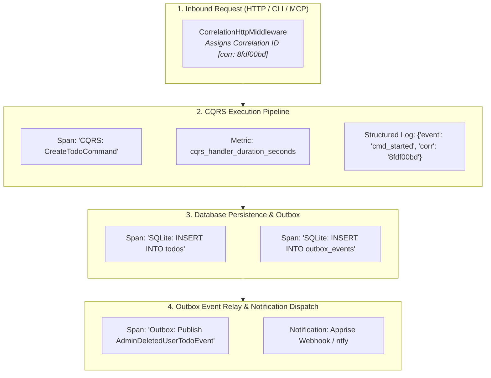

# Tutorial 6: Production Observability & Distributed Tracing

In this final chapter, you will instrument the To-Do microservice for **production observability**, **OpenTelemetry distributed tracing**, **structured JSON logging**, and live inspection via the **Hexastack DevTools Dashboard**.

> *"How do we trace an end-to-end transaction as it travels from an HTTP REST request, through CQRS handlers, into database queries, outbox event relays, and MCP AI tool calls?"*

---

## 1. Unified Telemetry Architecture

Hexastack provides an ambient correlation context that propagates across threads, async coroutines, and transport boundaries without manual parameter passing:



---

## 2. Structured JSON Logging with Ambient Correlation IDs

Configure structured logging with ambient correlation contexts:

```python
# src/todo_app/infra/logging.py
from hexastack_core.adapters.logging import StandardLogger

logger = StandardLogger("todo_app.prod")

# Inside any handler or adapter:
logger.info(
    "To-Do task successfully processed",
    extra={"todo_id": todo.id, "owner_id": todo.owner_id, "priority": todo.priority},
)
```

**JSON Output in Production**:
```json
{
  "timestamp": "2026-08-20T20:25:00.123Z",
  "level": "INFO",
  "logger": "todo_app",
  "message": "To-Do task successfully processed",
  "correlation_id": "8fdf00bd-45a2-4a0b-932f-b4e12e1098a1",
  "todo_id": "00b158af-155a-4586-a793-7f0642451199",
  "owner_id": "alice",
  "priority": "high"
}
```

---

## 3. Dedicated Scoped Entrypoint (`ch06_observability.py`)

Create `src/todo_app/entrypoints/ch06_observability.py`:

```python
"""Chapter 6 Entrypoint: Fully Instrumented Production To-Do Service."""

import uvicorn
from fastapi import FastAPI
from rodi import Container

from hexastack_core.adapters.logging import StandardLogger
from hexastack_core.adapters.notification import StdoutNotificationAdapter
from hexastack_core.infra.bootstrap import bootstrap
from hexastack_core.ports.logging import LoggingPort
from hexastack_core.ports.notification import NotificationPort

import todo_app.infra.handlers
from todo_app.adapters.driven.sqlite import (
    SqliteTodoRepository,
    create_sqlite_session_factory,
)
from todo_app.adapters.driving.http import router
from todo_app.ports.repositories import TodoRepositoryPort


def build_app(db_url: str = "sqlite:///todos_prod.db") -> FastAPI:
    di = Container()
    session_factory = create_sqlite_session_factory(db_url=db_url)
    repo = SqliteTodoRepository(session_factory=session_factory)
    notifier = StdoutNotificationAdapter()
    logger = StandardLogger("todo_app.prod")

    di.add_instance(repo, declared_class=TodoRepositoryPort)
    di.add_instance(notifier, declared_class=NotificationPort)
    di.add_instance(logger, declared_class=LoggingPort)

    res = bootstrap(
        container=di,
        packages_to_scan=[
            todo_app.infra.handlers,
        ],
    )
    app = res.container.resolve(FastAPI)
    app.include_router(router)
    return app


app = build_app()

if __name__ == "__main__":
    uvicorn.run(app, host="127.0.0.1", port=8000)
```

---

## 4. Interactive DevTools Dashboard & Observability UI

Launch the Hexastack interactive telemetry and diagnostics dashboard:

```bash
# 1. Launch the interactive DevTools web dashboard
uv run hexastack ui --port 8000

# 2. Inspect active runtime handlers, registered routes, and telemetry middleware
uv run hexastack inspect registry
```

Watch the CLI setup for a production-grade microservice:

<video controls autoplay loop muted playsinline width="100%" style="border-radius: 8px; margin: 16px 0; box-shadow: 0 10px 30px rgba(0,0,0,0.4);">
  <source src="../assets/demos/todo-ch06-cli-demo.webm" type="video/webm">
  <track label="English" kind="subtitles" srclang="en" src="../assets/demos/todo-ch06-cli-demo.vtt" default>
</video>

---

---

## 5. Verification: Observability & Endpoints

Inspect real-time telemetry spans, metrics exposition, and structured execution traces:

1. **Send Requests**: Issue several commands and queries via HTTP REST, CLI, or MCP.
2. **Prometheus Metrics**: Fetch `http://127.0.0.1:8000/metrics` to verify that HTTP request counters, handler latency histograms, and domain gauges are continuously tracked.
3. **Inspect Spans**: Open DevTools UI (`http://127.0.0.1:8000/_devtools`) to view active pipeline execution telemetry.
4. **Structured Logs**: View contextual JSON log outputs with correlation IDs and redactions.

---

## 6. Summary & Up Next

### What You've Learned 🎓
- How ambient correlation IDs propagate across async Coroutines and middlewares.
- How to emit structured JSON logs with sensitive field redaction.
- How to export turnkey Prometheus metrics via `/metrics` and trace spans via OpenTelemetry.
- How to inspect runtime CQRS pipeline diagnostics using Hexastack DevTools.

### Up Next: High-Performance Binary Transports ⚡
Our service handles HTTP, CLI, and MCP seamlessly. But internal microservices often demand ultra-low latency and binary serialization.

In Chapter 7, we introduce **gRPC Service Adapters**, **Protobuf Schemas**, and **Server Reflection**:

- **[Tutorial 7: High-Performance gRPC & Dual Transport Parity](./07-high-performance-grpc-and-microservices.md) ➔**
