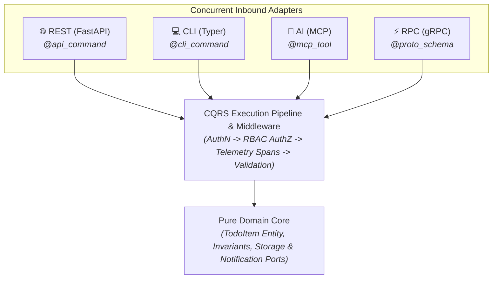

# Tutorial 7: High-Performance gRPC & Dual Transport Parity

In this chapter, you will add a high-throughput **gRPC binary protocol adapter** to the To-Do microservice without rewriting a single line of business domain logic or CQRS handlers.

> *"How do we serve 10,000 requests/sec with Protocol Buffers for internal microservices while preserving existing REST, CLI, and MCP AI transports?"*

---

## 1. Dual Inbound Transports: The Power of Ports & Adapters

In Hexagonal Architecture, gRPC is simply another **driving presentation adapter** that translates incoming Protocol Buffer messages into standard CQRS commands and queries:



---

## 2. Defining Protobuf Contracts: Inline vs External Files

Hexastack offers **two flexible approaches** for declaring gRPC contracts:

### Option A: Inline `@proto_schema` (Colocated with Commands)
You can colocate the Protobuf IDL string directly alongside your CQRS dataclass:

```python
# src/todo_app/adapters/driving/grpc.py
from dataclasses import dataclass
from hexastack_grpc.infra.decorators import proto_schema


@proto_schema(
    schema="""
    syntax = "proto3";
    package todo.v1;

    message CreateTodoRequest {
        string title = 1;
        string description = 2;
        string priority = 3;
    }

    message CreateTodoResponse {
        string id = 1;
        string title = 2;
        string status = 3;
    }

    service TodoService {
        rpc CreateTodo (CreateTodoRequest) returns (CreateTodoResponse);
    }
    """,
    message_name="CreateTodoRequest",
    service_name="todo.v1.TodoService",
    rpc_name="CreateTodo",
)
@dataclass
class CreateTodoRpcCommand:
    title: str
    description: str = ""
    priority: str = "medium"
```

### Option B: External `.proto` Files (`@proto_file`)
If your organization maintains shared `.proto` repositories:

```python
from hexastack_grpc.infra.decorators import proto_file


@proto_file(
    file_path="protos/todo/v1/todo.proto",
    message_name="CreateTodoRequest",
    service_name="todo.v1.TodoService",
    rpc_name="CreateTodo",
)
@dataclass
class CreateTodoRpcCommand:
    title: str
    description: str = ""
```

---

## 3. Compiling Stubs: In-Process Tooling (`hexastack grpc compile`)

> [!NOTE]
> **Manual Compilation is NOT Required for Runtime Dev & Tests**:
> Hexastack's `ProtoCompiler` compiles in-memory during interactive test runs. However, compiling explicitly generates typed `.py` and `.pyi` stubs for full IDE autocompletion and static type checking (`ty check`, `mypy`).

To compile all discovered `@proto_schema` strings and `.proto` files in your project:

```bash
uv run hexastack grpc compile --out-dir src/todo_app/adapters/driving/grpc/gen
```

This generates:
- `src/todo_app/adapters/driving/grpc/gen/schema_0_pb2.py` (Message descriptors)
- `src/todo_app/adapters/driving/grpc/gen/schema_0_pb2_grpc.py` (Servicer & Stub interfaces)
- `src/todo_app/adapters/driving/grpc/gen/schema_0_pb2.pyi` (Static typing stubs)

---

## 4. Implementing the gRPC Servicer

Bridge the incoming RPC call directly into the Hexastack `CommandBusPort`:

```python
# src/todo_app/adapters/driving/grpc_servicer.py
import grpc
from hexastack_cqrs.ports.buses import CommandBusPort
from hexastack_grpc.infra.decorators import grpc_service

# Import generated stubs
from todo_app.adapters.driving.grpc.gen import schema_0_pb2 as pb2
from todo_app.adapters.driving.grpc.gen import schema_0_pb2_grpc as pb2_grpc
from todo_app.domain.commands import CreateTodoCommand


@grpc_service(
    pb2_grpc.add_TodoServiceServicer_to_server,
    service_names=["todo.v1.TodoService"],
)
class TodoGrpcServicer(pb2_grpc.TodoServiceServicer):
    """Driving presentation adapter routing gRPC calls to domain CQRS buses."""

    def __init__(self, command_bus: CommandBusPort) -> None:
        self._command_bus = command_bus

    def CreateTodo(
        self,
        request: pb2.CreateTodoRequest,
        context: grpc.ServicerContext,
    ) -> pb2.CreateTodoResponse:
        cmd = CreateTodoCommand(
            title=request.title,
            description=request.description,
            priority=request.priority or "medium",
        )
        result = self._command_bus.dispatch(cmd)
        return pb2.CreateTodoResponse(
            id=result.id,
            title=result.title,
            status=result.status,
        )
```

---

## 5. Live Server Launch & Server Reflection

Hexastack allows inspecting registered gRPC services directly via CLI:

```bash
# 1. Introspect registered gRPC servicers, RPC endpoints, and Protobuf schemas
uv run hexastack grpc list

# 2. Launch the gRPC daemon
uv run hexastack grpc serve --host 0.0.0.0 --port 50051
```

### Interactive Debugging with `grpcurl`
Because Hexastack automatically enables **gRPC Server Reflection**, clients can inspect and call your service with **zero `.proto` files required on the client machine**:

```bash
# 1. Discover registered RPC services:
grpcurl -plaintext localhost:50051 list
# Output:
#   grpc.reflection.v1alpha.ServerReflection
#   todo.v1.TodoService

# 2. Inspect method signature:
grpcurl -plaintext localhost:50051 describe todo.v1.TodoService.CreateTodo

# 3. Call the RPC method over binary HTTP/2:
grpcurl -plaintext -d '{"title": "Deploy to Kubernetes", "priority": "high"}' \
  localhost:50051 todo.v1.TodoService/CreateTodo
```

---

## 6. Summary: The 4-Transport Parity Milestone 🏆

Your To-Do application now concurrently serves **4 distinct client protocols** from a single pure business domain:

| Transport | Protocol | Target Client | Entrypoint / Command |
| :--- | :--- | :--- | :--- |
| **HTTP REST** | JSON over HTTP/1.1 | Web & Mobile frontends | `POST /todos` |
| **CLI** | Shell Subcommands | DevOps scripts & terminal users | `todo-app create-todo` |
| **AI MCP** | JSON-RPC over stdio | Claude Desktop, Gemini, Antigravity | `@mcp_tool create_todo` |
| **gRPC** | Protobuf over HTTP/2 | High-throughput microservices | `TodoService/CreateTodo` |
