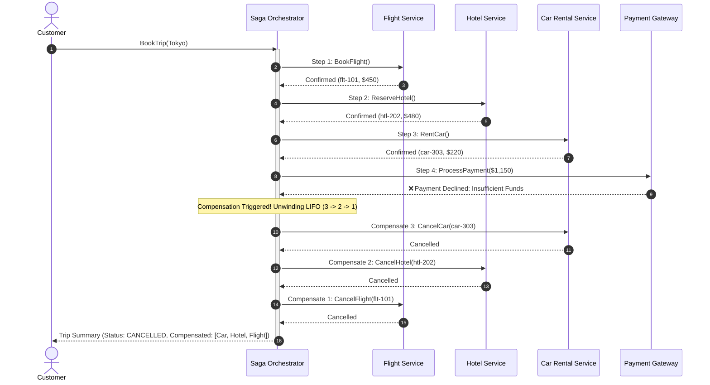

# Tutorial 9: Distributed Saga Orchestration & Compensating Transactions

In this tutorial, you will explore the **Trip Booking Service** (`examples/trip-booking`), a reference architecture demonstrating how **Hexastack** implements the **Distributed Saga Orchestration Pattern** with automated, reverse (LIFO) compensating transactions across simulated external boundaries (Flight GDS, Hotel PMS, Car Rental, and Payment Gateway).

By the end of this guide, you will understand:

- Why Two-Phase Commit (2PC) fails across distributed microservices and external APIs.
- The theoretical foundation of the Saga pattern ($T_1 \dots T_n$ forward steps and $C_{k-1} \dots C_1$ compensations).
- How Hexastack's `hexastack-cqrs` package models sagas through pure domain state machines (`SagaStatus`, `SagaState`, `SagaResult`).
- How to declare multi-step workflows fluently using `SagaBuilder`.
- How the `InMemorySagaOrchestrator` executes forward actions and guarantees automated reverse (LIFO) rollback on any failure.
- How to drive and observe sagas interactively via the Typer CLI and FastAPI REST endpoints.

---

## 1. The Distributed Transaction Problem

In a traditional monolithic application backed by a single relational database, maintaining transactional consistency across business entities is trivial:

```python
# Monolithic ACID: Single local database transaction
with db_session.begin():
    reserve_flight()
    reserve_hotel()
    reserve_car()
    charge_payment()
```

If any step raises an error, the database engine rolls back all modifications atomically.

### Why 2PC Fails in Microservices

When business capabilities are decomposed into autonomous services—or when operations cross third-party vendor boundaries (Airlines, Hotel booking engines, Payment Gateways like Stripe)—a single database transaction is impossible:

1. **Third-Party APIs Don't Support 2PC**: External vendors expose HTTP REST or gRPC endpoints (`POST /bookings`, `POST /charges`), not XA two-phase commit coordinators.
2. **Blocking & Latency**: Two-Phase Commit holds database locks across network boundaries until the coordinator commits. In distributed networks, latency spikes or partitions lock rows indefinitely, destroying throughput.
3. **Coordinator Bottleneck**: A centralized 2PC coordinator represents a critical single point of failure and architectural coupling.

---

## 2. The Saga Pattern: Orchestration & Compensations

First formulated by Hector Garcia-Molina and Kenneth Salem in 1987, the **Saga Pattern** structures a distributed business transaction as a sequence of local transactions:

$$T_1, T_2, \dots, T_n$$

Every forward transaction $T_i$ that mutates state is paired with a corresponding **compensating transaction** $C_i$:

$$C_1, C_2, \dots, C_n$$

### Key Invariants of the Saga Pattern

1. **Forward Progression**: The orchestrator executes forward steps $T_1 \dots T_n$ sequentially until all succeed.
2. **Failure Detection**: If step $T_k$ ($1 \le k \le n$) fails, forward progression halts immediately. Steps $T_{k+1} \dots T_n$ are **never executed**.
3. **Strict LIFO Compensation**: The orchestrator unwinds all successfully completed steps prior to the failure in reverse chronological order:
   $$C_{k-1}, C_{k-2}, \dots, C_1$$
4. **Compensation Idempotency**: Compensating actions must be idempotent—re-running a cancellation must yield the same clean outcome even during network retries.



---

## 3. Hexagonal Seams & Architecture

Hexastack enforces strict Hexagonal (Ports & Adapters) boundaries so that saga coordination remains decoupled from external transport protocols and vendor SDKs.

```
examples/trip-booking/
├── pyproject.toml
├── README.md
├── src/
│   └── trip_booking/
│       ├── domain/                # Pure Business Logic & State Machines
│       │   └── models.py          # FlightReservation, HotelReservation, TripBookingSummary
│       ├── ports/                 # Abstract ABC Interfaces (Secondary Seams)
│       │   └── services.py        # FlightServicePort, HotelServicePort, PaymentServicePort
│       ├── adapters/              # Concrete Implementations
│       │   ├── driven/            # Secondary Adapters
│       │   │   └── in_memory.py   # InMemoryFlightService with failure injection
│       │   └── driving/           # Primary Adapters
│       │       └── http.py        # FastAPI REST API (POST /trips/book)
│       └── infra/                 # Wiring & Coordination
│           ├── saga.py            # TripBookingCoordinator using SagaBuilder DSL
│           ├── bootstrap.py       # Dependency Injection container
│           └── cli.py             # Typer CLI application (trip-booking book)
└── tests/
    └── unit/
        ├── test_domain.py
        ├── test_adapters.py
        ├── test_saga.py           # Invariant verification of LIFO unwinding
        ├── test_api.py            # FastAPI TestClient verification
        └── test_cli.py            # Typer CliRunner verification
```

### Layer Responsibilities

1. **`domain/` (The Core)**:
   - Completely pure Python dataclasses and Pydantic models.
   - Contains zero imports from FastAPI, databases, or HTTP libraries.
   - `SagaStatus` (`PENDING`, `RUNNING`, `COMPLETED`, `COMPENSATING`, `COMPENSATED`, `FAILED`) models the state machine lifecycle.

2. **`ports/` (The Seams)**:
   - Defines abstract boundaries:
     ```python
     class FlightServicePort(ABC):
         @abstractmethod
         def book_flight(self, request: TripBookingRequest) -> FlightReservation: ...
         @abstractmethod
         def cancel_flight(self, reservation: FlightReservation) -> None: ...
     ```

3. **`infra/` (The Declarative Saga Orchestrator)**:
   - Uses `@saga` and `@step` decorators from `hexastack-cqrs` to declare steps and their compensating counterparts deterministically on classes:
     ```python
     @saga(name="TripBookingSaga")
     class TripBookingCoordinator:
         @step(name="BookFlight", order=1, compensate="cancel_flight")
         def book_flight(self, request: TripBookingRequest) -> FlightReservation:
             return self.flight_service.book_flight(request)

         def cancel_flight(self, reservation: FlightReservation) -> None:
             self.flight_service.cancel_flight(reservation)
     ```
   - Alternatively, uses the fluent functional `SagaBuilder` DSL (Pattern A) when dynamic step assembly is needed at runtime:
     ```python
     builder = SagaBuilder("TripBookingSaga")
     builder.step(
         name="BookFlight",
         action=lambda ctx: flight_service.book_flight(req),
         compensate=lambda res, ctx: flight_service.cancel_flight(res),
     )
     ```

---

## 4. Hands-On Walkthrough

### Step 1: Running the Happy Path via CLI

Execute an end-to-end trip booking where all partners succeed:

```bash
uv run trip-booking book --customer cust-001 --destination Tokyo --nights 4
```

**Terminal Output:**
```
╭────── Hexastack Saga Orchestrator ──────╮
│ Executing Trip Booking Saga             │
│ Customer: cust-001 | Destination: Tokyo │
│ Failure Injection: NONE                 │
╰─────────────────────────────────────────╯
               Saga Execution Report
┏━━━━━━━━━━━━━━━┳━━━━━━━━━━━━━━━━━━━━━━━━━━━━━━━━━┓
┃ Property      ┃ Value                           ┃
┡━━━━━━━━━━━━━━━╇━━━━━━━━━━━━━━━━━━━━━━━━━━━━━━━━━┩
│ Trip ID       │ trip-a1b2c3d4                   │
│ Customer      │ cust-001                        │
│ Destination   │ Tokyo                           │
│ Final Status  │ CONFIRMED                       │
│ Total Charged │ $1150.00                        │
│ Flight        │ HX-404 ($450.00)                │
│ Hotel         │ The Grand Tokyo Hotel ($480.00) │
│ Car Rental    │ SUV ($220.00)                   │
│ Payment Ref   │ txn-99e8d7c6                    │
└───────────────┴─────────────────────────────────┘
```

All 4 steps executed sequentially. Zero compensations were needed.

---

### Step 2: Injecting a Failure at Step 3 (Car Rental)

Now simulate what happens when rental car inventory is depleted:

```bash
uv run trip-booking book --customer cust-002 --destination Rome --fail-at car
```

**Terminal Output:**
```
╭────── Hexastack Saga Orchestrator ──────╮
│ Executing Trip Booking Saga             │
│ Customer: cust-002 | Destination: Rome  │
│ Failure Injection: CAR                  │
╰─────────────────────────────────────────╯
               Saga Execution Report
┏━━━━━━━━━━━━━━━━━━━━━━━━━━┳━━━━━━━━━━━━━━━━━━━━━━━━━━━━━━━━━━━━━━━━━━━━━┓
┃ Property                 ┃ Value                                       ┃
┡━━━━━━━━━━━━━━━━━━━━━━━━━━╇━━━━━━━━━━━━━━━━━━━━━━━━━━━━━━━━━━━━━━━━━━━━━┩
│ Trip ID                  │ trip-e5f6a7b8                               │
│ Customer                 │ cust-002                                    │
│ Destination              │ Rome                                        │
│ Final Status             │ CANCELLED                                   │
│ Total Charged            │ $0.00                                       │
│ Triggering Fault         │ No SUV vehicles available at rental desk.   │
│ Compensated Steps (LIFO) │ ReserveHotel -> BookFlight                  │
└──────────────────────────┴─────────────────────────────────────────────┘
```

**What just happened?**
1. `BookFlight` succeeded $\rightarrow$ flight reserved.
2. `ReserveHotel` succeeded $\rightarrow$ hotel booked.
3. `RentCar` threw `RuntimeError("No SUV vehicles available...")`.
4. Forward progress halted immediately (`ProcessPayment` was never called).
5. The orchestrator entered `COMPENSATING` mode and rolled back in exact LIFO order:
   - First: `cancel_hotel(hotel_res)`
   - Second: `cancel_flight(flight_res)`
6. The terminal state is `COMPENSATED`, customer is charged $0.00, and no orphan bookings exist.

---

### Step 3: Injecting a Failure at Step 4 (Payment Processing)

Simulate a payment gateway decline after all three travel reservations have been made:

```bash
uv run trip-booking book --customer cust-003 --destination Honolulu --fail-at payment
```

**Terminal Output:**
```
┏━━━━━━━━━━━━━━━━━━━━━━━━━━┳━━━━━━━━━━━━━━━━━━━━━━━━━━━━━━━━━━━━━━━━━━━━━┓
┃ Property                 ┃ Value                                       ┃
┡━━━━━━━━━━━━━━━━━━━━━━━━━━╇━━━━━━━━━━━━━━━━━━━━━━━━━━━━━━━━━━━━━━━━━━━━━┩
│ Final Status             │ CANCELLED                                   │
│ Total Charged            │ $0.00                                       │
│ Triggering Fault         │ Payment declined: Insufficient credit line. │
│ Compensated Steps (LIFO) │ RentCar -> ReserveHotel -> BookFlight       │
└──────────────────────────┴─────────────────────────────────────────────┘
```

All three prior reservations were unwound in reverse:
1. `RentCar` compensated.
2. `ReserveHotel` compensated.
3. `BookFlight` compensated.

---

### Step 4: Executing via FastAPI HTTP Endpoint

Start the FastAPI application or query it using Python:

```python
from fastapi.testclient import TestClient
from trip_booking.adapters.driving.http import create_app

client = TestClient(create_app())

# Trigger payment failure via query parameter
response = client.post(
    "/trips/book?fail_at=payment",
    json={
        "customer_id": "cust-web-99",
        "customer_email": "traveler@example.com",
        "destination": "London",
        "departure_date": "2026-12-10",
        "return_date": "2026-12-15",
        "hotel_nights": 5,
        "car_rental_days": 5,
        "car_class": "Convertible",
    },
)

print(response.status_code)  # 422 Unprocessable Content
print(response.json())
# {
#   "status": "CANCELLED",
#   "compensated_steps": ["RentCar", "ReserveHotel", "BookFlight"],
#   "error_message": "Payment declined: Insufficient credit line.",
#   ...
# }
```

---

## 5. Verification & Testing Rigor

Execute the entire test suite covering unit tests, failure injection, API routes, and CLI commands:

```bash
uv run pytest-run -e trip-booking
```

All 19 tests pass with $\ge 90\%$ test coverage.

---

## 6. Key Takeaways for Production Architectures

1. **Design Compensations Upfront**: Before implementing any forward business logic, ask: *What is the exact API call to revert this action? Is it idempotent?*
2. **Never Let Compensations Fail Silently**: If a compensation raises an exception (e.g. network partition), the orchestrator transitions to `SagaStatus.FAILED` and raises `SagaCompensationError` for immediate dead-letter-queue alerting.
3. **Decouple with Ports**: Keeping external vendors behind abstract ports allows swapping in-memory mock adapters during tests with real Stripe or Amadeus SDKs in production without altering a single line of saga logic.
