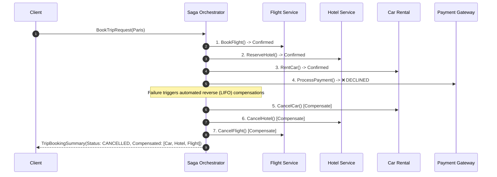

# Distributed Saga Orchestration: Holiday Trip Booking Service

[](https://github.com/TheTrueSCU/hexastack)
[](tests/)

A production-grade reference microservice demonstrating the **Distributed Saga Orchestration Pattern** with automated reverse (LIFO) compensating transactions, built on [Hexastack](https://github.com/TheTrueSCU/hexastack).

---

## 1. Architectural Overview

In a distributed microservice landscape, booking a holiday vacation involves multiple independent external boundaries:
1. **Flight Service**: Reserves airline seats via an Airline GDS API.
2. **Hotel Service**: Reserves accommodation via property management partners.
3. **Car Rental Service**: Reserves vehicles from rental agencies.
4. **Payment Gateway**: Authorizes and charges the customer's credit card.

Traditional Two-Phase Commit (2PC) transactions do not scale across third-party REST/gRPC boundaries and risk distributed deadlocks. The **Saga Pattern** solves this problem by structuring the workflow as a sequence of local transactions:



---

## 2. Hexagonal Seams

- **`domain/`**: Pure data models (`FlightReservation`, `HotelReservation`, `CarReservation`, `PaymentReceipt`, `TripBookingSummary`). No external dependencies or framework imports.
- **`ports/`**: Abstract interfaces (`FlightServicePort`, `HotelServicePort`, `CarRentalPort`, `PaymentServicePort`).
- **`adapters/`**:
  - `driven/`: In-memory implementations of all 4 booking services, equipped with failure injection flags.
  - `driving/`: FastAPI HTTP REST routes (`POST /trips/book`, `GET /trips/health`).
- **`infra/`**:
  - `saga.py`: Declarative `SagaBuilder` workflow definition and `TripBookingCoordinator`.
  - `cli.py`: Interactive Typer CLI tool for executing the saga and observing compensation unwinding in real time.

---

## 3. Quickstart & CLI Usage

### Run via Typer CLI

#### Happy Path (All Steps Succeed)
```bash
uv run trip-booking book --customer cust-007 --destination Tokyo --nights 5
```

#### Simulate Failure at Car Rental Step
```bash
uv run trip-booking book --customer cust-007 --destination Rome --fail-at car
```
*Output demonstrates automatic cancellation of Hotel and Flight reservations in strict reverse order (`ReserveHotel -> BookFlight`).*

#### Simulate Failure at Payment Step
```bash
uv run trip-booking book --customer cust-007 --destination Honolulu --fail-at payment
```
*Output demonstrates compensation unwinding across Car, Hotel, and Flight (`RentCar -> ReserveHotel -> BookFlight`).*

---

## 4. Run Tests & Coverage

```bash
uv run pytest-run -e trip-booking
```

Target test coverage is $\ge 90\%$ with strict 1:1 test parity and invariant validation.
