# hexastack

> The unified distribution package and diagnostic CLI for the Hexastack framework.

[](https://pypi.org/project/hexastack/)
[](https://www.python.org/downloads/)
[](https://codecov.io/github/TheTrueSCU/hexastack)
[](../../LICENSE)
[](https://www.w3.org/WAI/WCAG21/quickref/?levels=aa)
[](https://github.com/dequelabs/axe-core)
---

## 1. Overview & Capabilities

`hexastack` acts as the umbrella distribution for the entire Hexastack monorepo, offering:

- **Scoped Extras**: Single-command installs for scoped use cases (e.g., `pip install hexastack[cli]`, `pip install hexastack[web]`, `pip install hexastack[graphql]`, `pip install hexastack[mcp]`, `pip install hexastack[grpc]`, `pip install hexastack[db]`).
- **Zero-Install Project Scaffolding**: `hexastack new <template> <name>` instantly scaffolds production-grade microservices adhering strictly to Hexagonal Architecture, complete with tiered CI, import-linter contracts, and passing test suites.
- **Interactive Diagnostic CLI**: The `hexastack` terminal command provides system health checks, package inspection, CQRS message route exploration, local FastAPI dev server launching, MCP server execution, gRPC daemon hosting, and Alembic database migration management.

---

## 2. Monorepo & Sibling Relationships

```mermaid
graph TD
    subgraph Umbrella ["hexastack (Distribution & CLI App)"]
        CLI_APP["hexastack CLI Entrypoint"]
        DIAG["Diagnostics Handlers (info, inspect, ping)"]
        DEMO_SERVER["FastAPI Demo Server (serve)"]
        DB_CLI["Alembic Migration Tooling (db)"]
        MCP_CLI["MCP Server Runner (mcp)"]
        GRPC_CLI["gRPC Server Daemon (grpc)"]
    end

    subgraph BaseDependencies ["Default Direct Dependencies"]
        CORE["hexastack-core"]
        CQRS["hexastack-cqrs"]
        LOG["hexastack-logging"]
    end

    subgraph ScopedExtras ["Optional Scoped Extras"]
        AUTH["hexastack-auth (hexastack[auth])"]
        OTEL["hexastack-otel (hexastack[otel])"]
        EVENTS["hexastack-events (hexastack[events])"]
        AI["hexastack-ai (hexastack[ai])"]
        CLI["hexastack-cli (hexastack[cli])"]
        FASTAPI["hexastack-fastapi (hexastack[fastapi])"]
        GRAPHQL["hexastack-graphql (hexastack[graphql])"]
        MCP["hexastack-mcp (hexastack[mcp])"]
        GRPC["hexastack-grpc (hexastack[grpc])"]
        DB["hexastack-db (hexastack[db])"]
        FLAGS["hexastack-flags (hexastack[flags])"]
        UVICORN["uvicorn[standard] (hexastack[web])"]
    end

    Umbrella --> CORE
    Umbrella --> CQRS
    Umbrella --> LOG

    CLI_APP -. optional extra .-> CLI
    DEMO_SERVER -. optional extra .-> FASTAPI
    DEMO_SERVER -. optional extra .-> UVICORN
    DB_CLI -. optional extra .-> DB
    MCP_CLI -. optional extra .-> MCP
    GRPC_CLI -. optional extra .-> GRPC
```



### Explicit Dependencies (Direct)
- `hexastack-core`: Core kernel, DI container (`rodi`), and bootstrap engine.
- `hexastack-cqrs`: Command, query, and event execution buses.
- `hexastack-logging`: Structured logging and telemetry.

### Optional Integrations (Extras)
- `[auth]`: Installs `hexastack-auth` for security, RBAC, JWT, PBKDF2, and `@authorize` middleware.
- `[otel]`: Installs `hexastack-otel` for OpenTelemetry distributed tracing and OTLP export.
- `[events]`: Installs `hexastack-events` for CloudEvents 1.0, Transactional Outbox, and streaming buses.
- `[ai]`: Installs `hexastack-ai` for LiteLLM, Instructor, PydanticAI, and reflective agent tools.
- `[cli]`: Installs `hexastack-cli` for interactive CLI commands.
- `[db]` / `[sql]`: Installs `hexastack-db` for persistence and Alembic migrations.
- `[fastapi]`: Installs `hexastack-fastapi`.
- `[flags]`: Installs `hexastack-flags` for CNCF OpenFeature enterprise feature flag providers (Flagd, Unleash, Flipt).
- `[graphql]`: Installs `hexastack-graphql`.
- `[mcp]`: Installs `hexastack-mcp` for Model Context Protocol AI agent tools.
- `[grpc]`: Installs `hexastack-grpc` for high-performance RPC services.
- `[web]`: Installs `hexastack-fastapi` and `uvicorn[standard]`.
- `[docs]`: Installs `zensical` for static documentation generation and hosting.
- `[testing]`: Installs recommended testing tools (`hypothesis`, `inline-snapshot`, `playwright`, `pytest-archon`, `schemathesis`).
- `[all]`: Complete installation with all adapters and development tools.

---

## 3. Installation

```bash
# Minimal installation
pip install hexastack

# Testing toolkit (Archon boundary checks, Hypothesis fuzzing, Schemathesis)
pip install "hexastack[testing]"

# CNCF OpenFeature flags
pip install "hexastack[flags]"

# Security & RBAC
pip install "hexastack[auth]"

# OpenTelemetry Tracing
pip install "hexastack[otel]"

# CloudEvents & Transactional Outbox
pip install "hexastack[events]"

# AI Integration (LiteLLM, Instructor, PydanticAI)
pip install "hexastack[ai]"

# CLI support
pip install "hexastack[cli]"

# Full web stack (FastAPI + Uvicorn)
pip install "hexastack[web]"

# GraphQL support
pip install "hexastack[graphql]"

# Model Context Protocol support
pip install "hexastack[mcp]"

# gRPC support
pip install "hexastack[grpc]"

# Database support with migrations
pip install "hexastack[db]"

# Complete ecosystem
pip install "hexastack[all]"
```

---

## 4. Project Scaffolding & Archetypes (`hexastack new` & `hexastack init`)

Hexastack includes a production-grade scaffolding engine that creates fully functioning, decoupled microservices adhering strictly to Hexagonal Architecture, complete with pre-configured `.importlinter` boundaries, GitHub Actions CI workflows, multi-stage rootless Dockerfiles, passing test suites, and secret scanning.

### Interactive Scaffolding Wizard (`hexastack init`)

Launch an interactive terminal wizard that guides you through template selection, database drivers, auth, transports, and telemetry:

```bash
hexastack init
```

### Direct Archetype Scaffolding (`hexastack new`)

Generate microservices in a single command using one of the pre-built blueprints:

```bash
# Enterprise grade multi-transport service (FastAPI + gRPC + GraphQL + MCP + Outbox + Release + OpenSSF)
hexastack new enterprise core-platform

# Asynchronous event-driven microservice with CloudEvents 1.0 and Transactional Outbox
hexastack new event-driven billing-worker

# GraphQL presentation service with Strawberry schema and CQRS bus
hexastack new graphql-service analytics-service

# High-throughput gRPC binary RPC microservice with in-process ProtoCompiler and Buf linting
hexastack new grpc-service payment-gateway

# AI Agent service equipped with Model Context Protocol (MCP) server & tools
hexastack new mcp-agent customer-assistant

# Ultra-minimal CQRS microservice
hexastack new minimal lightweight-worker

# Web API service with FastAPI, SQLite/Postgres, and OpenAPI specs
hexastack new web-api order-service
```

### Scaffolded Service Anatomy

Every scaffolded service immediately includes:
1. **Strict Layer Isolation**: `domain/` (0 framework dependencies), `ports/` (abstract protocols), `adapters/driving/` (FastAPI / gRPC / CLI / MCP), `adapters/driven/` (SQLAlchemy / InMemory / Outbox), and `infra/` (bootstrappers & configuration).
2. **Golden-Path Multi-Stage Dockerfile**: Ultra-fast `uv`-cached builder layer, rootless non-root runtime user (`appuser:10001`), `/health` probe `HEALTHCHECK`, and `.dockerignore`.
3. **Automated Quality Gates**: `.importlinter` rules enforcing directional purity, pre-commit config with `detect-secrets`, `pip-audit`, and `ruff`, plus a complete `pytest` unit test suite.
4. **Automated Release Pipeline (`--with-release`)**: `.github/workflows/release.yml` with `uv build`, `pypa/gh-action-pypi-publish`, and SPDX/CycloneDX SBOM generation via `anchore/sbom-action`, plus a `CHANGELOG.md`.
5. **OpenSSF Security Suite (`--with-openssf`)**: `.github/workflows/scorecard.yml` (weekly security analysis), `SECURITY.md`, `GOVERNANCE.md`, and `CODE_OF_CONDUCT.md`.


---

## 5. CLI Diagnostic Commands

When installed with `hexastack[all]` or `hexastack[cli]`:

```bash
# Check installed packages and optional dependency statuses
hexastack info

# Inspect registered CQRS commands, queries, and configs
hexastack inspect registry

# Send a test ping command through the CQRS pipeline
hexastack ping --message "Hello Hexastack"

# Launch local FastAPI dev server with live reload (requires hexastack[web])
hexastack serve --host 127.0.0.1 --port 8000

# Launch MCP server in stdio mode (requires hexastack[mcp])
hexastack mcp run

# Launch gRPC daemon (requires hexastack[grpc])
hexastack grpc serve --host 0.0.0.0 --port 50051

# Manage database migrations (requires hexastack[db])
hexastack db init migrations/
hexastack db revision "add users table"
hexastack db upgrade head
hexastack db current
hexastack db history
```
