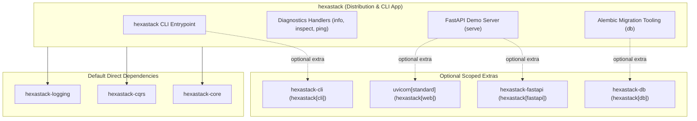

# hexastack

> The unified distribution package and diagnostic CLI for the Hexastack framework.

[](https://www.python.org/downloads/)

---

## 1. Overview & Capabilities

`hexastack` acts as the umbrella distribution for the entire Hexastack monorepo, offering:

- **Scoped Extras**: Single-command installs for scoped use cases (e.g., `pip install hexastack[cli]`, `pip install hexastack[web]`, `pip install hexastack[db]`).
- **Interactive Diagnostic CLI**: The `hexastack` terminal command provides system health checks, package inspection, CQRS message route exploration, local FastAPI development servers, and Alembic database migration management.

---

## 2. Monorepo & Sibling Relationships



### Explicit Dependencies (Direct)
- `hexastack-core`: Core kernel and bootstrap engine.
- `hexastack-cqrs`: Command and query buses.
- `hexastack-logging`: Structured logging.

### Optional Integrations (Extras)
- `[cli]`: Installs `hexastack-cli` for interactive CLI commands.
- `[db]` / `[sql]`: Installs `hexastack-db` for persistence and Alembic migrations.
- `[fastapi]`: Installs `hexastack-fastapi`.
- `[web]`: Installs `hexastack-fastapi` and `uvicorn[standard]`.
- `[all]`: Complete installation with all adapters and development tools.

---

## 3. Installation

```bash
# Minimal installation
pip install hexastack

# CLI support
pip install "hexastack[cli]"

# Full web stack (FastAPI + Uvicorn)
pip install "hexastack[web]"

# Database support with migrations
pip install "hexastack[db]"

# Complete ecosystem
pip install "hexastack[all]"
```

---

## 4. CLI Diagnostic Commands

When installed with `hexastack[all]` or `hexastack[cli]`:

```bash
# Check installed packages and optional dependency statuses (alphabetized)
hexastack info

# Inspect registered CQRS commands, queries, and configs
hexastack inspect registry

# Send a test ping command through the CQRS pipeline
hexastack demo ping --message "Hello Hexastack"

# Launch local FastAPI dev server with live reload (requires hexastack[web])
hexastack serve --host 127.0.0.1 --port 8000

# Manage database migrations (requires hexastack[db])
hexastack db init migrations/
hexastack db revision "add users table"
hexastack db upgrade head
hexastack db current
hexastack db history
```
