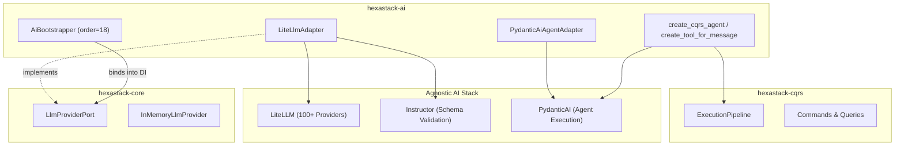

# hexastack-ai

AI engine, LLM provider integration (LiteLLM, Instructor, PydanticAI), and CQRS agent tool reflection for the **Hexastack** hexagonal architecture framework.

[](https://pypi.org/project/hexastack-ai/)
[](https://www.python.org/downloads/)
[](https://codecov.io/github/TheTrueSCU/hexastack)
[](../../LICENSE)

---

## 1. Overview

`hexastack-ai` integrates an agnostic, production-grade AI stack directly into the Hexastack architecture:
- **LiteLLM**: Unified driver abstraction across 100+ LLM providers (OpenAI, Anthropic Claude, Google Gemini, Ollama, Groq, Bedrock).
- **Instructor**: Self-correcting structured output validation returning strongly typed Pydantic models.
- **PydanticAI**: Type-safe agent loop orchestration and tool execution.
- **CQRS Tool Reflection**: Automatically turns Hexastack CQRS Commands and Queries into callable AI Agent tools.

---

## 2. Architecture & Relationships



---

## 3. Installation

```bash
# Standalone install
pip install hexastack-ai

# Via umbrella package
pip install "hexastack[ai]"
```

---

## 4. Configuration Reference

```toml
[hexastack.ai]
# Provider: "memory" (default for testing), "litellm", "openai", "anthropic", "gemini", "ollama"
provider = "litellm"
model = "gpt-4o-mini"
temperature = 0.2
max_tokens = 2048
api_key = "sk-..." # Or set standard env var OPENAI_API_KEY / ANTHROPIC_API_KEY

# LiteLLM Dialect Settings
[hexastack.ai.litellm]
drop_params = true
num_retries = 3
timeout = 60.0
api_base = "http://localhost:4000" # Optional LiteLLM proxy URL

# Ollama Local Dialect Settings
[hexastack.ai.ollama]
base_url = "http://localhost:11434"

# PydanticAI Agent Settings
[hexastack.ai.agent]
max_turns = 10
system_prompt = "You are a helpful AI assistant."
```

---

## 5. Usage Examples

### 1. Structured Output Extraction

```python
from pydantic import BaseModel
from hexastack_core.ports.ai import LlmProviderPort


class InvoiceDTO(BaseModel):
    customer_id: str
    total_amount: float
    items: list[str]


def extract_invoice(llm: LlmProviderPort, text: str) -> InvoiceDTO:
    return llm.generate_structured(
        prompt=f"Extract invoice details from: {text}",
        response_schema=InvoiceDTO,
    )
```

### 2. Auto-Reflecting CQRS Commands as Agent Tools

```python
from hexastack_core.domain import Command, Query
from hexastack_ai.infra.tools import create_cqrs_agent


class CancelSubscriptionCommand(Command):
    user_id: str
    reason: str


class GetUserPlanQuery(Query[str]):
    user_id: str


# Create PydanticAI agent with CQRS handlers as native tools:
agent = create_cqrs_agent(
    pipeline=runtime.pipeline,
    messages=[CancelSubscriptionCommand, GetUserPlanQuery],
    model="anthropic/claude-3-5-sonnet",
    system_prompt="You are a customer support agent.",
)

# Agent selects appropriate tools and executes them via Hexastack ExecutionPipeline:
result = agent.run_sync("Cancel subscription for user 123 due to pricing.")
```
