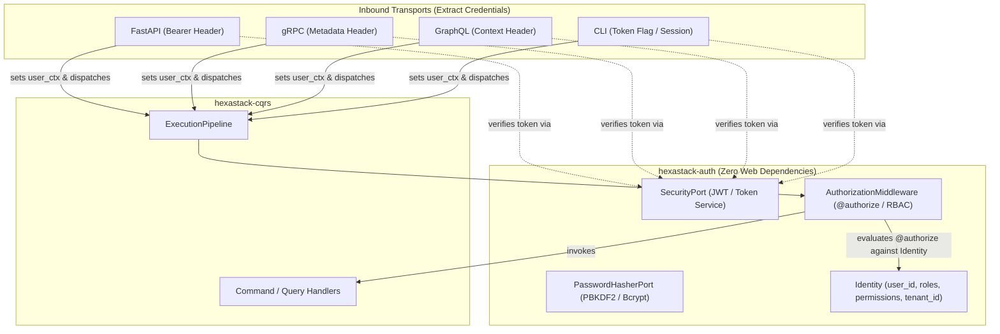

# Hexastack Auth

**`hexastack-auth`** is the security, identity, and authorization engine for the Hexastack framework. It provides protocol-agnostic identity primitives, JWT token creation/verification, PBKDF2 password hashing, and declarative `@authorize` Role-Based Access Control (RBAC) across CQRS pipelines.

---

## 🏛️ Architectural Overview

`hexastack-auth` adheres strictly to Hexagonal Architecture by maintaining zero dependencies on HTTP web frameworks or transport libraries. Presentation adapters (FastAPI, gRPC, GraphQL, MCP, CLI) populate the `Identity` context, and the CQRS `AuthorizationMiddleware` enforces permissions uniformly.



---

## 📦 Features

- **Protocol Agnostic**: Works identically across REST, GraphQL, gRPC, CLI, and MCP.
- **JWT & In-Memory Token Adapters**: `JwtSecurityAdapter` (PyJWT) with expiration, audience, issuer, tenant isolation, and custom claims support.
- **PBKDF2 Password Hashing**: `Pbkdf2PasswordHasher` utilizing OWASP-standard 600,000 iterations and constant-time comparison without binary C-dependencies.
- **Declarative Decorators**:
  - `@authorize(roles=[...], permissions=[...])`
  - `@authenticated()`
  - `@requires_role("admin", "operator")`
  - `@requires_permission("users:write")`
- **CQRS Authorization Middleware**: `AuthorizationMiddleware` intercepts command and query dispatches, raising `InvalidCredentialsError` (401) or `InsufficientPermissionsError` (403).

---

## 🚀 Quickstart

### 1. Configuration (`pyproject.toml` or `hexastack.toml`)

```toml
[hexastack.auth]
secret_key = "your-production-secret-key"
algorithm = "HS256"
token_expire_minutes = 120
issuer = "my-org-auth"
provider = "jwt"
hasher = "pbkdf2"
```

### 2. Protecting CQRS Messages with `@authorize`

```python
from hexastack_core.domain import Command
from hexastack_auth import authorize, requires_role


@authorize(roles=["admin"], permissions=["users:ban"])
class BanUserCommand(Command):
    user_id: str
    reason: str


@requires_role("tenant_admin")
class UpdateBillingCommand(Command):
    plan: str
```

### 3. Issuing and Verifying Tokens

```python
from hexastack_auth import Identity, SecurityPort
from hexastack_core.infra.bootstrap import bootstrap

runtime = bootstrap(packages_to_scan=[__name__])
security = runtime.container.resolve(SecurityPort)

# Issue a JWT
identity = Identity(
    user_id="user-123",
    roles=frozenset(["admin", "editor"]),
    permissions=frozenset(["articles:publish"]),
    tenant_id="tenant-42",
)
token = security.create_token(identity)

# Verify JWT
verified_identity = security.verify_token(token)
assert verified_identity.user_id == "user-123"
assert verified_identity.has_role("admin")
```

---

## 🧪 Testing Support

For unit testing without JWT signing overhead or cryptographic delay, configure in-memory backends:

```python
from hexastack_auth.adapters import InMemorySecurityService, InMemoryPasswordHasher

mock_security = InMemorySecurityService()
mock_hasher = InMemoryPasswordHasher()
```
