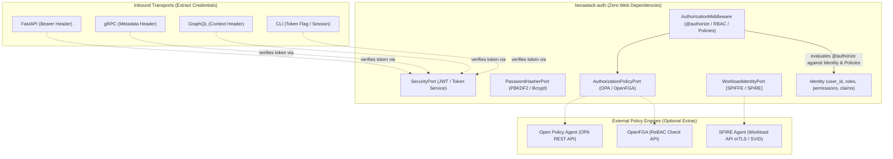

# Hexastack Auth

**`hexastack-auth`** is the security, identity, and authorization engine for the Hexastack framework. It provides protocol-agnostic identity primitives, JWT token creation/verification, PBKDF2 password hashing, and declarative `@authorize` access control across CQRS pipelines (RBAC, OPA Policy-as-Code, OpenFGA ReBAC, and SPIFFE Workload Identity).

---

## 🏛️ Architectural Overview

`hexastack-auth` adheres strictly to Hexagonal Architecture by maintaining zero dependencies on HTTP web frameworks or transport libraries. Presentation adapters (FastAPI, gRPC, GraphQL, MCP, CLI) populate the `Identity` context, and the CQRS `AuthorizationMiddleware` enforces permissions, policies, relationship checks, and workload identity uniformly.



---

## 📦 Features & Optional Extras

| Feature / Engine | Scoped Extra | Key Components | Description |
|---|---|---|---|
| **Core RBAC & JWT** | *(Included by default)* | `JwtSecurityAdapter`, `Pbkdf2PasswordHasher` | Role/permission-based access control, cryptographic token issuance. |
| **FastAPI Route Guards** | `hexastack-auth[fastapi]` | `require_policy`, `require_relation` | HTTP endpoint dependencies enforcing OPA policies and OpenFGA relationships. |
| **gRPC Auth Interceptor** | `hexastack-auth[grpc]` | `AuthServerInterceptor` | Server interceptor extracting metadata credentials and SPIFFE IDs into `UserContext`. |
| **Open Policy Agent** | `hexastack-auth[opa]` | `OpaPolicyAdapter` | Policy-as-Code evaluation querying OPA Rego decision endpoints. |
| **OpenFGA ReBAC** | `hexastack-auth[openfga]` | `OpenFgaPolicyAdapter` | Fine-grained relationship-based access control (user can_edit document). |
| **SPIFFE / SPIRE** | `hexastack-auth[spiffe]` | `SpiffeWorkloadAdapter` | Zero-Trust workload identity and service-to-service SVID attestation. |

---

## 🚀 Quickstart

### 1. Configuration (`pyproject.toml` or `hexastack.toml`)

```toml
[hexastack.auth]
secret_key = "your-production-secret-key"
algorithm = "HS256"
token_expire_minutes = 120
provider = "jwt"
hasher = "pbkdf2"

# Open Policy Agent (OPA)
[hexastack.auth.opa]
enabled = true
url = "http://localhost:8181"
policy_path = "v1/data/authz/allow"

# OpenFGA ReBAC
[hexastack.auth.openfga]
enabled = true
api_url = "http://localhost:8080"
store_id = "01HN7K2M9V..."

# SPIFFE / SPIRE Workload Identity
[hexastack.auth.spiffe]
enabled = true
socket_path = "unix:///tmp/spire-agent/public/api.sock"
trust_domain = "example.org"
```

### 2. Protecting CQRS Messages with `@authorize`

```python
from hexastack_core.domain import Command
from hexastack_auth import authorize, requires_role


# 1. Standard RBAC
@authorize(roles=["admin"], permissions=["users:ban"])
class BanUserCommand(Command):
    user_id: str
    reason: str


# 2. OPA Policy-as-Code
@authorize(policy="policies.finance.approve_invoice")
class ApproveInvoiceCommand(Command):
    invoice_id: str
    amount: float


# 3. OpenFGA Relationship Check (ReBAC)
@authorize(relation="editor", object_type="document", object_id_field="doc_id")
class EditDocumentCommand(Command):
    doc_id: str
    content: str


# 4. SPIFFE Workload Trust (Service-to-Service)
@authorize(spiffe_ids=["spiffe://example.org/ns/prod/sa/billing-service"])
class SyncBillingCommand(Command):
    tx_id: str
```

### 3. FastAPI Route-Level Policy & Relationship Guards

```python
from fastapi import Depends, FastAPI
from hexastack_auth.adapters.fastapi import require_policy, require_relation

app = FastAPI()

# Guard endpoint with OPA Rego policy
@app.get(
    "/reports/confidential",
    dependencies=[Depends(require_policy("v1/data/reports/view"))],
)
async def get_confidential_reports():
    return {"data": "classified"}


# Guard endpoint with OpenFGA ReBAC relation
@app.post(
    "/documents/{doc_id}",
    dependencies=[Depends(require_relation("editor", "document", "doc_id"))],
)
async def update_document(doc_id: str):
    return {"status": "updated", "doc_id": doc_id}
```

### 4. gRPC Server Authentication Interceptor

```python
import grpc
from hexastack_auth.adapters.grpc import AuthServerInterceptor
from hexastack_auth.ports import SecurityPort, WorkloadIdentityPort

security_port = runtime.container.resolve(SecurityPort)
workload_port = runtime.container.resolve(WorkloadIdentityPort)

server = grpc.server(
    futures.ThreadPoolExecutor(max_workers=10),
    interceptors=[
        AuthServerInterceptor(
            security_port=security_port,
            workload_port=workload_port,
            required=False,
        )
    ],
)
```
