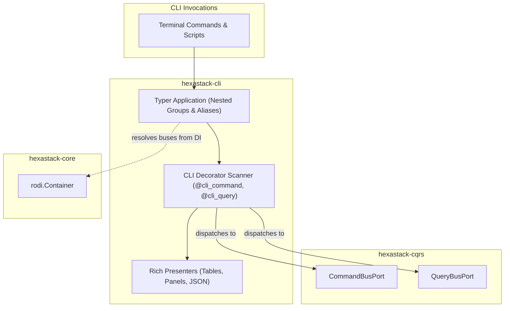

# hexastack-cli

> Typer and Rich presentation adapter for Hexastack: nested commands, aliases, piped outputs, and CQRS dispatching.

[](https://www.python.org/downloads/)

---

## 1. Overview & Capabilities

`hexastack-cli` turns Hexastack CQRS commands and queries into intuitive, modern CLI applications:

- **Nested Command Hierarchies**: Nest subcommands naturally (`app user create`, `app db migrate`) using `@cli_group`.
- **Command Aliases**: Register multiple aliases for the same action (`app user new == app user create`).
- **Feature Flag Gating**: Gate CLI commands dynamically with `@feature_flag_command(...)` and `@cli_command(..., feature_flag=...)`.
- **Rich Formatted & CI-Friendly Output**: Beautiful tables, panels, and spinners for interactive terminals; clean text/JSON streaming for CI/CD pipelines.
- **Direct CQRS Dispatching**: Declaratively expose domain commands (`@cli_command`) and queries (`@cli_query`) with automatic parameter parsing and validation.

---

## 2. Package Anatomy & Key Components

```
hexastack_cli/
├── domain/          # CliContext, OutputFormat enum
├── adapters/        # create_cli_app, Rich presenters, Typer command runners
└── infra/           # CliBootstrapper (order=30), @cli_command, @cli_query, @cli_group, @feature_flag_command
```

### Key Exports

| Category | Exports |
|---|---|
| **Decorators** | `@cli_command`, `@cli_query`, `@cli_group`, `@feature_flag_command` |
| **Application Factory** | `create_cli_app`, `CliBootstrapper` (order=30) |
| **Presenters** | `RichTerminalPresenter`, `ConsolePresenter`, `TablePresenter`, `JsonPresenter` |

---

## 3. Monorepo & Sibling Relationships



### Explicit Dependencies (Direct)
- `hexastack-core`: Core kernel, DI container, and ports.
- `hexastack-cqrs`: `CommandBusPort` and `QueryBusPort` for message dispatching.
- `typer>=0.27.1`: CLI command parser and shell completion.
- `rich>=15.0.0`: Terminal formatting, tables, and colors.

### Implied / Behavioral Relationships (DI-Mediated)
- **CQRS Integration**: Dispatches CLI argument payloads directly into the application's command and query buses.
- **Umbrella CLI**: Consumed by the `hexastack` umbrella package to power diagnostic commands (`hexastack info`, `hexastack inspect registry`, `hexastack demo ping`).

---

## 4. Installation

```bash
# Standalone install
pip install hexastack-cli

# Via umbrella package
pip install "hexastack[cli]"
```

---

## 5. Quickstart Example

```python
from dataclasses import dataclass
from hexastack_core.infra.bootstrap import bootstrap
from hexastack_cqrs.domain.query import Query
from hexastack_cqrs.infra.decorators import query_handler
from hexastack_cli.infra.decorators import cli_query, cli_group


@dataclass(frozen=True)
class CheckStatusQuery(Query):
    service_name: str


@query_handler(CheckStatusQuery)
class CheckStatusHandler:
    def __call__(self, qry: CheckStatusQuery) -> dict:
        return {"service": qry.service_name, "status": "ONLINE"}


# Expose query as a CLI command
cli_query("status", aliases=["st", "health"], help="Check status of a service")(
    CheckStatusQuery
)

runtime = bootstrap(packages_to_scan=[__name__])
cli_app = runtime.get("cli_app")
```
