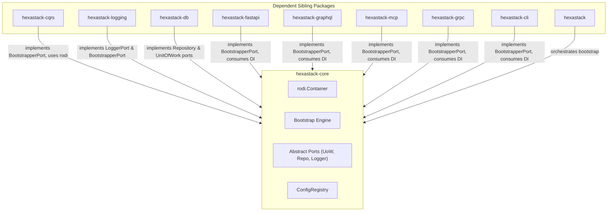

# hexastack-core

> The foundational kernel of Hexastack: dependency injection, abstract ports, domain abstractions, configuration registry, and the modular bootstrap lifecycle.

[](https://www.python.org/downloads/)
[](https://codecov.io/github/TheTrueSCU/hexastack)

---

## 1. Overview & Capabilities

`hexastack-core` serves as the zero-dependency (excluding `pydantic` and `rodi`) microkernel for all Hexastack packages. It establishes:

- **Dependency Injection Engine**: Powered by `rodi`, managing service lifecycles (singleton, scoped, transient).
- **Feature Flag Port & Providers**: Vendor-agnostic feature toggling (`FeatureFlagPort`, `EvaluationContext`, `ConfigFeatureFlagAdapter`, `InMemoryFeatureFlagAdapter`) with multi-tenant and ambient `UserContext` targeting.
- **Core Domain Primitives**: Generic `Result[T, E]`, generic types, and standard exception hierarchies (`HexastackError`, `ConfigurationError`, `MissingDependencyError`).
- **Core Port Contracts**: Standard abstract protocols and ABCs for repositories (`Repository[E, ID]`), unit of work (`UnitOfWork`), logging (`LoggerPort`), presenters (`PresenterPort`), feature flags (`FeatureFlagPort`), and bootstrappers (`BootstrapperPort`).
- **Configuration & Type Registries**: Type-safe Pydantic configuration parsing from TOML (`ConfigRegistry`) and generic type registries (`GenericTypeRegistry`).
- **Three-Phase Bootstrap Engine**: Deterministic orchestration of Phase 1 config registration, Phase 2 container assembly, and Phase 3 reflective scanning.
- **Testing & Quality Toolkit**:
  - `assert_clean_architecture(...)`: Hexagonal architecture boundary verification powered by `pytest-archon`.
  - `create_test_runtime(...)`: Lightweight in-memory DI test harness and doubles (`TestRuntime`).
  - `cqrs_strategy(...)`: Hypothesis property-based fuzzing strategy generator for Pydantic/dataclass CQRS models.
  - Feature flag testing: `@parametrize_flags`, `flag_scope`, `@require_feature`, and `@require_extra`.
- **Context Utilities**: Async-safe correlation ID and context variable management (`get_correlation_id`, `set_correlation_id`, `UserContext`).

---

## 2. Package Anatomy & Key Components

```
hexastack_core/
├── domain/          # Result[T, E], HexastackError, Entity, ValueObject, EvaluationContext
├── ports/           # Repository, UnitOfWork, BootstrapperPort, LoggerPort, PresenterPort, FeatureFlagPort
├── adapters/        # InMemoryRepository, InMemoryUnitOfWork, InMemoryFeatureFlagAdapter, ConfigFeatureFlagAdapter
├── infra/           # Bootstrap engine, ConfigRegistry, GenericTypeRegistry, decorators
├── testing/         # assert_clean_architecture, create_test_runtime, cqrs_strategy, flag_scope, isolation
└── utils/           # Context variable utilities, reflection helpers
```

### Key Exports

| Category | Exports |
|---|---|
| **Bootstrap** | `bootstrap`, `BootstrapContext`, `BootstrapResult`, `scan_modules` |
| **Config** | `ConfigRegistry`, `HexastackConfig`, `HexastackCoreConfig`, `@config_section` |
| **Context** | `get_correlation_id`, `set_correlation_id`, `correlation_scope`, `UserContext` |
| **Domain** | `Result`, `Ok`, `Err`, `HexastackError`, `ConfigurationError`, `MissingDependencyError`, `EntityNotFoundError` |
| **Feature Flags** | `EvaluationContext`, `FlagEvaluationDetails`, `InMemoryFeatureFlagAdapter`, `ConfigFeatureFlagAdapter` |
| **Ports** | `BootstrapperPort`, `Repository`, `AsyncRepository`, `UnitOfWork`, `AsyncUnitOfWork`, `LoggerPort`, `PresenterPort`, `FeatureFlagPort` |
| **Registries** | `GenericTypeRegistry`, `ExceptionRegistry` |
| **Testing** | `assert_clean_architecture`, `create_test_runtime`, `TestRuntime`, `cqrs_strategy`, `faker_strategy`, `flag_scope`, `generate_synthetic_payload`, `isolate_registries`, `parametrize_flags`, `@require_extra`, `@require_feature`, `seeded_faker` |

---

## 3. Monorepo & Sibling Relationships



### Explicit Dependencies (Direct)
- `pydantic>=2.13.4`: Schema validation and config parsing.
- `rodi>=2.1.0`: Fast, lightweight dependency injection container.

### Implied / Behavioral Relationships (DI-Mediated)
- **Provides Ports**: Defines `UnitOfWorkPort` and `Repository` implemented by `hexastack-db`.
- **Provides Telemetry Contract**: Defines `LoggerPort` implemented by `hexastack-logging`.
- **Provides Bootstrap Framework**: All siblings expose extension entry points implementing `BootstrapperPort`.

---

## 4. Installation

```bash
# Standalone installation
pip install hexastack-core

# Via umbrella package
pip install hexastack
```

---

## 5. Configuration Reference

Configuration schemas are registered under `[hexastack]`:

```toml
[hexastack]
app_name = "my-application"
environment = "production" # "development", "staging", "production", "test"
debug = false
```

---

## 6. Quickstart Example

```python
from hexastack_core.infra.bootstrap import bootstrap
from hexastack_core.ports.bootstrap import BootstrapperPort, BootstrapContext
from hexastack_core.domain.result import Ok, Err, Result


# 1. Implement a custom extension
class ServiceBootstrapper(BootstrapperPort):
    name = "custom_service"
    order = 10

    def configure(self, context: BootstrapContext) -> None:
        context.container.add_instance("Service Configured", declared_class=str)


# 2. Run deterministic bootstrap
result = bootstrap(bootstrappers=[ServiceBootstrapper()], auto_discover=False)
value = result.container.get(str)
print(value)  # "Service Configured"
```
