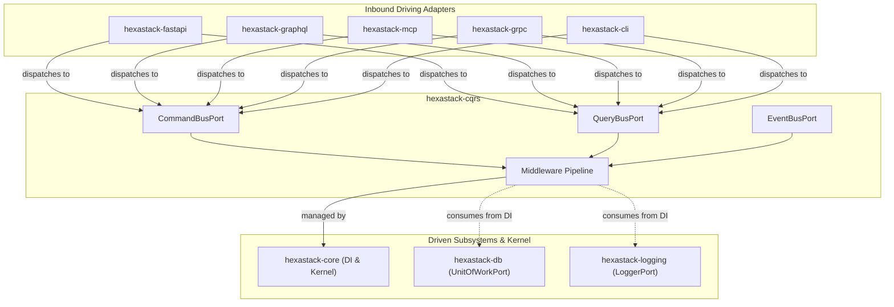

# hexastack-cqrs

> Command Query Responsibility Segregation (CQRS) buses, execution pipelines, and middleware for Hexastack.

[](https://www.python.org/downloads/)
[](https://codecov.io/github/TheTrueSCU/hexastack)

---

## 1. Overview & Capabilities

`hexastack-cqrs` powers the application logic layer of Hexastack applications, enforcing a strict separation between write operations (Commands) and read projections (Queries):

- **Synchronous & Asynchronous Buses**: `SynchronousCommandBus`, `SynchronousQueryBus`, `SynchronousEventBus`, and async/distributed buses.
- **Composable Middleware Pipeline**: Pluggable middlewares executed sequentially before and after command/query handling:
  - `CorrelationMiddleware`: Propagates correlation IDs across requests and async tasks.
  - `TimingMiddleware`: Measures and records execution latency.
  - `LoggingMiddleware`: Logs execution lifecycles and errors via `LoggerPort` (dynamically gated via `features.cqrs.logging`).
  - `TenacityRetryMiddleware`: Exponential backoff and retry policies powered by `tenacity` (dynamically gated via `features.cqrs.retry`).
  - `UnitOfWorkMiddleware`: Automatic transaction scoping (`commit()` on success, `rollback()` on failure).
  - `ConditionalFeatureFlagMiddleware`: Evaluates dynamic feature flags before dispatching commands/queries.
- **Declarative Decorators & Scanning**: `@command_handler`, `@query_handler`, `@event_handler`, and `@feature_flag` registered via reflective module scanning.
- **Declarative Query Caching & Tag Invalidation**:
  - `@cached_query(ttl_seconds, tags, key_fields)`: Declaratively caches read projections in `CachePort` / `AsyncCachePort`.
  - `@invalidates_cache(tags)`: Automatically invalidates related cached tag groups when modifying Commands succeed.
  - `QueryCachingMiddleware` & `CommandCacheInvalidationMiddleware`: Intercept query executions and command results to manage cache lifecycles transparently.
- **Presenter & Response Mapping**: Integration with `PresenterPort` for formatting outputs across CLI and REST adapters.

---

## 2. Package Anatomy & Key Components

```
hexastack_cqrs/
├── domain/          # Command, Query, Event, Handler protocols, CQRS exceptions
├── ports/           # CommandBusPort, QueryBusPort, EventBusPort, MiddlewarePort
├── adapters/        # Buses (Synchronous & Asynchronous with Huey)
└── infra/           # CqrsBootstrapper (order=20), Middleware pipeline, Registries, @cached_query, @feature_flag
```

### Key Exports

| Category | Exports |
|---|---|
| **Adapters** | `SynchronousCommandBus`, `SynchronousQueryBus`, `SynchronousEventBus`, `HueyCommandBus`, `HueyEventBus` |
| **Bootstrap** | `CqrsBootstrapper` (order=20), `CqrsConfig` |
| **Decorators** | `@command_handler`, `@query_handler`, `@event_handler`, `@cached_query`, `@invalidates_cache`, `@feature_flag`, `@presenter` |
| **Domain** | `Command`, `Query`, `Event`, `CommandHandler`, `QueryHandler`, `EventHandler` |
| **Middlewares** | `CorrelationMiddleware`, `TimingMiddleware`, `LoggingMiddleware`, `QueryCachingMiddleware`, `CommandCacheInvalidationMiddleware`, `TenacityRetryMiddleware`, `UnitOfWorkMiddleware`, `ConditionalFeatureFlagMiddleware`, `ExecutionPipeline` |
| **Ports** | `CommandBusPort`, `QueryBusPort`, `EventBusPort`, `MiddlewarePort` |


---

## 3. Monorepo & Sibling Relationships



### Explicit Dependencies (Direct)
- `hexastack-core`: Core kernel, DI container, base exceptions, and ports.
- `tenacity>=9.0.0`: Resilient retry policies with exponential backoff.

### Implied / Behavioral Relationships (DI-Mediated)
- **UnitOfWork Scoping**: `UnitOfWorkMiddleware` dynamically resolves `UnitOfWorkPort` from the DI container (injected by `hexastack-db`) to manage transactions.
- **Telemetry Integration**: `LoggingMiddleware` dynamically resolves `LoggerPort` from the DI container (injected by `hexastack-logging`).
- **Driving Adapters**: Consumed by `hexastack-fastapi` and `hexastack-cli` to route incoming user actions to business handlers.

### Optional Integrations (Extras)
- `[huey]`: Enables asynchronous, distributed task queue execution using `HueyCommandBus` and `HueyEventBus`.

---

## 4. Installation

```bash
# Standalone installation
pip install hexastack-cqrs

# With asynchronous distributed background worker (Huey)
pip install "hexastack-cqrs[huey]"

# Via umbrella package
pip install hexastack
```

---

## 5. Configuration Reference

```toml
[hexastack.cqrs]
enable_correlation = true
enable_timing = true
enable_logging = true
enable_uow = true
retry_attempts = 3
retry_backoff_base = 0.5
```

---

## 6. Quickstart Example

```python
from dataclasses import dataclass
from hexastack_core.infra.bootstrap import bootstrap
from hexastack_cqrs.domain.command import Command
from hexastack_cqrs.infra.decorators import command_handler
from hexastack_cqrs.ports.buses import CommandBusPort


@dataclass(frozen=True)
class CreateOrderCommand(Command):
    order_id: str
    amount: float


@command_handler(CreateOrderCommand)
class CreateOrderHandler:
    def __call__(self, cmd: CreateOrderCommand) -> str:
        return f"Order {cmd.order_id} created for ${cmd.amount:.2f}"


runtime = bootstrap(packages_to_scan=[__name__])
bus = runtime.container.get(CommandBusPort)

result = bus.dispatch(CreateOrderCommand(order_id="ord-99", amount=49.99))
print(result)  # "Order ord-99 created for $49.99"
```
