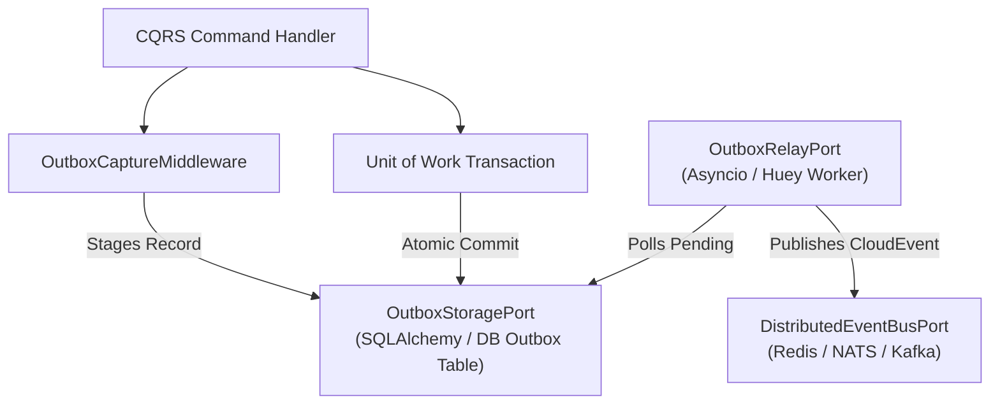

# hexastack-events

**CNCF CloudEvents 1.0 serialization, Transactional Outbox pattern, and distributed event streaming for Hexastack.**

Part of the [Hexastack Framework](https://github.com/TheTrueSCU/hexastack).

[](https://pypi.org/project/hexastack-events/)
[](https://www.python.org/downloads/)
[](https://codecov.io/github/TheTrueSCU/hexastack)
[](../../LICENSE)

---

## 1. Architectural Overview

`hexastack-events` extends Hexastack's in-process CQRS buses with enterprise distributed event streaming and reliability patterns:

1. **CNCF CloudEvents 1.0 Protocol**: Automatic serialization and deserialization of domain `Event` models into standardized CloudEvents JSON envelopes with W3C correlation ID and multi-tenant partitioning.
2. **Transactional Outbox Engine (Gap 6)**: Guarantees at-least-once delivery by staging uncommitted domain events in an `OutboxStoragePort` within the same transaction as business state mutations.
3. **Dual Relay Engines**:
   - **Native Asyncio (`AsyncioOutboxRelay`)**: In-process background task running with zero external dependencies.
   - **Huey Worker (`HueyOutboxRelay`)**: Multi-process worker executing outbox polling in separate worker nodes (`pip install hexastack-events[huey]`).
4. **Relational Database Outbox Storage (`SqlAlchemyOutboxStorage`)**: Pluggable storage adapter supporting SQLAlchemy tables and transactions (`pip install hexastack-events[sql]`).
5. **Distributed Event Bus ([`DistributedEventBusPort`](file:///home/rjdw/Projects/hexastack/packages/hexastack_events/src/hexastack_events/ports/buses.py))**: Standardized cross-service messaging interface for Redis, NATS, Kafka, and in-memory brokers.



---

## 2. Key Exports & Package Structure

```
hexastack_events/
├── domain/          # EventContext, OutboxRecord, OutboxStatus, CloudEventEnvelope, EventError
├── ports/           # OutboxStoragePort, OutboxRelayPort, DistributedEventBusPort
├── adapters/
│   ├── cloudevents/ # to_cloudevent, from_cloudevent, cloudevent_to_json/dict
│   ├── outbox/      # AsyncioOutboxRelay, HueyOutboxRelay, InMemoryOutboxStorage, SqlAlchemyOutboxStorage
│   └── buses/       # InMemoryDistributedEventBus
└── infra/           # EventsBootstrapper (order=22), HexastackEventsConfig, OutboxCaptureMiddleware
```

---

## 3. Quickstart & Installation

```bash
# Core CloudEvents & Asyncio Outbox Relay (zero extra dependencies)
pip install hexastack-events

# With SQLAlchemy relational database outbox storage
pip install "hexastack-events[sql]"

# With Huey multi-process worker support
pip install "hexastack-events[huey]"
```

### Configuration (`hexastack.toml` or `pyproject.toml`)

```toml
[hexastack.events]
source = "billing-service"
relay_mode = "asyncio" # "asyncio", "huey", "manual", "disabled"
poll_interval_seconds = 1.0
batch_size = 50
max_retries = 5
enabled = true
```

### Transactional Outbox Example with SQLAlchemy

```python
from hexastack_core.domain import Event
from hexastack_events.adapters.outbox.sqlalchemy import OutboxEventMixin
from sqlalchemy.orm import DeclarativeBase


class Base(DeclarativeBase):
    pass


class OrderOutboxEvent(Base, OutboxEventMixin):
    __tablename__ = "outbox_events"


class OrderPlacedEvent(Event):
    order_id: str
    total_amount: float
    customer_id: str
```
