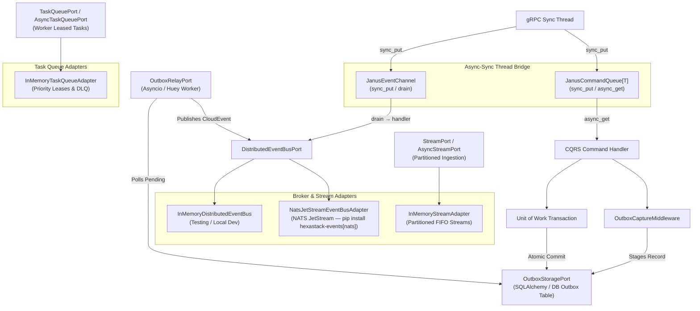

# hexastack-events

**CNCF CloudEvents 1.0 serialization, Transactional Outbox pattern, NATS JetStream distributed event bus, and janus async-sync thread bridge for Hexastack.**

Part of the [Hexastack Framework](https://github.com/TheTrueSCU/hexastack).

[](https://pypi.org/project/hexastack-events/)
[](https://www.python.org/downloads/)
[](https://codecov.io/github/TheTrueSCU/hexastack)
[](../../LICENSE)

---

## 1. Architectural Overview

`hexastack-events` extends Hexastack's in-process CQRS buses with enterprise distributed event streaming, reliability patterns, and async-sync thread bridging:

1. **CNCF CloudEvents 1.0 Protocol**: Automatic serialization and deserialization of domain `Event` models into standardized CloudEvents JSON envelopes with W3C correlation ID and multi-tenant partitioning.
2. **Transactional Outbox Engine**: Guarantees at-least-once delivery by staging uncommitted domain events in an `OutboxStoragePort` within the same transaction as business state mutations.
3. **Partitioned Stream Engine (`StreamPort`, `InMemoryStreamAdapter`)**: High-throughput partitioned event stream ingestion with deterministic partition key routing, consumer group offset tracking, and async/sync read slices.
4. **Distributed Task Queue & Worker Leasing (`TaskQueuePort`, `InMemoryTaskQueueAdapter`)**: Background task execution with active worker leasing, priority-ordered execution, lease renewals/heartbeats, failure retries, and dead-letter queue routing.
5. **Dual Relay Engines with Multi-Process Locking**:
   - **Native Asyncio (`AsyncioOutboxRelay`)**: In-process background task with zero external dependencies, supporting optional `LockPort` / `filelock` coordination.
   - **Huey Worker (`HueyOutboxRelay`)**: Multi-process worker executing outbox polling in separate worker nodes (`pip install hexastack-events[huey]`), supporting optional `LockPort` / `filelock` mutual exclusion.
6. **Relational Database Outbox Storage (`SqlAlchemyOutboxStorage`)**: Pluggable storage adapter supporting SQLAlchemy tables and transactions (`pip install hexastack-events[sql]`).
7. **NATS JetStream Distributed Event Bus (`NatsJetStreamEventBusAdapter`)**: Production-grade at-least-once delivery via NATS JetStream — durable push consumers, WorkQueue stream retention, dead-letter routing, and msgspec zero-copy encoding (`pip install hexastack-events[nats]`).
8. **Janus Async-Sync Thread Bridge (`JanusEventChannel`, `JanusCommandQueue[T]`)**: Thread-safe ↔ asyncio-safe queue bridges enabling synchronous OS threads (gRPC servicers, CLI handlers) to enqueue events and commands for dispatch by async event-loop consumers (`pip install hexastack-events[janus]`).
9. **Multi-Process Concurrency Protection (`filelock`)**: Inter-process file locking prevents competing workers or pollers from creating lock contention or duplicate event dispatches on SQLite and filesystem backends (`pip install hexastack-events[filelock]`).




---

## 2. Key Exports & Package Structure

```
hexastack_events/
├── domain/
│   ├── models.py        # CloudEventEnvelope, OutboxRecord, OutboxStatus
│   ├── streams.py       # StreamMessage, StreamPartitionOffset
│   ├── tasks.py         # TaskRecord, TaskState
│   ├── serialization.py # MsgspecEnvelopeSerializer, encode/decode helpers
│   ├── exceptions.py    # EventError, EventDeliveryError, EventSerializationError, …
│   └── context.py       # EventContext (correlation, tenant)
├── ports/
│   ├── buses.py         # DistributedEventBusPort
│   ├── streams.py       # StreamPort, AsyncStreamPort
│   ├── tasks.py         # TaskQueuePort, AsyncTaskQueuePort
│   └── outbox.py        # OutboxStoragePort, OutboxRelayPort
├── adapters/
│   ├── cloudevents/     # to_cloudevent, from_cloudevent, cloudevent_to_json/dict
│   ├── outbox/          # AsyncioOutboxRelay, HueyOutboxRelay, InMemoryOutboxStorage, SqlAlchemyOutboxStorage
│   ├── streams/         # InMemoryStreamAdapter
│   ├── tasks/           # InMemoryTaskQueueAdapter
│   └── buses/
│       ├── in_memory.py     # InMemoryDistributedEventBus (testing)
│       ├── nats.py          # NatsJetStreamEventBusAdapter [nats]
│       └── janus_bridge.py  # JanusEventChannel, JanusCommandQueue[T] [janus]
└── infra/
    ├── bootstrap.py     # EventsBootstrapper (order=22)
    ├── config.py        # HexastackEventsConfig
    └── middleware.py    # OutboxCaptureMiddleware
```

### High-Throughput `msgspec` Serialization

`hexastack-events` includes zero-copy serialization engines powered by `msgspec`:

- `encode_cloudevent_bytes(envelope)` / `decode_cloudevent_bytes(data)`: Optimized UTF-8 JSON encoding.
- `encode_cloudevent_msgpack(envelope)` / `decode_cloudevent_msgpack(data)`: Binary MessagePack encoding.
- `MsgspecEnvelopeSerializer`: Reusable wire serialization adapter (used internally by `NatsJetStreamEventBusAdapter`).

---

## 3. Quickstart & Installation

```bash
# Core CloudEvents & Asyncio Outbox Relay (zero extra dependencies)
pip install hexastack-events

# With SQLAlchemy relational database outbox storage
pip install "hexastack-events[sql]"

# With Huey multi-process worker support
pip install "hexastack-events[huey]"

# With NATS JetStream distributed event bus
pip install "hexastack-events[nats]"

# With janus async-sync thread bridge (usable with any bus adapter)
pip install "hexastack-events[janus]"

# Full stack: NATS + janus bridge
pip install "hexastack-events[nats,janus]"
```

### Configuration (`hexastack.toml` or `pyproject.toml`)

```toml
[hexastack.events]
source = "billing-service"
relay_mode = "asyncio" # "asyncio", "huey", "manual", "disabled"
poll_interval_seconds = 1.0
batch_size = 50
max_retries = 5
enabled = true
```

### Transactional Outbox Example with SQLAlchemy

```python
from hexastack_core.domain import Event
from hexastack_events.adapters.outbox.sqlalchemy import OutboxEventMixin
from sqlalchemy.orm import DeclarativeBase


class Base(DeclarativeBase):
    pass


class OrderOutboxEvent(Base, OutboxEventMixin):
    __tablename__ = "outbox_events"


class OrderPlacedEvent(Event):
    order_id: str
    total_amount: float
    customer_id: str
```

---

## 4. NATS JetStream Adapter

`NatsJetStreamEventBusAdapter` implements `DistributedEventBusPort` backed by **NATS JetStream** for production at-least-once distributed event delivery.

### Design

| Property | Detail |
|---|---|
| **Lazy import** | `nats-py` imported only at call-time; package loads cleanly without `[nats]` installed |
| **Lazy connect** | No network I/O until `await adapter.connect()` |
| **Stream provisioning** | `WorkQueue` retention, `File` storage; calls `update_stream` if stream already exists |
| **Subject routing** | `{prefix}.{envelope.type}` — one NATS subject per CloudEvent type |
| **Wire encoding** | msgspec JSON (zero-copy, sub-millisecond) |
| **Consumer resilience** | Durable push consumers; configurable `max_deliver` + `ack_wait`; messages `nak`'d on handler failure |
| **Sync bridge** | Background asyncio thread loop + `run_coroutine_threadsafe` — sync callers never block the event loop |
| **Lifecycle** | `async with adapter:` context manager for connect/disconnect |

### Usage

```python
import asyncio
from hexastack_events.adapters.buses.nats import NatsJetStreamEventBusAdapter
from hexastack_events.domain.models import CloudEventEnvelope


async def main():
    adapter = NatsJetStreamEventBusAdapter(
        servers=["nats://localhost:4222"],
        stream_name="my-service",
        subject_prefix="my-service.events",
        max_deliver=5,
        ack_wait_seconds=30.0,
    )

    async with adapter:
        # Publish a CloudEvent envelope
        envelope = CloudEventEnvelope(
            id="evt-001",
            source="order-service",
            type="OrderPlaced",
            time="2026-08-31T00:00:00Z",
            data={"order_id": "o-42", "total": 199.0},
        )
        adapter.publish_envelope(envelope)

        # Subscribe a handler
        def on_order_placed(env: CloudEventEnvelope) -> None:
            print(f"Received: {env.type} — {env.data}")

        adapter.subscribe("OrderPlaced", on_order_placed)
        await asyncio.sleep(1)  # let messages arrive


asyncio.run(main())
```

### DI Bootstrap Integration

```python
from hexastack_events.adapters.buses.nats import NatsJetStreamEventBusAdapter
from hexastack_events.ports.buses import DistributedEventBusPort

# In your application bootstrap / DI wiring:
nats_bus = NatsJetStreamEventBusAdapter(servers=["nats://nats:4222"])
container.add_instance(nats_bus, declared_class=DistributedEventBusPort)
```

---

## 5. Janus Async-Sync Thread Bridge

`JanusEventChannel` and `JanusCommandQueue[T]` solve the hard problem of getting synchronous OS threads (gRPC servicers, CLI processes, background OS threads) to publish events or dispatch commands into an async event-loop — without nesting event loops or blocking I/O.

```mermaid
sequenceDiagram
    participant GrpcThread as gRPC Sync Thread
    participant Janus as JanusEventChannel
    participant Loop as asyncio Event Loop
    participant Bus as DistributedEventBusPort

    GrpcThread->>Janus: sync_put(envelope)
    Note right of Janus: Thread-safe enqueue
    Loop->>Janus: await async_get() [drain]
    Janus-->>Loop: envelope
    Loop->>Bus: await publish_envelope(envelope)
```

### `JanusEventChannel` — CloudEvent envelope bridge

```python
import asyncio
from hexastack_events.adapters.buses.janus_bridge import JanusEventChannel
from hexastack_events.domain.models import CloudEventEnvelope


async def start_drain(channel: JanusEventChannel, bus) -> None:
    async def handler(env: CloudEventEnvelope) -> None:
        await bus.async_publish_envelope(env)

    await channel.drain(handler)


async def main():
    channel = JanusEventChannel(maxsize=1000)
    bus = ...  # your DistributedEventBusPort

    # Start the async drainer
    asyncio.create_task(start_drain(channel, bus))

    # In a gRPC sync thread:
    import threading

    def grpc_handler():
        envelope = CloudEventEnvelope(
            id="evt-grpc-1",
            source="grpc-service",
            type="PaymentReceived",
            time="2026-08-31T00:00:00Z",
            data={"amount": 50.0},
        )
        channel.sync_put(envelope)  # non-blocking, thread-safe

    threading.Thread(target=grpc_handler).start()
    await asyncio.sleep(0.1)
```

### `JanusCommandQueue[T]` — Generic CQRS command bridge

```python
import asyncio
import threading
from hexastack_events.adapters.buses.janus_bridge import JanusCommandQueue
from my_app.commands import CreateOrderCommand


queue: JanusCommandQueue[CreateOrderCommand] = JanusCommandQueue()


async def dispatcher(bus) -> None:
    """Drain commands from sync threads into the async command bus."""

    async def dispatch(cmd: CreateOrderCommand) -> None:
        await bus.dispatch(cmd)

    await queue.drain(dispatch)


# In a sync gRPC servicer:
def grpc_create_order(request, context):
    queue.sync_put(CreateOrderCommand(order_id=request.order_id))
```

---

## 6. Adapter Comparison

| Adapter | Install | Use Case |
|---|---|---|
| `InMemoryDistributedEventBus` | *(core)* | Unit tests, local development |
| `InMemoryStreamAdapter` | *(core)* | Partitioned FIFO event stream buffer, deterministic hashing, offset tracking |
| `InMemoryTaskQueueAdapter` | *(core)* | Worker-leased background task execution, priorities, and DLQ |
| `NatsJetStreamEventBusAdapter` | `[nats]` | Production at-least-once delivery, consumer groups, DLQ |
| `JanusEventChannel` | `[janus]` | Sync thread → async event loop bridge (gRPC, CLI) |
| `JanusCommandQueue[T]` | `[janus]` | Sync thread → async CQRS command dispatch |

---

## 7. Optional Extras Summary

| Extra | Installs | Unlocks |
|---|---|---|
| *(none)* | `cloudevents`, `msgspec`, `pydantic` | CloudEvents serialization, Asyncio outbox relay |
| `[sql]` | `sqlalchemy` | Relational database outbox storage |
| `[huey]` | `huey` | Multi-process Huey outbox relay worker |
| `[apprise]` | `apprise` | Multi-channel notification adapter |
| `[nats]` | `nats-py` | NATS JetStream distributed event bus |
| `[janus]` | `janus` | Async-sync thread bridge for events and commands |
