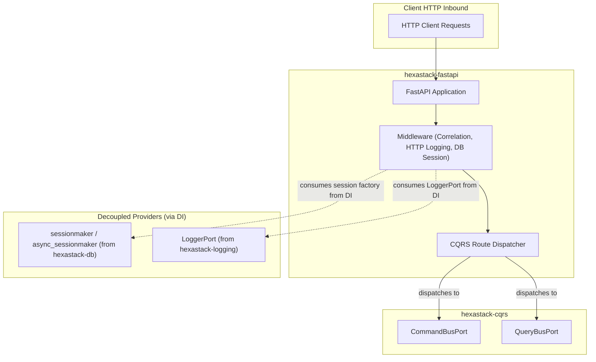

# hexastack-fastapi

> FastAPI presentation adapter for Hexastack: automatic CQRS routing, database session middleware, exception mapping, and health check endpoints.

[](https://www.python.org/downloads/)

---

## 1. Overview & Capabilities

- **Automatic CQRS Routing & Feature Gating**: Map HTTP endpoints directly to `CommandBusPort` or `QueryBusPort` using `@api_command` and `@api_query`, with native feature flag route guards (`@feature_flag_route` and `require_feature(...)`).
- **Decoupled Database Session Middleware**: `DbSessionMiddleware` (sync) and `AsyncDbSessionMiddleware` (async) manage session-per-request lifecycles by consuming sessionmakers from DI without a hard dependency on `hexastack-db`.
- **Standardized Exception Handlers**: Automatically translates domain exceptions (`EntityNotFoundError`, `UniqueConstraintViolationError`, `HexastackError`) into appropriate HTTP status codes (404, 409, 500) and structured JSON error envelopes.
- **Observability & Correlation Middleware**: Injects `X-Correlation-ID` headers and logs HTTP request lifecycles.
- **Built-in Health Checks**: Configurable `/health` and `/ready` endpoints verifying container and subsystem readiness.

---

## 2. Package Anatomy & Key Components

```
hexastack_fastapi/
├── domain/          # HealthStatus, HTTP error envelope models
├── adapters/        # create_app, routing decorators, health endpoints, db_session middleware, dependencies
└── infra/           # FastApiBootstrapper (order=30), exception handlers, correlation/logging middlewares
```

### Key Exports

| Category | Exports |
|---|---|
| **Application Factory** | `create_app`, `FastApiBootstrapper` (order=30) |
| **Decorators** | `@api_command`, `@api_query`, `@feature_flag_route`, `RouteMetadata` |
| **Dependencies** | `get_container`, `get_pipeline`, `get_feature_flags`, `require_feature` |
| **Exception Handlers** | `register_exception_handlers`, `domain_exception_handler` |
| **Middlewares** | `DbSessionMiddleware`, `AsyncDbSessionMiddleware`, `add_db_session_middleware`, `CorrelationMiddleware`, `HttpLoggingMiddleware` |
| **Routing** | `CqrsRouter`, `autodiscover_routes` |
| **Testing & Conformance** | `create_test_client`, `check_openapi_conformance` (Schemathesis contract checks) |

---

## 3. Monorepo & Sibling Relationships



### Explicit Dependencies (Direct)
- `hexastack-core`: DI container, core ports, exception registry, and context propagation.
- `hexastack-cqrs`: `CommandBusPort` and `QueryBusPort` for message dispatching.
- `fastapi>=0.141.1`: Web framework and ASGI routing.

### Implied / Behavioral Relationships (DI-Mediated)
- **Zero-Dependency DB Session Management**: `DbSessionMiddleware` dynamically resolves SQLAlchemy `sessionmaker` from DI without directly importing `hexastack-db`.
- **Telemetry Integration**: `HttpLoggingMiddleware` outputs structured request telemetry through `LoggerPort`.
- **Exception Mapping**: Registers global exception handlers translating core domain errors into standard HTTP error responses.

---

## 4. Installation

```bash
# Standalone install
pip install hexastack-fastapi

# With Uvicorn development server
pip install "hexastack-fastapi[web]"  # or: pip install "hexastack[web]"

# Via umbrella package
pip install "hexastack[fastapi]"
```

---

## 5. Configuration Reference

```toml
[hexastack.fastapi]
title = "Hexastack API"
version = "1.0.0"
docs_url = "/docs"
openapi_url = "/openapi.json"
cors_origins = ["*"]
enable_correlation_header = true
```

---

## 6. Quickstart Example

```python
from dataclasses import dataclass
from fastapi.testclient import TestClient
from hexastack_core.infra.bootstrap import bootstrap
from hexastack_cqrs.domain.query import Query
from hexastack_cqrs.infra.decorators import query_handler
from hexastack_fastapi.adapters.app import create_app


@dataclass(frozen=True)
class GetGreetingQuery(Query):
    name: str


@query_handler(GetGreetingQuery)
class GetGreetingHandler:
    def __call__(self, qry: GetGreetingQuery) -> dict:
        return {"message": f"Hello, {qry.name}!"}


runtime = bootstrap(packages_to_scan=[__name__])
app = create_app(runtime)

client = TestClient(app)
response = client.get("/health")
print(response.json())  # {"status": "healthy"}
```
