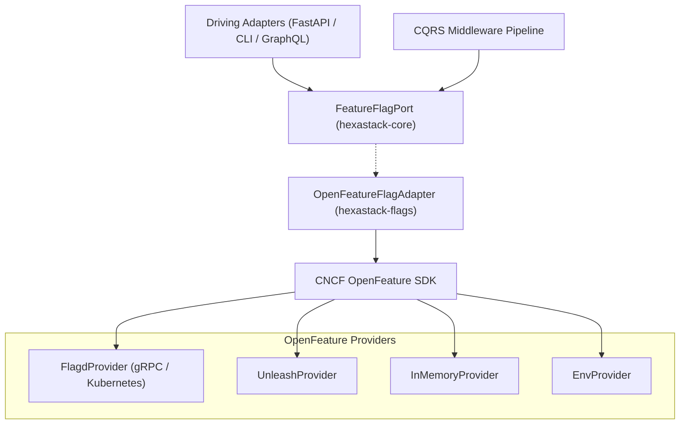

# hexastack-flags

**CNCF OpenFeature provider adapters and enterprise feature flagging for Hexastack.**

Part of the [Hexastack Framework](https://github.com/TheTrueSCU/hexastack).

[](https://pypi.org/project/hexastack-flags/)
[](https://www.python.org/downloads/)
[](https://codecov.io/github/TheTrueSCU/hexastack)
[](../../LICENSE)

---

## 1. Architectural Overview

`hexastack-flags` provides the production-grade adapter connecting Hexastack's [`FeatureFlagPort`](file:///home/rjdw/Projects/hexastack/packages/hexastack_core/src/hexastack_core/ports/feature_flags.py) to the **CNCF OpenFeature Python SDK**.

It decouples your domain, CQRS handlers, REST routes, Typer commands, and GraphQL resolvers from proprietary feature flagging APIs, allowing seamless integration with **Flagd**, **Unleash**, **Flipt**, **GO Feature Flag**, or local in-memory providers.



---

## 2. Quickstart

### Installation

```bash
# Core OpenFeature adapter with In-Memory support
pip install hexastack-flags

# With Flagd provider
pip install "hexastack-flags[flagd]"
```

### Configuration (`hexastack.toml` or `pyproject.toml`)

```toml
[hexastack.flags]
provider = "flagd" # "in_memory", "flagd", "env"
host = "localhost"
port = 8013
cache = true
timeout_ms = 5000
```

---

## 3. Evaluation Examples

```python
from hexastack_core.ports.feature_flags import FeatureFlagPort
from hexastack_core.domain.feature_flags import EvaluationContext

flags = container.resolve(FeatureFlagPort)

# 1. Simple boolean toggle
if flags.is_enabled("features.checkout.v2", default=False):
    ...

# 2. Contextual evaluation (multi-tenant / user targeting)
ctx = EvaluationContext(user_id="usr_123", tenant_id="tenant-alpha")
theme = flags.get_string_value("features.ui.theme", default="light", context=ctx)
```
