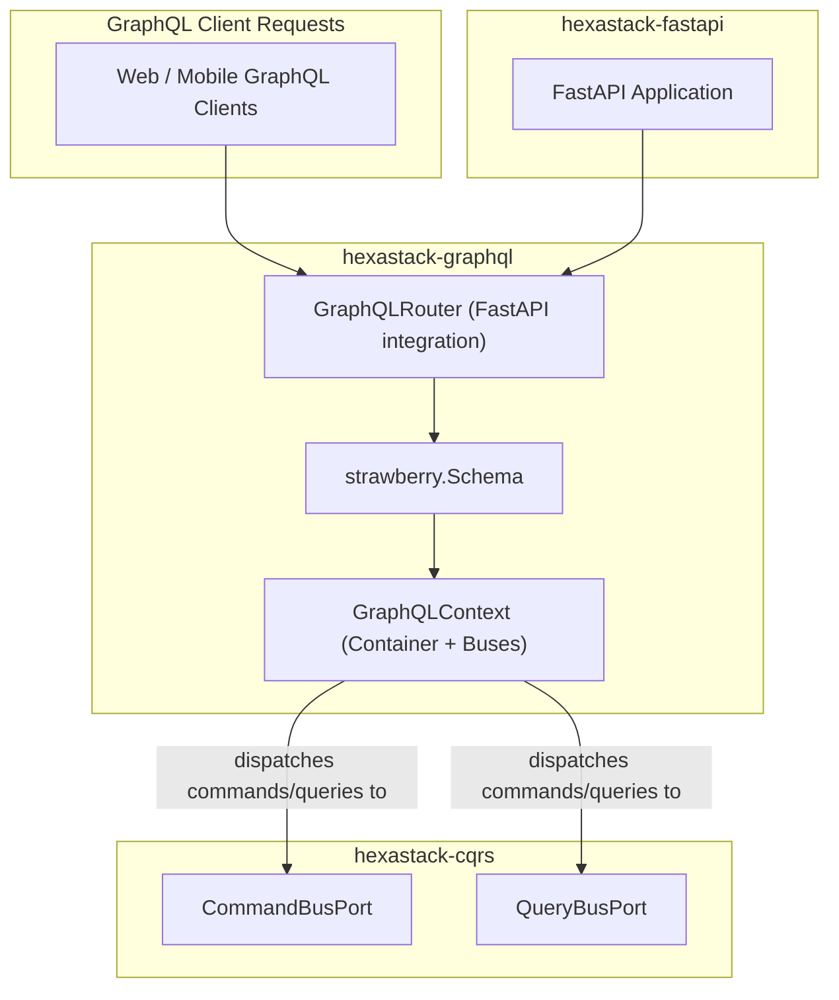

# hexastack-graphql

> Strawberry GraphQL presentation adapter and CQRS integration for Hexastack.

[](https://www.python.org/downloads/)
[](https://codecov.io/github/TheTrueSCU/hexastack)

---

## 1. Overview & Capabilities

`hexastack-graphql` brings the power and type-safety of [Strawberry GraphQL](https://strawberry.rocks/) into the Hexastack architecture:

- **Type-Safe GraphQL Schemas**: Native Python dataclass-based GraphQL schema definition via Strawberry.
- **CQRS Integration via Context**: Injects the `rodi.Container`, `CommandBusPort`, and `QueryBusPort` directly into Strawberry's `Info.context` (`GraphQLContext`).
- **Declarative Query & Mutation Registries**:
  - `@graphql_query_type` and `@graphql_mutation_type`: Register whole type classes to be merged into root Query and Mutation types.
  - `@graphql_query` and `@graphql_mutation`: Register standalone resolver functions as top-level fields.
- **Dynamic Field Resolver Feature Flagging**:
  - `@feature_flag_field("flag_key", raise_error=True, fallback=...)`: Evaluates feature flags dynamically before executing field resolvers, raising a `GraphQLError` or returning a safe fallback value.
- **FastAPI Mount & GraphiQL Playground**: Seamless mounting as a `GraphQLRouter` into FastAPI applications with interactive GraphiQL playground enabled.

---

## 2. Package Anatomy & Key Components

```
hexastack_graphql/
├── domain/          # GraphQLContext, GraphQLError, SchemaBuildingError
├── ports/           # GraphQLContextFactoryPort
├── adapters/        # create_graphql_router, mount_graphql_router (FastAPI integration)
└── infra/
    ├── bootstrap.py # GraphQLBootstrapper (order=35)
    ├── config.py    # HexastackGraphQLConfig
    ├── decorators.py# @graphql_query, @graphql_mutation, @graphql_query_type, @graphql_mutation_type, @feature_flag_field
    └── registries/  # schema.py (GraphQLSchemaRegistry)
```

### Key Exports

| Category | Exports |
|---|---|
| **Bootstrap** | `GraphQLBootstrapper` (order=35), `HexastackGraphQLConfig` |
| **Context & Domain** | `GraphQLContext`, `GraphQLError`, `SchemaBuildingError` |
| **Decorators** | `@graphql_query`, `@graphql_mutation`, `@graphql_query_type`, `@graphql_mutation_type`, `@feature_flag_field` |
| **FastAPI Adapters** | `create_graphql_router`, `mount_graphql_router` |
| **Registries** | `GraphQLSchemaRegistry`, `get_schema_registry` |

---

## 3. Monorepo & Sibling Relationships



### Explicit Dependencies (Direct)
- `hexastack-core`: DI container, configuration registry, base exceptions.
- `hexastack-cqrs`: `CommandBusPort` and `QueryBusPort` for message dispatching.
- `strawberry-graphql>=0.260.0`: Core GraphQL engine and schema generator.

### Implied / Behavioral Relationships (DI-Mediated)
- **FastAPI Auto-Mounting**: `GraphQLBootstrapper` (order=35) discovers the `FastAPI` instance created by `FastApiBootstrapper` (order=30) and attaches the `GraphQLRouter` automatically if `auto_mount_fastapi=true`.
- **CQRS Dispatching**: Field resolvers receive `info.context.query_bus` and `info.context.command_bus` to delegate execution into the CQRS pipeline.

### Optional Integrations (Extras)
- `[fastapi]`: Installs `hexastack-fastapi` and `fastapi>=0.141.1` for HTTP routing and GraphiQL playground.

---

## 4. Installation

```bash
# Standalone install
pip install hexastack-graphql

# With FastAPI integration
pip install "hexastack-graphql[fastapi]"

# Via umbrella package
pip install "hexastack[graphql]"
```

---

## 5. Configuration Reference

```toml
[hexastack.graphql]
path = "/graphql" # Route prefix for GraphQL endpoint
graphiql = true # Enable interactive GraphiQL web UI
allow_queries = true
allow_mutations = true
auto_mount_fastapi = true # Auto mount onto FastAPI application on bootstrap
title = "Hexastack GraphQL API"
```

---

## 6. Quickstart Example

```python
from dataclasses import dataclass
import strawberry
from strawberry.types import Info
from hexastack_core.infra.bootstrap import bootstrap
from hexastack_cqrs.domain.query import Query
from hexastack_cqrs.infra.decorators import query_handler
from hexastack_graphql.domain.context import GraphQLContext
from hexastack_graphql.infra.decorators import graphql_query_type


# 1. Define CQRS Query & Handler
@dataclass(frozen=True)
class GetItemQuery(Query):
    item_id: str


@query_handler(GetItemQuery)
class GetItemHandler:
    def __call__(self, qry: GetItemQuery) -> dict:
        return {"id": qry.item_id, "name": f"Item {qry.item_id}"}


# 2. Define Strawberry GraphQL Type
@strawberry.type
class ItemType:
    id: str
    name: str


@graphql_query_type
class Query:
    @strawberry.field
    def item(self, info: Info[GraphQLContext, None], item_id: str) -> ItemType:
        res = info.context.query_bus.dispatch(GetItemQuery(item_id=item_id))
        return ItemType(id=res["id"], name=res["name"])


# 3. Bootstrap Runtime with GraphQL
runtime = bootstrap(packages_to_scan=[__name__])
schema = runtime.get("graphql_schema")

result = schema.execute_sync(
    '{ item(itemId: "123") { id name } }',
    context_value=GraphQLContext(
        container=runtime.container, query_bus=runtime.get("query_bus")
    ),
)
print(result.data)  # {'item': {'id': '123', 'name': 'Item 123'}}
```
