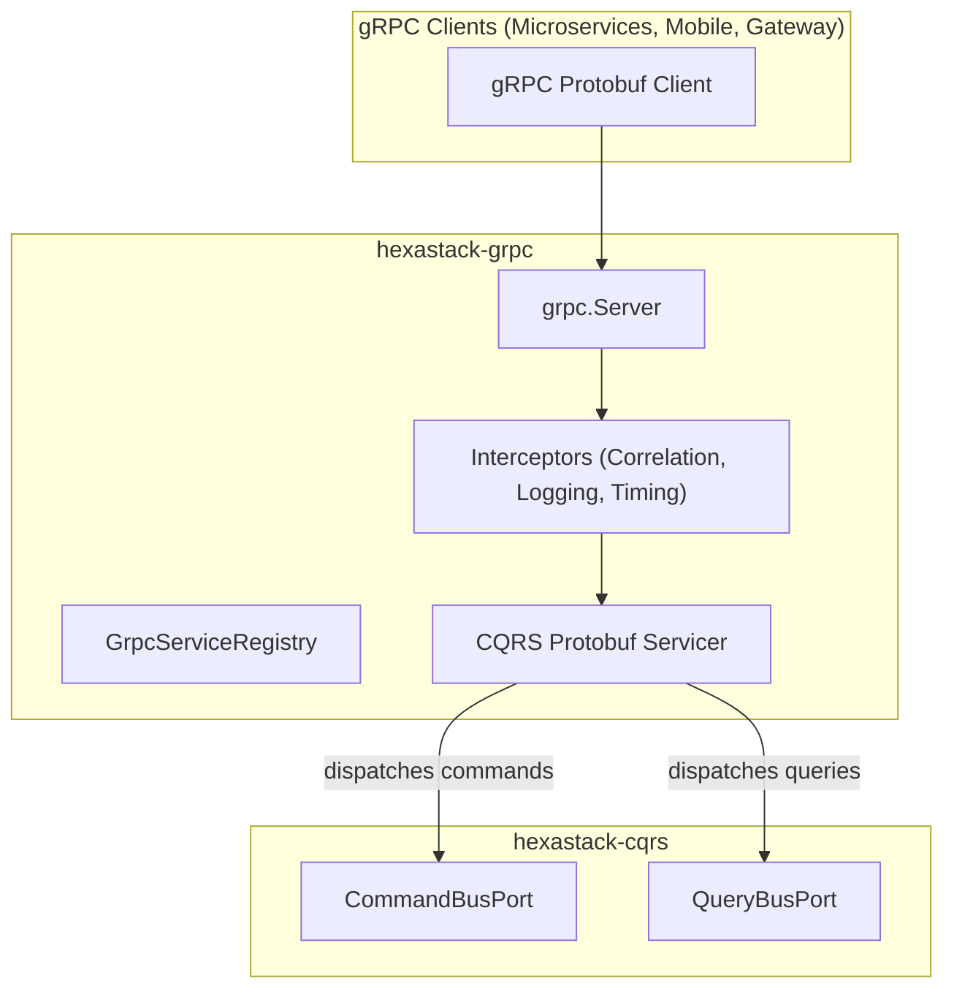

# hexastack-grpc

> High-performance gRPC presentation adapter, interceptors, and CQRS service integration for Hexastack.

[](https://pypi.org/project/hexastack-grpc/)
[](https://www.python.org/downloads/)
[](https://codecov.io/github/TheTrueSCU/hexastack)
[](../../LICENSE)
---

## 1. Overview & Capabilities

`hexastack-grpc` provides a binary RPC presentation adapter for Hexastack applications:

- **Declarative Service Registration (`@grpc_service`)**: Mounts generated protobuf RPC servicers onto the `grpc.Server` with automatic DI resolution.
- **gRPC Health Checking Protocol**: Standard `grpc.health.v1.Health` servicer (`GrpcHealthServicer`) supporting Kubernetes liveness, readiness, and stream health probes.
- **Bidirectional & Server-Streaming RPC Dispatch**: `dispatch_rpc_stream_query` and `dispatch_rpc_bidirectional_stream` streaming CQRS command and query pipelines over HTTP/2.
- **Cross-Cutting Interceptor Pipeline**:
  - `CorrelationServerInterceptor`: Propagates `x-correlation-id` from incoming metadata into `ContextVar`.
  - `LoggingServerInterceptor`: Structured telemetry for RPC method invocations.
  - `TimingServerInterceptor`: Measures RPC execution latency in milliseconds.
  - `MetricsServerInterceptor`: Records RPC request rates, statuses, and handling durations to `MetricsPort`.
- **Single-Pass Reflection**: Automatically discovers and registers decorated servicers in Phase 3 module scanning via `create_grpc_visitor`.
- **gRPC Server Reflection**: Automatically enables gRPC Server Reflection Protocol when `grpcio-reflection` is installed.


---

## 2. Package Anatomy & Key Components

```
hexastack_grpc/
├── domain/          # GrpcError, ServiceRegistrationError, RpcExecutionError
├── adapters/        # create_async_grpc_server, run_grpc_server, GrpcHealthServicer
└── infra/
    ├── bootstrap.py # GrpcBootstrapper (order=40)
    ├── config.py    # HexastackGrpcConfig
    ├── decorators.py# @grpc_service
    ├── dispatch.py  # dispatch_rpc_command, dispatch_rpc_query, dispatch_rpc_stream_query, dispatch_rpc_bidirectional_stream
    ├── autodiscovery.py # create_grpc_visitor, autodiscover_grpc_services
    ├── interceptors/# correlation, logging, timing interceptors
    └── registries/  # service.py (GrpcServiceRegistry)
```


---

## 3. Monorepo & Sibling Relationships



### Explicit Dependencies (Direct)
- `hexastack-core`: DI container (`rodi`), configuration registry, context variables.
- `hexastack-cqrs`: `CommandBusPort` and `QueryBusPort`.
- `grpcio>=1.68.0`, `protobuf>=5.29.0`.

### Optional Integrations (Extras)
- `[reflection]`: Installs `grpcio-reflection>=1.68.0` for runtime service reflection tools (`grpcurl`, Postman).

---

## 4. Installation

```bash
# Standalone installation
pip install hexastack-grpc

# With Server Reflection support
pip install "hexastack-grpc[reflection]"

# Via umbrella package
pip install "hexastack[grpc]"
```

---

## 5. Configuration Reference

```toml
[hexastack.grpc]
host = "0.0.0.0"
port = 50051
max_workers = 10
enable_reflection = true
auto_start = false
```

---

## 6. Quickstart Example

```python
from hexastack_core.infra.bootstrap import bootstrap
from hexastack_grpc.infra.decorators import grpc_service


# 1. Define Servicer implementing generated protobuf class
class GreeterServicer:
    def SayHello(self, request, context):
        return HelloReply(message=f"Hello, {request.name}!")


# 2. Register Servicer with generated add hook
@grpc_service(add_GreeterServicer_to_server)
class GreeterService(GreeterServicer):
    pass


# 3. Bootstrap Runtime and Start Server
runtime = bootstrap(packages_to_scan=[__name__])
grpc_server = runtime.get("grpc_server")
grpc_server.start()
```
