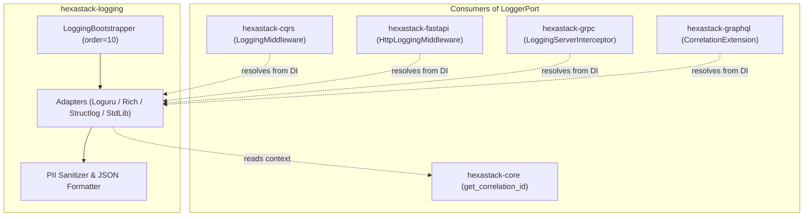

# hexastack-logging

> Structured logging, security sanitization, and adapter integrations (Loguru, Rich, Structlog) for Hexastack.

[](https://www.python.org/downloads/)
[](https://codecov.io/github/TheTrueSCU/hexastack)

---

## 1. Overview & Capabilities

`hexastack-logging` provides high-performance, structured telemetry across the entire Hexastack lifecycle:

- **Multiple Backend Adapters**: Native implementations for `Loguru`, `Rich`, `Structlog`, and standard library structured logging.
- **Security & PII Sanitization**: Automatic masking of sensitive fields (passwords, tokens, authorization headers, credit cards).
- **Formatters**: JSON formatting for cloud aggregators (Datadog, CloudWatch) and colored console formatting for local development.
- **Context & Correlation Integration**: Injects active `correlation_id` from async context into all log outputs.
- **Log Filtering & Levels**: Fine-grained level filtering and module-based log routing.

---

## 2. Package Anatomy & Key Components

```
hexastack_logging/
├── domain/          # LogRecord, LogLevel, Logging exceptions
├── ports/           # LoggerPort, FormatterPort, FilterPort, SanitizerPort
├── adapters/        # LoguruAdapter, RichAdapter, StructlogAdapter, StructuredLogger
└── infra/           # LoggingBootstrapper (order=10), Formatters, Sanitizers, Config
```

### Key Exports

| Category | Exports |
|---|---|
| **Adapters** | `StructuredLogger`, `LoguruAdapter`, `RichAdapter`, `StructlogAdapter` |
| **Bootstrap** | `LoggingBootstrapper` (order=10), `HexastackLoggingConfig` |
| **Formatters** | `JsonFormatter`, `ConsoleFormatter` |
| **Sanitization** | `SanitizerFilter`, `mask_sensitive_data` |

---

## 3. Monorepo & Sibling Relationships



### Explicit Dependencies (Direct)
- `hexastack-core`: Abstract `LoggerPort`, DI container, and async context tracking.

### Implied / Behavioral Relationships (DI-Mediated)
- **Dependency Provider**: Binds `LoggerPort` into the DI container at `order=10` (before CQRS `order=20`), ensuring telemetry is available to all subsequent bootstrappers and middlewares.
- **Correlation ID Synchronization**: Automatically reads and outputs `get_correlation_id()` stored in `hexastack_core.utils.context`.

### Optional Integrations (Extras)
- `[loguru]`: Enables `loguru>=0.7.0`.
- `[rich]`: Enables `rich>=13.0.0` console formatting.
- `[structlog]`: Enables `structlog>=24.0.0`.
- `[all]`: Installs all optional logging backends.

---

## 4. Installation

```bash
# Standalone standard library logging
pip install hexastack-logging

# With Loguru and Rich support
pip install "hexastack-logging[loguru,rich]"

# All logging backends
pip install "hexastack-logging[all]"

# Via umbrella package
pip install hexastack
```

---

## 5. Configuration Reference

```toml
[hexastack.logging]
level = "INFO" # "DEBUG", "INFO", "WARNING", "ERROR", "CRITICAL"
format = "json" # "json", "console"
backend = "structlog" # "standard", "loguru", "rich", "structlog"
sanitize_keys = ["password", "token", "secret", "authorization", "api_key"]
```

---

## 6. Quickstart Example

```python
from hexastack_core.infra.bootstrap import bootstrap
from hexastack_core.ports.logging import LoggerPort

runtime = bootstrap(
    config_overrides={
        "logging": {
            "level": "DEBUG",
            "format": "console",
        }
    }
)

logger = runtime.container.get(LoggerPort)
logger.info("Application initialized successfully", extra={"user_count": 42})
```
