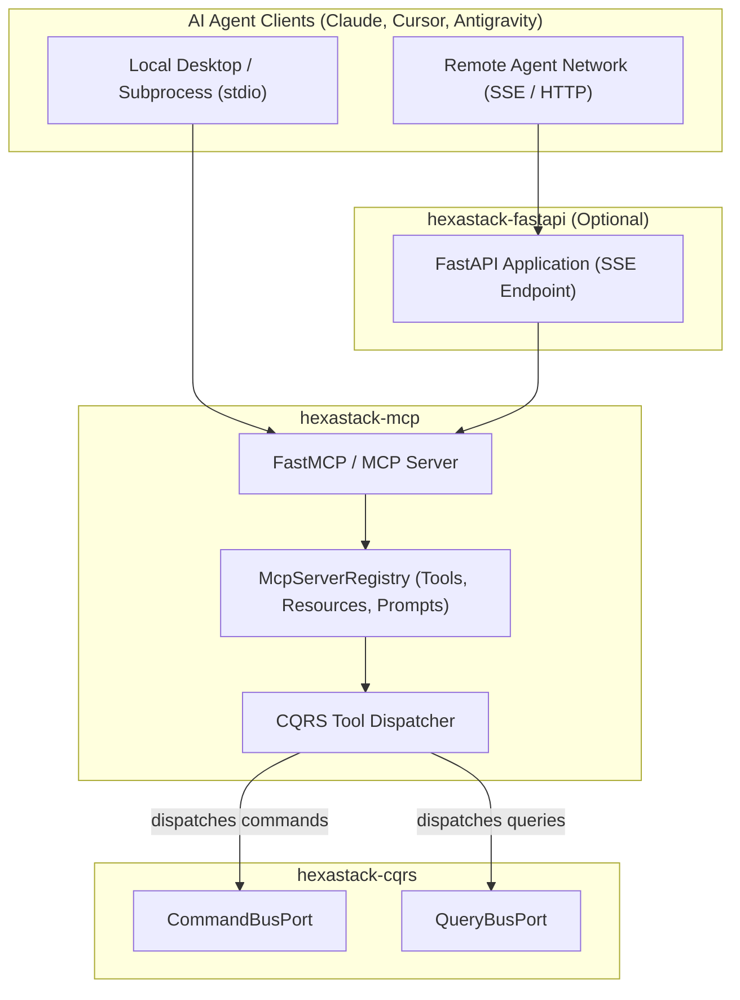

# hexastack-mcp

> Model Context Protocol (MCP) adapter and AI agent tool integration for Hexastack.

[](https://www.python.org/downloads/)

---

## 1. Overview & Capabilities

`hexastack-mcp` exposes Hexastack application services directly to AI agents (Claude Desktop, Cursor, Antigravity, custom LLM agents) via the official Anthropic Model Context Protocol:

- **Automatic CQRS Tool Generation (`@mcp_tool`)**: Decorates CQRS Command and Query models, converting them into structured LLM tools with JSON Schema validation.
- **Resource URI Providers (`@mcp_resource`)**: Exposes read endpoints and system diagnostics as readable MCP resources (`hexastack://schema`, `hexastack://info`).
- **Prompt Templates (`@mcp_prompt`)**: Configures reusable workflow prompts for LLM clients.
- **Multiple Transports**:
  - **Standard I/O (`stdio`)**: Local process communication for desktop assistants and subprocess agents.
  - **Server-Sent Events (`sse`)**: HTTP SSE transport via FastAPI for remote agent networks.
- **Single-Pass Reflection**: Discovers decorated tools and resources in Phase 3 module scanning via `create_mcp_visitor`.

---

## 2. Package Anatomy & Key Components

```
hexastack_mcp/
├── domain/          # McpToolMetadata, McpResourceMetadata, McpPromptMetadata, McpError
├── adapters/        # stdio runner, sse/FastAPI router, FastMCP server wrapper
└── infra/
    ├── bootstrap.py # McpBootstrapper (order=40)
    ├── config.py    # HexastackMcpConfig
    ├── decorators.py# @mcp_tool, @mcp_resource, @mcp_prompt
    ├── autodiscovery.py # create_mcp_visitor
    └── registries/  # server.py (McpServerRegistry)
```

### Key Exports

| Category | Exports |
|---|---|
| **Adapters** | `run_stdio_server`, `create_sse_router`, `mount_mcp_sse` |
| **Bootstrap** | `McpBootstrapper` (order=40), `HexastackMcpConfig` |
| **Decorators** | `@mcp_tool`, `@mcp_resource`, `@mcp_prompt` |
| **Registries** | `McpServerRegistry`, `get_mcp_registry` |

---

## 3. Monorepo & Sibling Relationships



### Explicit Dependencies (Direct)
- `hexastack-core`: DI container, configuration registry, base exceptions.
- `hexastack-cqrs`: `CommandBusPort` and `QueryBusPort` for message dispatching.
- `mcp>=1.3.0`: Official Anthropic Model Context Protocol SDK.

### Implied / Behavioral Relationships (DI-Mediated)
- **FastAPI SSE Integration**: `McpBootstrapper` (order=40) attaches SSE endpoints to the active `FastAPI` instance when `hexastack-fastapi` is present and `auto_mount_fastapi=true`.
- **CQRS Dispatching**: When an LLM executes an MCP tool, the adapter resolves `CommandBusPort` or `QueryBusPort` to run the command through the full middleware pipeline.

### Optional Integrations (Extras)
- `[fastapi]`: Installs `hexastack-fastapi` and `fastapi>=0.141.1` for remote SSE transport over HTTP.

---

## 4. Installation

```bash
# Standalone stdio transport
pip install hexastack-mcp

# With FastAPI remote SSE transport
pip install "hexastack-mcp[fastapi]"

# Via umbrella package
pip install "hexastack[mcp]"
```

---

## 5. Configuration Reference

```toml
[hexastack.mcp]
server_name = "Hexastack MCP Server"
server_version = "0.1.0"
sse_path = "/sse" # Route prefix for SSE transport
auto_mount_fastapi = true # Auto-mount SSE router into FastAPI on bootstrap
```

---

## 6. Quickstart Example

```python
from dataclasses import dataclass
from hexastack_core.infra.bootstrap import bootstrap
from hexastack_cqrs.domain.query import Query
from hexastack_cqrs.infra.decorators import query_handler
from hexastack_mcp.infra.decorators import mcp_tool


# 1. Define CQRS Query & Handler
@dataclass(frozen=True)
class CheckSystemStatusQuery(Query):
    service: str = "database"


@query_handler(CheckSystemStatusQuery)
class CheckSystemStatusHandler:
    def __call__(self, qry: CheckSystemStatusQuery) -> dict[str, str]:
        return {"service": qry.service, "status": "HEALTHY"}


# 2. Expose as MCP Tool for AI Agents
mcp_tool(
    name="check_status",
    description="Check the real-time operational status of internal subsystems.",
)(CheckSystemStatusQuery)

# 3. Bootstrap Runtime and Run MCP Server
runtime = bootstrap(packages_to_scan=[__name__])
mcp_server = runtime.get("mcp_server")
```
