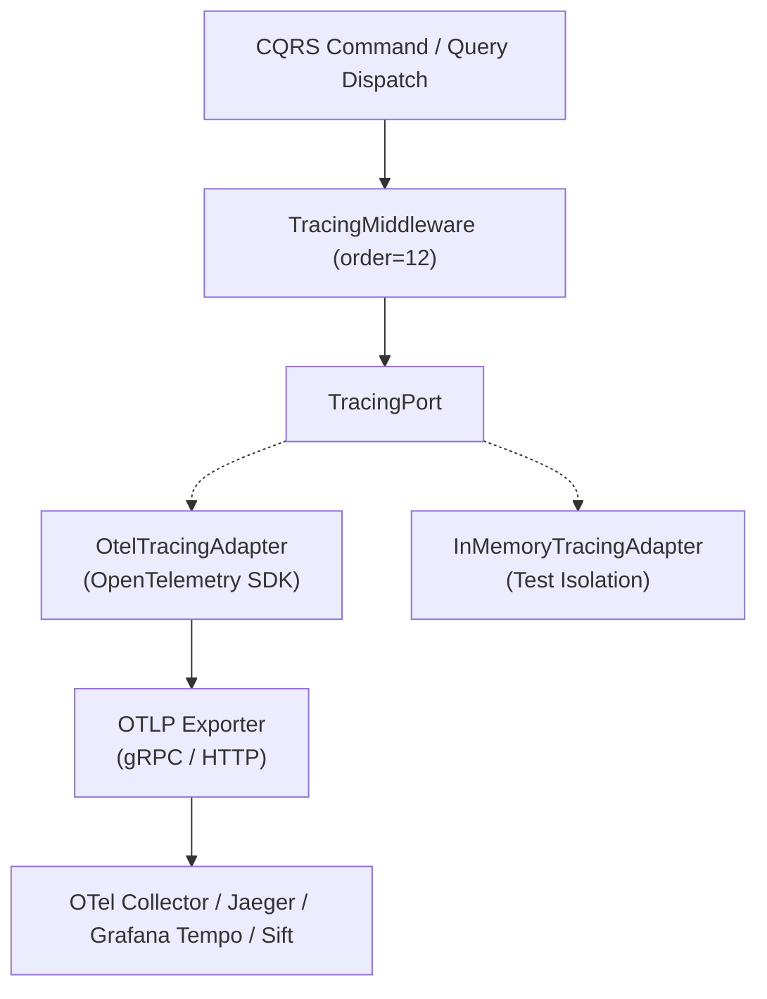

# hexastack-otel

**Vendor-agnostic OpenTelemetry distributed tracing and CQRS telemetry middleware for Hexastack.**

Part of the [Hexastack Framework](https://github.com/TheTrueSCU/hexastack).

[](https://pypi.org/project/hexastack-otel/)
[](https://www.python.org/downloads/)
[](https://codecov.io/github/TheTrueSCU/hexastack)
[](../../LICENSE)

---

## 1. Architectural Overview

`hexastack-otel` provides a pure hexagonal port interface ([`TracingPort`](file:///home/rjdw/Projects/hexastack/packages/hexastack_otel/src/hexastack_otel/ports/tracing.py)) backed by the official **OpenTelemetry Python SDK**.

It enables 100% vendor-agnostic distributed tracing, automatically linking correlation IDs and creating spans across CQRS Command/Query executions, HTTP endpoints, and gRPC RPCs.



---

## 2. Quickstart

### Installation

```bash
# Core OpenTelemetry SDK & TracingPort
pip install hexastack-otel

# With OTLP Protobuf Exporters (gRPC & HTTP)
pip install hexastack-otel[otlp]
```

### Configuration (`hexastack.toml` or `pyproject.toml`)

```toml
[hexastack.otel]
service_name = "order-service"
endpoint = "http://localhost:4317"
exporter = "otlp_grpc" # "memory", "console", "otlp_grpc", "otlp_http"
sample_rate = 1.0
enabled = true
```

---

## 3. Automatic CQRS Tracing & Dynamic Feature Flagging

The [`TracingMiddleware`](file:///home/rjdw/Projects/hexastack/packages/hexastack_otel/src/hexastack_otel/infra/middleware.py) automatically wraps every dispatched command or query in a scoped span:

- **Dynamic Feature Flag Control**: Evaluates `features.otel.tracing` via `FeatureFlagPort` dynamically per-message, enabling zero-downtime activation/deactivation of telemetry spans.
- **Span Name**: `cqrs.CreateOrderCommand`
- **Attributes**:
  - `message.name`: `CreateOrderCommand`
  - `message.type`: `command`
  - `correlation.id`: `0724ec78-f952-4467...`
  - `tenant.id`: `tenant-alpha`
  - `user.id`: `usr_123`
- **Error Capture**: Automatically catches unhandled exceptions, records them as span exception events, and sets span status to `ERROR`.
