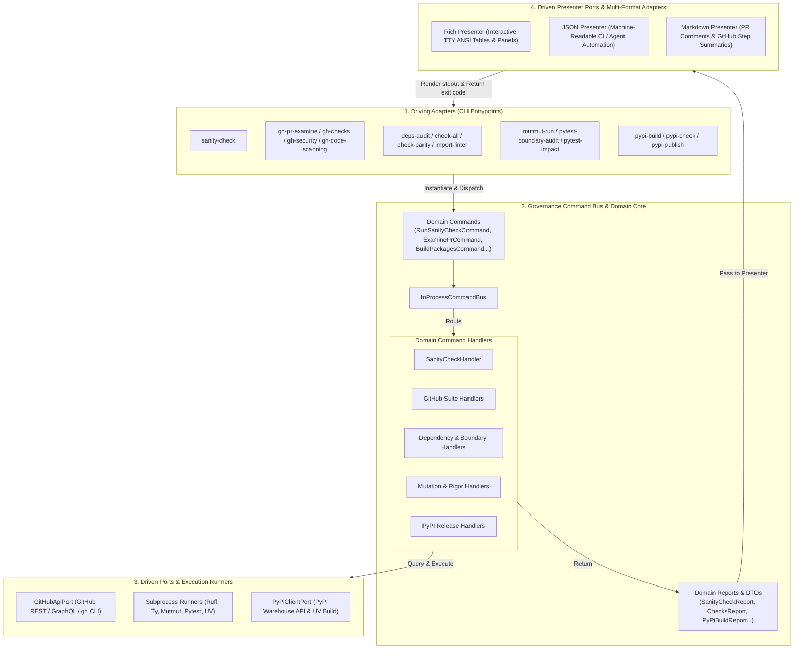

# Hexastack Tools (`packages/hexastack_tools`)

Developer tooling, repository governance, code-scanning analysis, and CI automation suite for the Hexastack monorepo.

---

## 📖 Complete Documentation & Usage

For full CLI usage instructions and command examples, see the canonical [**USAGE Guide**](USAGE.md) or the [online developer documentation](file:///docs/tools.md).

---

## 🏛️ Architectural Intent & CQRS Flow

`hexastack-tools` strictly dogfoods Hexastack's hexagonal architecture and CQRS patterns across every CLI command:

- **`domain/`**: Pure data contracts, command definitions (`RunSanityCheckCommand`, `ExaminePrCommand`, `BuildPackagesCommand`), and structured report models (`SanityCheckReport`, `ChecksReport`, `PyPiBuildReport`).
- **`ports/`**: Abstract boundary interfaces for runner engines (`LinterRunnerPort`, `DependencyAuditorPort`, `PyPiClientPort`, `GitHubApiPort`) and presentation formatters (`SanityPresenterPort`, `GitHubPresenterPort`, `PyPiPresenterPort`, `TestingPresenterPort`, `DependencyPresenterPort`).
- **`adapters/runners/`**: Concrete infrastructure drivers invoking subprocesses (`uv`, `ruff`, `ty`, `mutmut`, `pytest`) or external APIs (GitHub REST/GraphQL, PyPI Warehouse).
- **`adapters/presenters/`**: Decoupled presentation adapters rendering to interactive Rich terminal dashboards, structured JSON payloads, or CI-ready GitHub Flavored Markdown.
- **`infra/handlers/`**: CQRS command handlers orchestrating execution across ports and emitting typed domain reports.
- **`infra/bootstrap.py`**: Centralized governance command bus factory (`create_governance_bus`) providing unified dispatching.
- **`commands/`**: Lightweight driving CLI adapters parsing command-line flags, dispatching domain commands via the bus, and invoking selected presenters.

### Architecture & Invocation Lifecycle

---

## ⚙️ Output Presentation Modes

All modernized CLI commands support multi-format presenters via `--format` / `-f`:

1. **`rich` / `table` (default)**: Colorized ANSI dashboards with status icons, panels, and live terminal styling.
2. **`json`**: Pure, machine-readable JSON payload suited for automated CI gating, scripts, and AI coding agents.
3. **`markdown`**: GitHub Flavored Markdown tables and callouts ready for GitHub Actions job summaries (`$GITHUB_STEP_SUMMARY`) or PR comments.

---

## 🛠️ Quick Command Reference

| Command | Purpose |
|---|---|
| `uv run sanity-check [-p <pkg>]` | Fast scoped pre-commit validator (Ruff, Ty, complexipy, `__all__`, test parity, pytest). |
| `uv run gh-pr-examine [pr]` | Full PR dashboard inspecting checks, review threads, failed CI logs, and conclusions. |
| `uv run gh-checks [pr/ref]` | Detailed status checks inspector. |
| `uv run gh-code-scanning` | CodeQL SAST security alerts browser. |
| `uv run gh-repo [owner/repo]` | Inspects GitHub repository settings, Actions permissions, and environments. |
| `uv run gh-security [pr]` | Review comments and bot security discussion thread auditor. |
| `uv run mutmut-run -p <pkg>` | Scoped mutation testing runner. |
| `uv run mutmut-inspect --summary` | High-level triage summary of surviving mutants (Critical, Equivalent, Ignorable). |
| `uv run pytest-boundary-audit` | Audits test suites for branch boundary and edge-case assertions. |
| `uv run pytest-redundancy-audit` | Analyzes test execution overlap and flags duplicate test paths. |
| `uv run pytest-impact` | Selectively runs tests impacted by current git diff changes. |
| `uv run check-test-parity` | Validates 1:1 mirroring between `src/` and `tests/unit/`. |
| `uv run check-all-statements` | Validates `__all__` alphabetical sorting. |
| `uv run fix-all-statements` | Automatically sorts and alphabetizes `__all__`. |
| `uv run check-extras-parity` | Audits subpackage optional extras forwarding into umbrella packaging. |
| `uv run deps-audit` | Unified dependency runner (deptry + extras parity audit across workspace). |
| `uv run import-linter-run` | Validates package and hexagonal architecture layer boundaries. |
| `uv run pypi-build` | Builds sdist and wheel packages across workspace with optional reproducible audit. |
| `uv run pypi-check` | Verifies build metadata and checks for PyPI release collisions. |
| `uv run pypi-publish` | Smart PyPI publisher skipping existing releases and handling rate limits. |
| `uv run codeql-scan` | Runs local SARIF CodeQL SAST security scan. |

For detailed syntax and flags, see [**USAGE.md**](USAGE.md).
